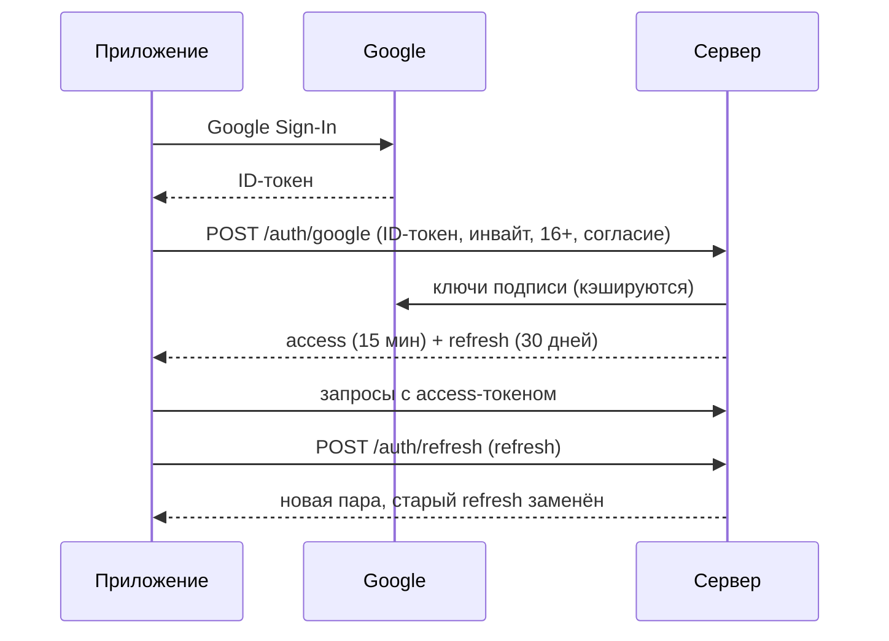

# Вход (PLAN.md, D10)

Код — `backend/src/Gorodki.Api/Features/Auth` и `Features/Me`. Всё закрыто по умолчанию: адрес без пометки `AllowAnonymous`
требует токен. Чужой ресурс по идентификатору (IDOR) — «нет такого» (404), админские адреса — 403 для игрока; роль
администратора проверяется по базе при каждом запросе, а не по токену. Каждый адрес с идентификатором в пути проверяет
тест `IdorTests`, список адресов он берёт у самого сервера: новый адрес без проверки роняет тест.

## Адреса

| Адрес | Что делает | Ошибки (`code` в ProblemDetails) |
|---|---|---|
| `POST /auth/google` | Вход; новый игрок — по инвайту, 16+ и действующему согласию | `google_not_configured` (503), `google_token_invalid` (401), `age_confirmation_required`, `consent_required`, `invite_required`, `invite_invalid`, `account_deleting` (403), `sign_in_conflict` (409 — повторить) |
| `POST /auth/refresh` | Новая пара токенов взамен refresh-токена | `refresh_invalid` (401 — войти заново), `refresh_reused` (401 — вход отменён) |
| `POST /auth/logout` | Отзывает все токены этого входа | — (всегда 204) |
| `GET /me` | Ник, цвет, роль, согласие на показ профиля | 401 без токена |
| `PUT /me/public-profile` | Согласие на показ ника: `{ "enabled": true }` → профиль. **Задача #71 (Егор)**: пока заглушка | 400 без поля `enabled`, 401 без токена |
| `GET/POST /me/privacy-zones`, `DELETE /me/privacy-zones/{id}` | Свои приватные зоны ([ниже](#приватные-зоны)) | `zone_invalid` (400), `zone_limit` (409), 404 — чужая или нет такой |
| `GET /me/export` | «Мои данные»: всё, что сервер хранит об игроке, одним JSON ([ниже](#мои-данные)) | 401 без токена |
| `DELETE /me` | Удалить аккаунт и все данные — необратимо ([ниже](#удаление-аккаунта)); 202 со сроком | 401 без токена |

## Правила

- **Access-токен** — свой JWT (HS256) на 15 минут: `sub` — id игрока, `role` — `player`, `demo` или `admin`.
- **Refresh-токен** — 256 случайных бит; в базе только его SHA-256, поэтому утечка базы не даёт войти в чужой аккаунт.
  Каждое обновление заменяет токен новым (`replaced_by_id`), все токены одного входа — одна «семья» (`family_id`).
- **Льготное окно 60 с.** Если уже заменённый токен пришёл снова в течение минуты, это, скорее всего, тот же телефон, не
  дождавшийся ответа: он получает ещё одну пару. Позже — похоже на кражу: отзывается вся семья. Окно действует, только пока
  у входа есть живой токен, иначе отзыв семьи можно было бы обойти.
- Два одновременных обновления одним токеном не выдадут две «первые» замены: строка токена блокируется (`FOR UPDATE`).
- Тело без токена (`{}`, `null`, пустая строка) — `refresh_invalid` при обновлении и 204 при выходе, а не 500.
- **Истёкшие токены стираются** раз в час (фоновый обработчик, `RefreshTokenRetention`): каждое обновление добавляет
  строку, и без чистки таблица и «мои данные» росли бы вечно. Заменённые, но не истёкшие остаются до конца срока — по ним
  узнаётся повтор украденного токена.
- **Инвайт** забирается одним `UPDATE` с условием «остались приглашения и код не истёк»: база сама не даст израсходовать больше,
  чем выдано, даже при одновременных регистрациях.
- **Ник** назначается сам: «Бегун-1234», цвет — случайный из 12.

## Удаление аккаунта

PLAN.md, §3.16, закон 99-З: «удаление ≤15 дней». Код — `MeEndpoints` (запрос), `AccountDeletion` (стирание).

- `DELETE /me` ставит отметку `deletion_requested_at` (повтор её не сдвигает) и стирает все refresh-токены — выход на
  всех устройствах; ответ — когда запрошено и срок (`deleteByMs`, +15 дней). С этого момента забеги, куски и заявки
  не принимаются (`account_deleting`), войти в аккаунт нельзя.
- Фоновый обработчик при ближайшем часовом проходе — но не раньше, чем запрос и последний захват игрока станут публичными
  (граница `TerritoryReader.PublicHorizon`, та же, что у карты; иначе стёртая земля проступила бы контуром недавней петли,
  ещё скрытой от остальных) — стирает аккаунт
  одной транзакцией под блокировкой игрока: землю
  (под блокировками тайлов, как захват; версии тайлов растут — карта у соседей обновится), захваты с журналом, забеги
  с точками, туман, токены, задания отката и саму запись игрока. Земля становится ничьей.
- В журнале **чужих** захватов (земля до/после) номер удалённого остаётся, пока журнал не сотрётся — через 7 дней,
  раньше срока закона. Откат и публичная проекция такую землю ничьей и возвращают — удалённый игрок на карте не появится.
- Окна для отмены нет: удаление — необратимо, подтверждение — на стороне приложения. Нужна отмена — это решение правил.
- Номер игрока стирается и из **списков атакующих** чужих участков (кто снял уровень за окно — `loss_attackers`)
  и их копий в журнале. Тайлы, где его номер есть только в этих списках, тоже берутся под блокировку: иначе захват в таком
  тайле, прочитавший участок до чистки, записал бы номер обратно уже после неё.
- Версии растут и у тайлов, где всю его землю отнял ещё **скрытый** чужой захват: публичная проекция возвращала её
  остальным, а после удаления не вернёт — туда же уходит подсказка `TilesChanged`. Иначе приложения с кэшем до раскрытия
  показывали бы землю удалённого аккаунта, а этот тайл — единственный его тайл без новой версии — выдал бы, где скрытый
  захват ([карта](territory-map.md)).
- Проверено тестом «полноты удаления»: после стирания номер игрока ищется во всех столбцах-идентификаторах схемы `app` —
  и одиночных (`uuid`), и списках (`uuid[]`); до 24.09 тест смотрел только одиночные и пропускал списки атакующих.

## Приватные зоны

PLAN.md, §3.16: «при первом „Старте“ — предложение сделать это место приватной зоной (400 м); подсказка, если ≥3 забегов
начинаются в одном месте» (подсказку считает приложение по своей истории). Код — `PrivacyZoneEndpoints`, `PrivacyZones`.

- Зона — круг радиусом `privacy.zoneRadiusMeters` (400 м) вокруг точки; радиус общий, из конфига. Зон — не больше
  `privacy.maxZones` (3: план числа не называет — дом, работа, учёба).
- В зоне не засчитываются визиты (§3.3): путь внутри кругов вычитается до подсчёта метров по кускам.
- Видит и убирает зону только сам игрок (условие по владельцу — в том же запросе; чужая — 404). Зоны удаляются вместе
  с аккаунтом и входят в «мои данные».

## Мои данные

PLAN.md, §3.16 (закон 99-З: «выгрузка данных»), §3.10 («карта входит в „мои данные“»). Код — `AccountExport`.

- `GET /me/export` — JSON-файл (`Content-Disposition: attachment`): профиль и согласия, входы (когда выдан, срок, отозван;
  самих токенов сервер не хранит), забеги — с точками и датчиками в том виде, в каком их прислал телефон, пока они
  хранятся (14 дней; потом — отметка `pointsErasedAtMs`), заявки петель и итог, земля (широта/долгота), туман по слоям,
  сезонам и тайлам (биты — как в `GET /fog`), приватные зоны.
- Только свои данные: всё выбирается по номеру из токена (проверено тестом — чужих забегов и захватов в выгрузке нет).

## Настройки (секреты — только в переменных окружения Render)

| Переменная | Что это |
|---|---|
| `ConnectionStrings__Gorodki` | Строка подключения к Supabase. Без неё сервер работает без базы и без входа |
| `Auth__SigningKey` | Ключ подписи, Base64, ≥ 32 байт (`openssl rand -base64 32`). **Секрет.** Без него сервер с базой не стартует |
| `Auth__GoogleClientIds__0`, `__1` | OAuth client ID приложения в Google Cloud (Free и Paid). Не секрет, но нужен аккаунт — issue #4 |

## Проверка

- `Gorodki.Api.Tests/Auth` — правила регистрации и выпуск токенов.
- `Gorodki.IntegrationTests/AuthFlowTests` — настоящий сервер в памяти и база в контейнере, Google подставной, время управляемое:
  регистрация, повторный вход, `/me`, обновление, потерянный ответ (окно), кража после окна, выход, отозванная семья внутри окна,
  поддельный токен Google, лимит инвайта, одновременные регистрации.
- `MigrationsTests` — любая правка модели без миграции роняет сборку.
