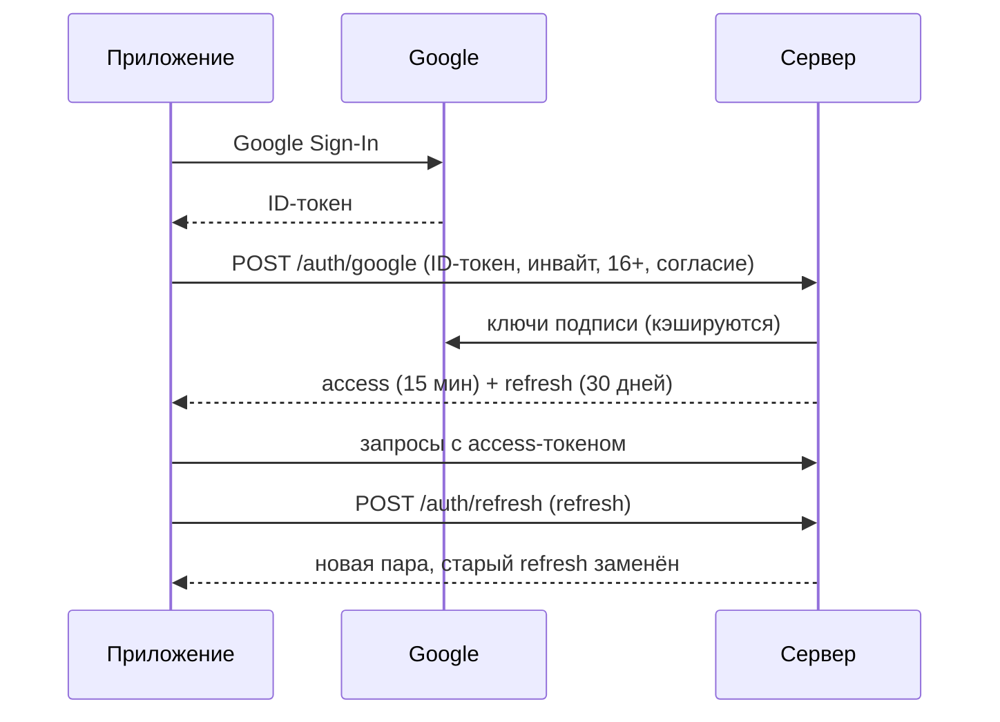

# Вход (PLAN.md, D10)

Код — `backend/src/Gorodki.Api/Features/Auth` и `Features/Me`. Всё закрыто по умолчанию: адрес без пометки `AllowAnonymous`
требует токен.

## Адреса

| Адрес | Что делает | Ошибки (`code` в ProblemDetails) |
|---|---|---|
| `POST /auth/google` | Вход; новый игрок — по инвайту, 16+ и действующему согласию | `google_not_configured` (503), `google_token_invalid` (401), `age_confirmation_required`, `consent_required`, `invite_required`, `invite_invalid` (403), `sign_in_conflict` (409 — повторить) |
| `POST /auth/refresh` | Новая пара токенов взамен refresh-токена | `refresh_invalid` (401 — войти заново), `refresh_reused` (401 — вход отменён) |
| `POST /auth/logout` | Отзывает все токены этого входа | — (всегда 204) |
| `GET /me` | Ник, цвет, роль, согласие на показ профиля | 401 без токена |

## Правила

- **Access-токен** — свой JWT (HS256) на 15 минут: `sub` — id игрока, `role` — `player`, `demo` или `admin`.
- **Refresh-токен** — 256 случайных бит; в базе только его SHA-256, поэтому утечка базы не даёт войти в чужой аккаунт.
  Каждое обновление заменяет токен новым (`replaced_by_id`), все токены одного входа — одна «семья» (`family_id`).
- **Льготное окно 60 с.** Если уже заменённый токен пришёл снова в течение минуты, это, скорее всего, тот же телефон, не
  дождавшийся ответа: он получает ещё одну пару. Позже — похоже на кражу: отзывается вся семья. Окно действует, только пока
  у входа есть живой токен, иначе отзыв семьи можно было бы обойти.
- Два одновременных обновления одним токеном не выдадут две «первые» замены: строка токена блокируется (`FOR UPDATE`).
- **Инвайт** забирается одним `UPDATE` с условием «остались приглашения и код не истёк»: база сама не даст израсходовать больше,
  чем выдано, даже при одновременных регистрациях.
- **Ник** назначается сам: «Бегун-1234», цвет — случайный из 12.

## Настройки (секреты — только в переменных окружения Render)

| Переменная | Что это |
|---|---|
| `ConnectionStrings__Gorodki` | Строка подключения к Supabase. Без неё сервер работает без базы и без входа |
| `Auth__SigningKey` | Ключ подписи, Base64, ≥ 32 байт (`openssl rand -base64 32`). **Секрет.** Без него сервер с базой не стартует |
| `Auth__GoogleClientIds__0`, `__1` | OAuth client ID приложения в Google Cloud (Free и Paid). Не секрет, но нужен аккаунт — issue #4 |

## Проверка

- `Gorodki.Api.Tests/Auth` — правила регистрации и выпуск токенов.
- `Gorodki.IntegrationTests/AuthFlowTests` — настоящий сервер в памяти и база в контейнере, Google подставной, время управляемое:
  регистрация, повторный вход, `/me`, обновление, потерянный ответ (окно), кража после окна, выход, отозванная семья внутри окна,
  поддельный токен Google, лимит инвайта, одновременные регистрации.
- `MigrationsTests` — любая правка модели без миграции роняет сборку.
