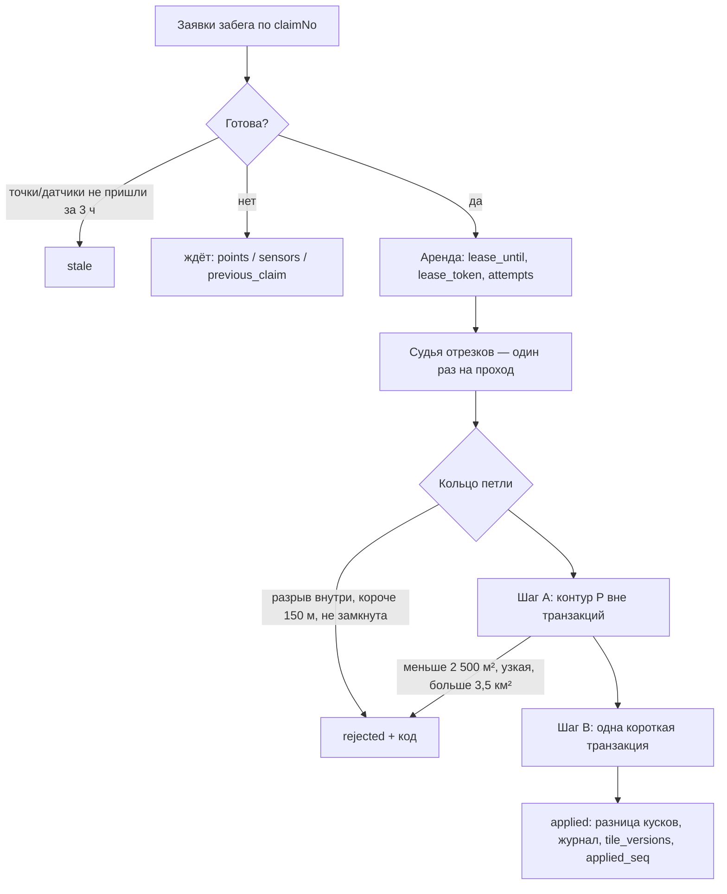

# Захваты: заявки петель и их обработка

Телефон замыкает петлю сам (`LoopDetector` в GameCore) и сразу отправляет незаконченный кусок точек и **заявку петли**.
Засчитывает её сервер — той же версией правил, по точкам из базы (PLAN.md, §3.2, §7.3). Ответ на заявку — «принято»,
итог приходит позже: телефон опрашивает `GET /runs/{id}/captures` (позже — push через SignalR).

Код: `backend/src/Gorodki.Api/Features/Captures`, правила готовности — `Gorodki.Domain/Runs/ClaimReadiness.cs`.

## Адреса

| Адрес | Что делает | Ошибки (`code`) |
|---|---|---|
| `POST /runs/{id}/loops` | Заявка петли: `claimNo`, `startSeq`, `endSeq`, `closure`, `estimatedArea`. Новая — 202, повтор той же — 200 с текущим итогом | `claim_invalid` (400) · `account_deleting` (403) · `run_not_found` (404 — повторить `POST /runs`, потом заявку) · `claim_conflict` (409 — окончательно, не повторять) · `upload_window_closed` (409 — окно приёма забега закрыто или его точки стёрты, окончательно) · `claim_limit` (429) |
| `GET /runs/{id}/captures` | Все заявки забега: статус, итог, чего ждёт ожидающая | `run_not_found` (404) |

## Правила для телефона (контракт)

- **Идентификатор заявки** `capture_id = UUIDv5(4f2c8a1e-9b3d-4c6f-a1e2-7d5b9c0f3e81, run_id ‖ end_seq)`:
  16 байт забега и 4 байта номера последней точки, оба — старший байт первым (порядок RFC 4122). Эталоны — `CaptureIdsTests`.
- **`claimNo`** — номер заявки в забеге по порядку: 0, 1, 2… Заявки забега сервер применяет по порядку.
- Статус ожидающей заявки подсказывает, что делать:

| `waitingFor` | Значит | Телефону |
|---|---|---|
| `points` | Нет точек до конца петли (сервер обрабатывает только начало следа без дыр) | Дослать недостающие куски |
| `sensors` | Данные датчиков переданы не до конца петли | Дослать куски с датчиками |
| `previous_claim` | Обрабатывается предыдущая заявка забега | Ждать (не дольше 10 минут — дальше очередь идёт без неё) |
| `queue` | Всё есть, очередь сервера | Ждать |

Датчики сервер не ждёт «по таймауту»: иначе можно было бы обойти проверки, просто не присылая их. Единственный запасной путь —
забег завершён и все его точки на месте.

## Обработка

`CaptureProcessor` (проход по забегу) и `CaptureWorker` (фоновая служба: один поток, опрос раз в 5 с или по сигналу
от приёма кусков и заявок). Решения — по итогам независимой критики дизайна.

- **Готовность** — те же правила, что видит телефон (`ClaimReadiness`). Датчики «по таймауту» не ждутся.
- **Аренда вместо удерживаемой блокировки**: заявка берётся короткой командой, судья и контур считаются вне транзакций,
  итог пишется, только если аренда ещё своя. Упавший проход не держит очередь: аренда истекает через 2 минуты.
- **Изоляция**: судья зовётся после аренды первой заявки. Непредвиденная ошибка заявки (испорченный кусок, сбой базы)
  пишется в `last_error`, аренда остаётся паузой до повтора; после 5 аренд — `failed` с `too_many_attempts`. Каждая стадия
  прохода обработчика (захваты, визиты, туман, раскрытия, откаты) и каждый забег в ней — отдельно: ошибка одного не
  останавливает остальное. Забег, у которого не посчитались туман или визиты, откладывается (`fog_retry_at`,
  `visits_retry_at`: 1, 2, 4… минуты, не реже раза в час) и уходит из очереди сам, когда стираются его точки.
- **Шаг B** — `lock_timeout` 5 с, `statement_timeout` 15 с; блокировка игрока (суточный лимит считается под ней), затем тайлов
  по возрастанию, у каждой лиги своё пространство блокировок; движок; **запись только разницы** (неизменные куски сохраняют id;
  нетронутую петлёй землю движок не пересобирает — [territory-map.md](territory-map.md));
  `tile_versions` — только у изменившихся тайлов; `applied_seq` — порядок применения для переигровки карты. Номер
  берётся под блокировками тайлов, поэтому параллельная обработка даёт ту же карту, что обработка по одной в порядке
  `applied_seq` — это проверяет интеграционный тест `CaptureSerializabilityTests` (PLAN.md, §13).
- **Время петли** `effective_at` — конец петли по часам сервера (с поправкой на сдвиг часов телефона), но не позже прихода заявки;
  целые миллисекунды. «Старше 3 часов» считается по моменту, когда у сервера появилось всё нужное (`evidence_at`).
- **Ошибки движка** (самопроверка не сошлась, база отвергла геометрию) — земля не меняется, одна повторная попытка, потом `failed`.
- **Журнал для отката** — в той же транзакции, что и земля (подробнее ниже).
- **Замыкание по пересечению**: кольцо через точку пересечения; хорда ≤ R проверяется только для `proximity`.
- **Правила земли** — версии конфига, действующей в момент применения (карта общая); судья — версии, с которой начат забег.

## Журнал захватов и откат

PLAN.md, §7.3, шаг B.5 и §3.9, слой 5: «откатываются только куски, которых после этого никто не трогал».
Код — `TerritoryMap.Apply`/`Restore` (домен), `CaptureJournal` (база). Решения — по итогам независимой критики дизайна.

- **След захвата** — где состояние земли стало другим, включая осколки, отданные соседям. Считается по тем же граням, что
  и решения захвата (без отдельного узлования). Второе узлование бывает только в тайле, где петля прошла и по земле, которую
  не изменила: куски собираются заново по линиям журнала, чтобы петля не резала эту землю ([territory-map.md](territory-map.md)).
  Тайл, где петля ничего не изменила, не переписывается и записи не получает. В журнал по каждому тайлу идут след и земля внутри него
  **до и после** захвата: состояние куска целиком и геометрия в TWKB (сетка 0,1 м — без потерь, больше чем втрое меньше WKB;
  побайтово совпадает с PostGIS `ST_AsTWKB`, проверено тестом).
- Таблицы `capture_journal` (след по тайлу) и `capture_journal_pieces` (земля до/после). Пишутся в транзакции захвата:
  земли без записи и записи без земли не бывает. Стираются через **7 дней** (обработчик, раз в час) — столько доступен откат.
- **Строки точного отката** (`capture_journal_parcels`, аудит BE-01): какие строки `parcels` захват удалил (с контуром в
  TWKB — ровно как лежал, побайтово как `ST_AsTWKB` PostGIS) и какие вставил (номера и состояние). Нужны только публичной
  проекции, пока захват скрыт: она возвращает удалённые строки до вершины и с теми же номерами
  ([territory-map.md](territory-map.md)); откат нарушителя их не использует. Номера вставленных строк база даёт при
  сохранении, поэтому строки пишутся вторым сохранением в той же транзакции тем же помощником, что и разница
  (`ParcelDiff.Swap`). Это лучшее усилие: контур, который не читается из TWKB тем же, или ошибка записи (откат до точки
  сохранения) оставляют тайл без строк, и проекция идёт запасным путём; захват из-за них не падает никогда, в лог — только
  число таких тайлов. Хранятся `max(1 ч, 2 × (задержка + шаг раскрытия))` — стираются той же часовой чисткой, живут до
  двух часов; размер таблицы — в `/health/ready` (`captureJournalParcelsBytes`).
- **Откат** (`Restore`): внутри следа там, где земля **и сейчас такая, какой её оставил захват**, возвращается прежнее
  состояние; где её с тех пор изменили — другой захват, смена сезона, удаление игрока, другой откат, — всё остаётся как есть.
  Сравнение с сохранённым «после», а не список поздних захватов: так откат сам замечает любые изменения земли и не зависит
  от порядка всех операций. Захваты одного игрока откатываются от новых к старым.
- **Визиты владельцев** касанием не считаются (`replayVisits`; откат нарушителя и публичная проекция скрытого захвата):
  где землю после захвата меняли только визиты (`VisitReplay` воспроизводит их точно — иначе это не визиты), земля
  возвращается с теми же визитами, посчитанными заново от прежнего состояния, если владелец до и после захвата один
  (жертва пробежала по треснувшей части — иначе трещина и осада оставались бы у неё и после отката), и прежней, если нет
  (визиты автора на взятом). Освежение владельцем своей земли его собственным захватом — тот же `CaptureRules.Visit`,
  от визита не отличить, и оно переносится так же (без захвата было бы то же). Без этого режима «тронутая» земля —
  любая изменённая (так проверяет растровый оракул).
- Перенос идёт **по граням следа**: визит, засчитанный на остатке куска вне следа, с возвращённой землёй не сливается.
  Поэтому после отката у жертвы обычно два куска с разным временем визита (остаток — без визита, если путь по нему
  короче 50 м), хотя без захвата визит лёг бы на весь кусок. Для отката нарушителя (захват давно публичен) это
  неточность у остатка на один визит (угасание и, может быть, +1 уровень). Публичная проекция скрытого захвата так
  откатывает только запасным путём — обычно точно, по строкам точного отката, без шва ([territory-map.md](territory-map.md)).
- Проверено: откат последнего захвата возвращает прежнюю карту (property-тест), откат захвата из середины истории
  совпадает с растровым оракулом «вернули ровно нетронутое» (1 500 случайных историй), откат с визитами случайных
  владельцев (у каждого куска своё время) — с растровым оракулом переноса визитов, инварианты карты после отката.
  Оракул переноса считает ожидаемое теми же `VisitReplay`, то есть проверяет учёт граней, а не совпадение с миром без
  захвата. Совпадение с миром без захвата проверяет независимый оракул точного отката (I8, `ExactUndoPropertyTests`):
  проекция равна тому же хранилищу, в котором скрытых захватов не было, — строка в строку, с визитами владельцев и
  удалением аккаунтов в окне.

### Откат нарушителя

Админ: `POST /admin/users/{id}/rollback` с причиной (журнал решений: кто, кого, почему), итог — `GET /admin/rollbacks/{id}`.
Адреса не входят в описание API для приложения; роль проверяется по базе.

1. Игрок **замораживается на 7 дней** (§3.9, слой 5) до постановки задания. Обработчик проверяет заморозку под блокировкой
   игрока — захваты замороженного отклоняются с кодом `account_frozen`.
2. Задание выполняет **фоновый обработчик** — движок участков однопоточный (ADR 0003). Список захватов составляется под той же
   блокировкой игрока: захват, который применялся в этот момент, уже записан, следующие увидят заморозку.
3. Захваты — **от новых к старым**, каждый отдельно: откат считается без блокировок, записывается короткой транзакцией под
   блокировками тайлов — только если версии тайлов не изменились (иначе пересчёт, до 5 раз). Иначе долгий откат держал бы
   тайлы и ронял чужие захваты по `lock_timeout`.
4. Земля, чьего прежнего хозяина уже нет (аккаунт удалён), возвращается **ничьей**.
5. Захват остаётся со статусом `applied` и получает `rolled_back_at`: для суточного лимита он по-прежнему считается,
   приложение (и сам нарушитель) видит прежний статус — новое значение перечисления уронило бы разбор ответа в клиенте.
6. Захваты старше недели (или применённые до журнала) не откатываются — считаются в итоге как «без журнала». Ошибка
   отката одного захвата (в том числе испорченная запись журнала) — его неудача в итоге (`failed`, `last_error`):
   остальные откатываются, задание завершается. Кроме временного сбоя базы (соединение, пул, взаимоблокировка,
   перезапуск): тогда задание остаётся ожидающим и повторяется в следующем проходе, уже откаченные захваты второй раз
   не берутся, а итог «откачено» и «возвращено» считается по всем попыткам.
7. Свои касания нарушителя (визиты, повторные петли по отнятой земле) «тронутой» её **не делают**: иначе, побегав по
   украденному, он бы его «отмыл». Визиты жертвы — тоже: треснувшая часть возвращается без трещины и осады, с этим
   визитом (посчитанным заново от прежнего куска); так же и освежение жертвой своей треснувшей земли её собственной
   петлёй — от визита его не отличить. Касание чужого — захват (кроме такого освежения), смена сезона — по-прежнему
   защищает землю.

Открытый вопрос правил (решает Никита): не засчитывать ли жертве угасание за время, пока земля была отнята.
Освежение соклановцем там, где визит владельца не поднял бы уровень, от визита неотличимо и переносится как визит; там,
где поднял бы, земля «тронута». Кланов пока нет — вопрос встанет с ними.

## Визиты

PLAN.md, §3.3: «визит — ≥50 м следа внутри участка или повторный захват; +1 уровень не чаще раза в 20 ч; не считаются
первые и последние 200 м забега и приватные зоны». Без визитов угасание (−1 уровень за 6 дней) заставляло бы
перезахватывать свою же землю. Код — `Visits`, `JudgedPath`, `CaptureRules.Visit` (домен), `VisitProcessor` (база).

- **Когда**: один раз за забег, в том же фоновом обработчике, что и захваты (после них, перед туманом), когда забег
  завершён и все точки на месте — то же условие, что у тумана, — и **не раньше, чем конец забега станет публичным**:
  граница `TerritoryReader.PublicHorizon` («сейчас − 20 минут» вниз до 5 минут, как у карты), конец — по часам сервера
  (с поправкой на часы телефона). Публичная задержка, §3.16: визит меняет землю и версию тайла и иначе выдал бы «игрок
  только что пробежал здесь»; у демо-аккаунта — сразу. Отметка — `runs.visits_processed_at`, итог — `visited_parcels`.
- **Какой путь**: только принятый судьёй отрезков (как у тумана): точки с плохой точностью пропускаются, разрыв рвёт путь,
  30 с перед разрывом не считаются. Первые и последние 200 м (`privacy.trimMeters`) отрезаются по длине пути: начало и конец
  забега чаще всего у дома — визит по ним выдал бы, где человек живёт.
- **Что считается**: ≥ 50 м засчитанного пути внутри куска (`territory.visitMinMeters`); граница куска — тоже внутри.
  Время визита — последняя точка пути в куске, по часам сервера (с поправкой на часы телефона).
- **Что делает**: закрепляет действующий уровень (угасание начинается заново) и +1, если прошло ≥ 20 ч с прошлого
  повышения, кусок не в осаде и уровень меньше 3. Угасшая до нуля земля визитом не возвращается — только захватом.
  Время визита назад не сдвигается (забег, пришедший с опозданием, не «старит» кусок).
- **Запись**: расчёт без блокировок, запись — короткая транзакция под блокировками тайлов; куски перечитываются,
  визит применяется к их свежему состоянию. Кусок, который за это время пересобрал захват (другой номер), пропускается.
  Версии тайлов растут — карта у соседей обновится.
- **Приватные зоны** игрока (§3.16, [адреса](auth.md#приватные-зоны)): путь внутри кругов радиусом 400 м вокруг них не считается.
- **Пока чужой захват скрыт**: визиты засчитываются, когда публичен конец забега, а захват той же земли, применённый в
  эти 20 минут, ещё скрыт. У жертвы это обычная игра — визиты ложатся на треснувшую часть и остаток куска; у автора —
  если захват применён позже конца забега (забег из офлайна) — на взятое. Публичная проекция переносит такие визиты на
  прежние куски (точный откат: времена визитов со всех вставленных захватом кусков владельца над прежним): взятое,
  уровень −1, осада и шов по линии петли до раскрытия не видны. Что остаётся — «визит не лёг» на землю, отнятую
  целиком, и запасной путь ([territory-map.md](territory-map.md)).

## Защита от мультиаккаунтов

PLAN.md, §3.3. Код — `CaptureProcessor` (проверки), `CaptureRules` (решение по куску).

- **Один аккаунт на устройство в сутки**: захват отклоняется (`device_shared`), если с этого устройства (`deviceId` забега —
  идентификатор установки из Keychain, переживает переустановку) в те же игровые сутки по Минску уже применён захват
  другого аккаунта. Проверка — под блокировкой устройства (после блокировки игрока): два аккаунта одного телефона
  не проскочат одновременно. Свои захваты с разных телефонов — можно.
- **Новый аккаунт уровни не снимает**: моложе 48 ч или с пробегом меньше 3 км (`territory.newAccountHours`,
  `territory.newAccountMinMeters`) — ничью землю берёт, свою освежает, чужую не трогает (`newAccountLimited` в итогах
  захвата; после щита, до лимитов снятия). Пробег — засчитанный путь прежних забегов (все лиги, `runs.accepted_meters`,
  считается вместе с визитами) и этого забега до конца петли.
- Бонус за приглашение (третий пункт правила) — вместе с приглашениями.

## Коды отказов

| Код | Значит |
|---|---|
| `segment_broken:<причина>` | Внутри петли след порван (`tooFast`, `vehicle`, `cycling`, `noSteps`, `strideOutOfRange`, `carLaunch`, `teleport`) |
| `too_few_points`, `too_short`, `not_closed` | Меньше 4 точек, путь короче 150 м, концы дальше R |
| `too_small`, `too_narrow`, `too_large`, `empty` | Контур меньше 2 500 м², уже «пятна» 9 м, больше 3,5 км², пустой после масок |
| `motion_not_authorized` | Нет разрешения «Движение» (§3.9: без него захват невозможен) |
| `daily_limit` | Уже 30 захватов за игровые сутки |
| `device_shared` | С этого телефона в эти игровые сутки уже засчитан захват другого аккаунта (§3.3) |
| `account_frozen` | Игрок заморожен (слой 5, откат) — захваты не применяются |
| `stale`, `points_not_received`, `sensors_not_received` | Петля старше 3 часов к моменту, когда пришло всё нужное; или так и не пришло; `stale` — и когда точки забега уже стёрты (14 дней) |
| `engine_failed`, `too_many_attempts` | Движок не смог применить петлю или заявку не удалось обработать 5 раз — земля не изменилась |

## Что ещё впереди

Снятие заморозки и бан (слой 5), outbox и SignalR, маски OSM, кланы, ослабление большой петли (ждёт решений, issue #48).
