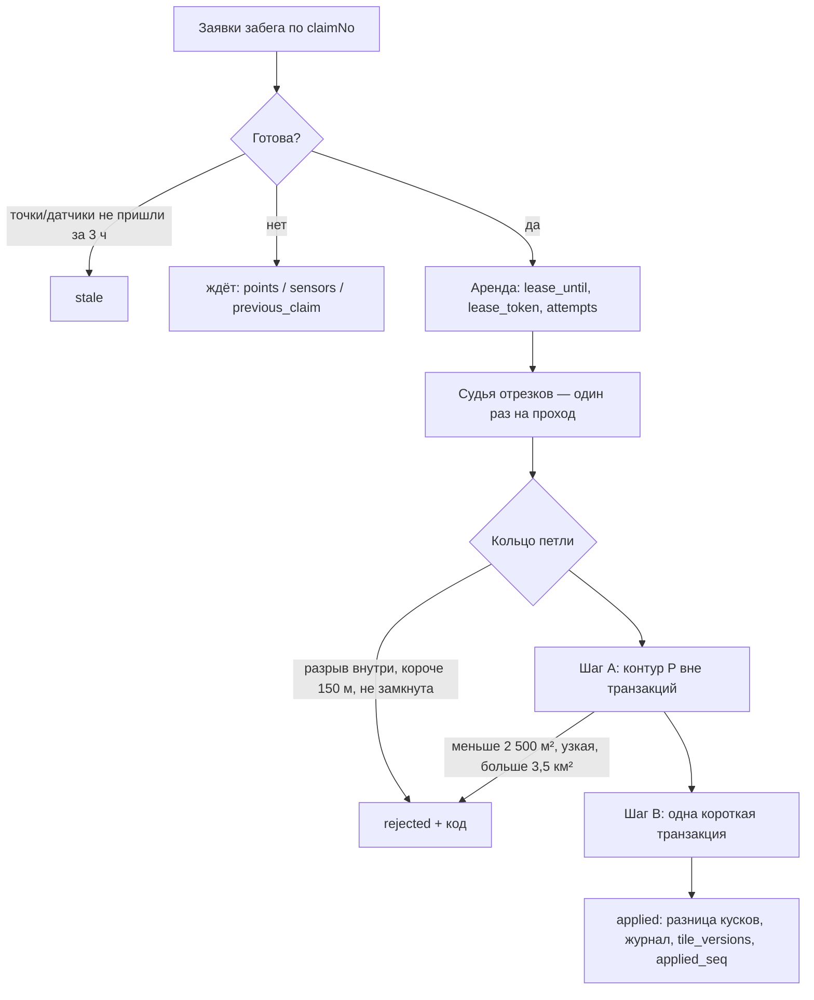

# Захваты: заявки петель и их обработка

Телефон замыкает петлю сам (`LoopDetector` в GameCore) и сразу отправляет незаконченный кусок точек и **заявку петли**.
Засчитывает её сервер — той же версией правил, по точкам из базы (PLAN.md, §3.2, §7.3). Ответ на заявку — «принято»,
итог приходит позже: телефон опрашивает `GET /runs/{id}/captures` (позже — push через SignalR).

Код: `backend/src/Gorodki.Api/Features/Captures`, правила готовности — `Gorodki.Domain/Runs/ClaimReadiness.cs`.

## Адреса

| Адрес | Что делает | Ошибки (`code`) |
|---|---|---|
| `POST /runs/{id}/loops` | Заявка петли: `claimNo`, `startSeq`, `endSeq`, `closure`, `estimatedArea`. Новая — 202, повтор той же — 200 с текущим итогом | `claim_invalid` (400) · `account_deleting` (403) · `run_not_found` (404 — повторить `POST /runs`, потом заявку) · `claim_conflict` (409 — окончательно, не повторять) · `claim_limit` (429) |
| `GET /runs/{id}/captures` | Все заявки забега: статус, итог, чего ждёт ожидающая | `run_not_found` (404) |

## Правила для телефона (контракт)

- **Идентификатор заявки** `capture_id = UUIDv5(4f2c8a1e-9b3d-4c6f-a1e2-7d5b9c0f3e81, run_id ‖ end_seq)`:
  16 байт забега и 4 байта номера последней точки, оба — старший байт первым (порядок RFC 4122). Эталоны — `CaptureIdsTests`.
- **`claimNo`** — номер заявки в забеге по порядку: 0, 1, 2… Заявки забега сервер применяет по порядку.
- Статус ожидающей заявки подсказывает, что делать:

| `waitingFor` | Значит | Телефону |
|---|---|---|
| `points` | Нет точек до конца петли (сервер обрабатывает только начало следа без дыр) | Дослать недостающие куски |
| `sensors` | Данные датчиков переданы не до конца петли | Дослать куски с датчиками |
| `previous_claim` | Обрабатывается предыдущая заявка забега | Ждать (не дольше 10 минут — дальше очередь идёт без неё) |
| `queue` | Всё есть, очередь сервера | Ждать |

Датчики сервер не ждёт «по таймауту»: иначе можно было бы обойти проверки, просто не присылая их. Единственный запасной путь —
забег завершён и все его точки на месте.

## Обработка

`CaptureProcessor` (проход по забегу) и `CaptureWorker` (фоновая служба: один поток, опрос раз в 5 с или по сигналу
от приёма кусков и заявок). Решения — по итогам независимой критики дизайна.

- **Готовность** — те же правила, что видит телефон (`ClaimReadiness`). Датчики «по таймауту» не ждутся.
- **Аренда вместо удерживаемой блокировки**: заявка берётся короткой командой, судья и контур считаются вне транзакций,
  итог пишется, только если аренда ещё своя. Упавший проход не держит очередь: аренда истекает через 2 минуты.
- **Шаг B** — `lock_timeout` 5 с, `statement_timeout` 15 с; блокировка игрока (суточный лимит считается под ней), затем тайлов
  по возрастанию, у каждой лиги своё пространство блокировок; движок; **запись только разницы** (неизменные куски сохраняют id);
  `tile_versions` — только у изменившихся тайлов; `applied_seq` — порядок применения для переигровки карты.
- **Время петли** `effective_at` — конец петли по часам сервера (с поправкой на сдвиг часов телефона), но не позже прихода заявки;
  целые миллисекунды. «Старше 3 часов» считается по моменту, когда у сервера появилось всё нужное (`evidence_at`).
- **Ошибки движка** (самопроверка не сошлась, база отвергла геометрию) — земля не меняется, одна повторная попытка, потом `failed`.
- **Журнал для отката** — в той же транзакции, что и земля (подробнее ниже).
- **Замыкание по пересечению**: кольцо через точку пересечения; хорда ≤ R проверяется только для `proximity`.
- **Правила земли** — версии конфига, действующей в момент применения (карта общая); судья — версии, с которой начат забег.

## Журнал захватов и откат

PLAN.md, §7.3, шаг B.5 и §3.9, слой 5: «откатываются только куски, которых после этого никто не трогал».
Код — `TerritoryMap.Apply`/`Restore` (домен), `CaptureJournal` (база). Решения — по итогам независимой критики дизайна.

- **След захвата** — где состояние земли стало другим, включая осколки, отданные соседям. Считается по тем же граням, что
  и сам захват (без второго узлования — шаг B не медленнее). В журнал по каждому тайлу идут след и земля внутри него
  **до и после** захвата: состояние куска целиком и геометрия в TWKB (сетка 0,1 м — без потерь, больше чем втрое меньше WKB;
  побайтово совпадает с PostGIS `ST_AsTWKB`, проверено тестом).
- Таблицы `capture_journal` (след по тайлу) и `capture_journal_pieces` (земля до/после). Пишутся в транзакции захвата:
  земли без записи и записи без земли не бывает. Стираются через **7 дней** (обработчик, раз в час) — столько доступен откат.
- **Откат** (`Restore`): внутри следа там, где земля **и сейчас такая, какой её оставил захват**, возвращается прежнее
  состояние; где её с тех пор изменили — другой захват, смена сезона, удаление игрока, другой откат, — всё остаётся как есть.
  Сравнение с сохранённым «после», а не список поздних захватов: так откат сам замечает любые изменения земли и не зависит
  от порядка всех операций. Захваты одного игрока откатываются от новых к старым.
- Проверено: откат последнего захвата возвращает прежнюю карту (property-тест), откат захвата из середины истории
  совпадает с растровым оракулом «вернули ровно нетронутое» (1 500 случайных историй), инварианты карты после отката.
- **Дальше** (следующий шаг): сам откат нарушителя на сервере — заморозка игрока, чтобы его новые захваты не ложились поверх
  отката; запись без долгих блокировок тайлов; статус захвата; учёт в суточном лимите; адрес для админа.

## Коды отказов

| Код | Значит |
|---|---|
| `segment_broken:<причина>` | Внутри петли след порван (`tooFast`, `vehicle`, `cycling`, `noSteps`, `strideOutOfRange`, `carLaunch`, `teleport`) |
| `too_few_points`, `too_short`, `not_closed` | Меньше 4 точек, путь короче 150 м, концы дальше R |
| `too_small`, `too_narrow`, `too_large`, `empty` | Контур меньше 2 500 м², уже «пятна» 9 м, больше 3,5 км², пустой после масок |
| `motion_not_authorized` | Нет разрешения «Движение» (§3.9: без него захват невозможен) |
| `daily_limit` | Уже 30 захватов за игровые сутки |
| `stale`, `points_not_received`, `sensors_not_received` | Петля старше 3 часов к моменту, когда пришло всё нужное; или так и не пришло |
| `engine_failed`, `too_many_attempts` | Движок не смог применить петлю — земля не изменилась |

## Что ещё впереди

Откат нарушителя на сервере (журнал уже пишется), outbox и SignalR, маски OSM, кланы, ослабление большой петли, защита от мультиаккаунтов,
`/territory` для карты, визиты (≥ 50 м следа внутри участка), чистка сырых точек через 14 дней.
