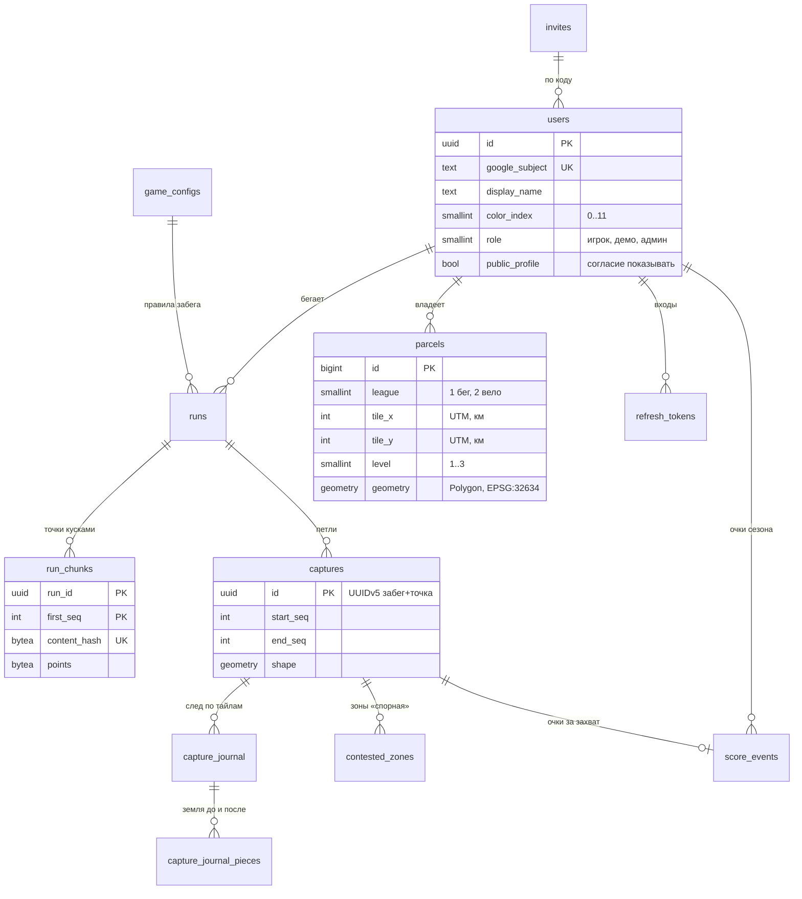

# Модель данных (схема v1)

PostgreSQL 17 + PostGIS 3.3 на Supabase. Все таблицы — в схеме `app`, PostGIS — в схеме `extensions`.
Код — `backend/src/Gorodki.Api/Infrastructure/Persistence`, миграции — там же в `Migrations/`.
Правила игры в базе не живут: они в `Gorodki.Domain` (ADR 0003), таблицы только хранят результат.

| Таблица | Зачем | Главные правила |
|---|---|---|
| `users` | Игроки | Ник уникален без учёта регистра; 16+ и согласие — отдельными полями (закон 99-З); `frozen_until` — заморозка (слой 5) |
| `invites` | Инвайт-коды закрытой регистрации | Приглашение забирается одним `UPDATE` с условием — лишних не израсходовать даже при гонке |
| `refresh_tokens` | Токены входа ([вход](auth.md)) | Хранится только SHA-256; `family_id` — все токены одного входа, `replaced_by_id` — чем заменён; истёкшие стираются раз в час |
| `game_configs` | Версии игрового конфига (все числа правил) | Забег проверяется той версией, с которой начат. Новая база сама получает версию 1 из кода при первом `GET /config`; её JSON — [контракт](../../contracts/README.md) |
| `runs` | Забеги ([приём](runs.md)) | `league` с первого дня (D16); `processed_seq` — до какой точки обработан; **один активный на игрока** (уникальный индекс); сдвиг часов телефона, установка, версия приложения — для доверия; счётчики кусков и байт — для лимитов; `fog_failures`/`fog_retry_at` и `visits_failures`/`visits_retry_at` — пауза перед повтором, если туман или визиты забега не посчитались ([обработка](captures.md#обработка)); `visits_retry_at` — и ожидание раскрытия скрытого захвата земли игрока ([визиты](captures.md#визиты)) |
| `run_chunks` | Точки забега кусками | Повтор того же содержимого не сохраняется (уникальный хэш); **куски одного забега не пересекаются** по номерам (`EXCLUDE` с `btree_gist`); через 14 дней содержимое стирается, номера остаются ([хранение](runs.md#хранение)) |
| `parcels` | Куски земли | Один простой многоугольник внутри одного тайла 1×1 км; **база сама отвергает неправильную геометрию** (`st_isvalid`); GiST-индекс; кто и когда снимал уровни (`loss_window_since`, `loss_attackers`) — часть состояния куска; `touched_at` — когда владелец взял или освежил кусок своим забегом («касались в этом сезоне», [очки и сезоны](scoring-and-seasons.md)) |
| `contested_zones` | Зоны «спорная» большой петли (§3.3, [захваты](captures.md#большая-петля)) | Чужая земля внутри петли по тайлу и `contested_until` (+24 ч); отдельный слой — куски не меняет; уходит с захватом (каскад, откат), истёкшие больше суток назад стирает часовая чистка |
| `captures` | Заявки петель и их итог ([захваты](captures.md)) | Идентификатор UUIDv5 — повтор заявки не применяется дважды; номер заявки в забеге уникален; аренда обработчика; `applied_seq` — порядок применения; `rolled_back_at` — откачен (статус остаётся «применён»); удаление забега историю захватов не стирает |
| `capture_journal` | След захвата по тайлу — для отката ([захваты](captures.md#журнал-захватов-и-откат)) | Пишется в транзакции захвата; геометрия в TWKB (сетка 0,1 м, без потерь); стирается через 7 дней |
| `capture_journal_pieces` | Земля внутри следа до и после захвата | Состояние куска целиком; без внешнего ключа на владельца — журнал переживает удаление аккаунта |
| `capture_rollbacks` | Задания отката захватов игрока и их итог ([откат](captures.md#откат-нарушителя)) | Причина обязательна — журнал решений; выполняет фоновый обработчик |
| `fog_tiles` | Туман игрока по тайлам уровня 14 ([туман](fog.md)) | Биты 256×256, сжатые Deflate; слой пешком/вело; видит только сам игрок, удаляется вместе с ним и при очистке истории исследований (`DELETE /fog`) |
| `leaderboard_snapshots` | Ежедневный срез рейтингов ([«Кто открыл больше»](fog.md#рейтинг-кто-открыл-больше)) | Сутки по Минску, рейтинг, слой, сезон, игрок → значение и место; хранится неделю, удаляется вместе с игроком |
| `seasons` | Календарь сезонов (PLAN.md, §3.4) | Номер как в плане (С0 = 0), начало — полночь по Минску (другое база не примет: `ck_seasons_minsk_midnight`), хранится в UTC; конец — начало следующего; `GET /seasons` для приложения. «За всё время» у сезонных данных — −1. `clean_start` — смена на сезон стирает землю (только С0), `reset_at` — когда смена выполнена ([очки и сезоны](scoring-and-seasons.md#смена-сезона-c4)) |
| `score_events` | Книга очков сезона ([очки и сезоны](scoring-and-seasons.md)) | Строка на захват (в его транзакции) и на дистанцию забега (с визитами); сезон и игровые сутки — у захвата по времени петли, у дистанции — по началу забега (по часам сервера); `visible_at` — другим видно только с границы публичности; одно начисление на захват и на забег — уникальные индексы; откат захвата стирает его строку, удаление аккаунта — каскадом |
| `tile_versions` | Версии тайлов | Клиенты перезапрашивают только изменившиеся тайлы |
| `privacy_zones` | Приватные зоны игрока ([вход](auth.md#приватные-зоны)) | Центр круга; радиус — общий, из игрового конфига (400 м); не больше трёх; видит только сам игрок |

Следующие таблицы (устройства, кланы, лента, фишки, тайники…) добавляются миграциями по ходу этапов (PLAN.md, §7.3).

## Проверка

- `tests/Gorodki.IntegrationTests` — на образе `supabase/postgres:17.6.1.175` (тот же PostgreSQL и PostGIS, что на Supabase):
  миграции применяются, PostGIS — 3.3, геометрия возвращается из базы точно, «бабочку» база не принимает, дубль куска точек не сохраняется.
- `PostgisCompatibilityTests` — в коде и миграциях нет функций PostGIS 3.4+, которых нет на Supabase.
- `MigrationsTests` — у каждой правки модели есть миграция (иначе тест падает, база не нужна).

## Бюджет хранения

Бесплатная база — 500 МБ, при переполнении она только для чтения — встанет вся игра (PLAN.md, §7). Что держит объём:
лимиты приёма забегов ([забеги](runs.md)), сырые точки — 14 дней ([хранение](runs.md#хранение)), журнал захватов — 7 дней,
туман — сжатые биты, токены входа — до конца срока (30 дней; каждое обновление добавляет строку, истёкшие стираются раз в час).

`GET /health/ready` (без входа; его вызывает пингер) показывает общий статус и статус каждой проверки (`database`, `storage`).
Бюджет — `databaseBytes`/`databaseMegabytes`, `connections`, `parcels`, `vertices` — и описания проверок видит только
администратор (токен с ролью `admin`): в описании упавшей проверки — текст ошибки базы с адресом пула и именем пользователя.
С **350 МБ** проверка `storage` «деградирует» и адрес отвечает **503** — пингер пришлёт письмо о сбое. Render смотрит
на `/health` (в базу не ходит), так что из-за этого сервер не перезапускается.

## Особенности

- Плагин NetTopologySuite сам добавляет в миграцию `CREATE EXTENSION IF NOT EXISTS postgis` без схемы. После нашей строки
  `... SCHEMA extensions` она ничего не делает — это нормально.
- Путь поиска `app,extensions,public` подставляется автоматически, если его нет в строке подключения (`AppDbContext.WithSearchPath`):
  без схемы `extensions` PostgreSQL не найдёт тип `geometry`.
