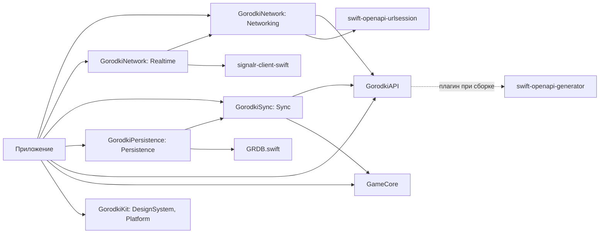
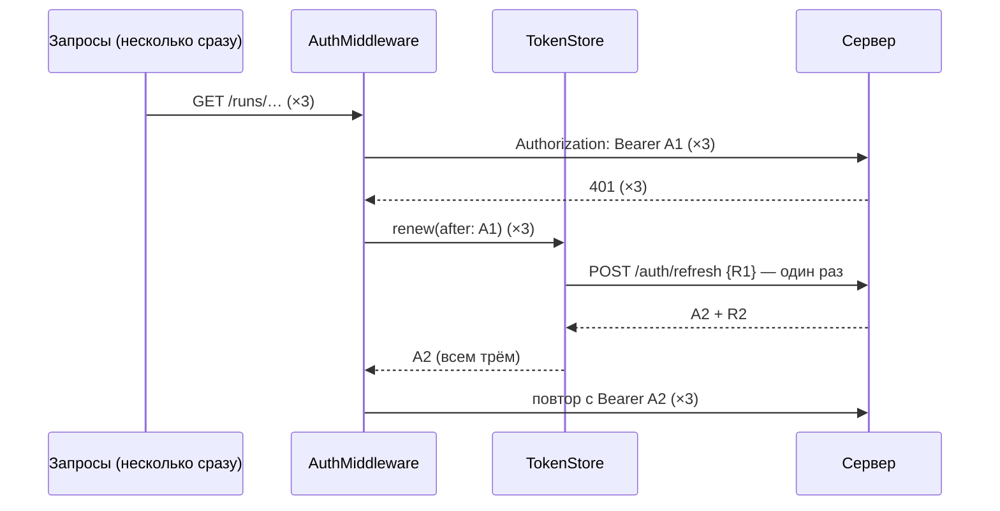

# Приложение: как собраны сеть, вход и синхронизация

Код: `ios/App/AppDependencies.swift` и пакет `ios/Packages/GorodkiNetwork` (библиотеки `Networking` и `Realtime`).
Сетевой слой — чистый Swift без UIKit и SwiftUI, его тесты идут на Linux в CI (`ios-core`). Keychain есть только
на платформах Apple, поэтому он спрятан за протоколом `TokenStorage`, а в тестах его заменяет память.

## Пакеты



Клиент API генерирует плагин при сборке ([ADR 0004](../adr/0004-openapi-swift.md)). Поэтому `xcodebuild` из командной
строки запускается с `-skipPackagePluginValidation` (`ios.yml`, `ipa.yml`, `ios-snapshots.yml`). В Xcode при первой
сборке нужно один раз нажать «Trust & Enable» у плагина. Внешние зависимости пакетов (генератор, SignalR, GRDB и их
зависимости) повторены в `ios/project.yml` точными версиями из `Package.resolved` пакетов: у сгенерированного проекта
своего `Package.resolved` нет, и без этого приложение собиралось бы с новейшими версиями, а не с проверенными.

## `AppDependencies`

Создаётся один раз при запуске (`AppDependencies.shared`), экраны получают его параметром.

| Что | Откуда | Если сервер не настроен |
|---|---|---|
| `serverURL` | Info.plist `GorodkiServerURL` ← `GORODKI_SERVER_URL` | `nil` |
| `tokens` | `TokenStore` поверх Keychain (сервис — bundle ID + `.auth`) | Работает: вход хранится и без сервера |
| `api` | `ClientFactory.make` — сгенерированный `Client` с `AuthMiddleware` | `nil` |
| `signIn` | `SignInService` — вход и выход ([ниже](#вход)) | `nil` |
| `realtime` | `RealtimeClient` с подключением `SignalRConnector` ([ниже](#реальное-время)) | `nil` |
| `territory` | `TerritoryCache` — земля «Бега» по тайлам с видимыми версиями ([territory-map.md](territory-map.md)), карта (этап 2) берёт тайлы отсюда | `nil` |
| `fog` | `FogCache` — свой туман «Пешком» ([fog.md](fog.md)) | `nil` |
| `tileLocation` | Земля и туман на диске — `Caches/gorodki-tiles` ([ниже](#данные-на-телефоне)) | Работает |
| `account` | `AccountService` — зоны приватности, `DELETE /me`, `GET /me/export` (только запросы, экранов нет) | `nil` |
| `history` | `RunHistory` — законченные забеги с точками (в той же базе, что очередь) | Работает |
| `exports` | `ExportFolder` — `Documents/Exports`, видна в «Файлах» | Работает |
| `syncStore` | Очередь синхронизации, общая для `RunRecorder` и `SyncEngine` | Работает: забеги копятся |
| `rules` | `RulesStore` — правила для нового забега (`GET /config`, файл `rules.json`) | Работает: версия 1, с которой собрано приложение |
| `installation` | `InstallationID` — `deviceId` забегов (Keychain, сервис — bundle ID + `.install`) | Работает |
| `startRun(league:motionAuthorized:)` | Забег с правилами последней известной версии, установкой и игроком → `RunSession`, проход синхронизации | Забег копится в очереди; без входа — `nil` |
| `startProbeRun(league:motionAuthorized:)` | Пробный забег «Лаборатории» ([ниже](#пробный-забег-лаборатории)): то же, но без входа — хозяин `lab`, без синхронизации | Работает |
| `syncEngine()` | `SyncEngine` вошедшего игрока (`sub` из access-токена), один на игрока | `nil` |
| `wipeLocalData()` | Стереть всё об игроке на телефоне ([ниже](#данные-на-телефоне)) — выход и удаление аккаунта | Работает |
| `deleteAccount()`, `exportMyData()`, `exportRunGPX(_:)` | Удалить аккаунт и стереть телефон; «мои данные» и след забега (GPX 1.1) — файлом в `Exports/` | Сервер — `nil`; GPX работает |
| `RunController.shared` | Забег для экрана: «Старт», «Финиш», снимок, Live Activity, продолжение при запуске, демо-повтор ([sync.md](sync.md#трекер-runtracker), [ниже](#запуск-и-фон)). Разрешение на геопозицию не спрошено — `locationNotDetermined`, экран зовёт `requestLocationAuthorization()`; запрещено — `locationDenied`, только Настройки | «Старт» — `notSignedIn` |

Очередь хранится в базе приложения (`GRDBSyncStore`, [sync.md](sync.md#хранилище-очереди-grdb)) и переживает выгрузку
приложения и перезапуск телефона. Если базу не открыть, `AppDependencies.live()` берёт очередь в памяти
(`queueSurvivesRestart == false` — забег, не доставленный до выгрузки, пропадёт; экран забега предупредит).

## Данные на телефоне

| Что | Где | Стирается |
|---|---|---|
| Вход | Keychain ([ниже](#keychain)) | `wipeLocalData` |
| Очередь синхронизации | `gorodki.sqlite`, таблицы `sync*` ([sync.md](sync.md#хранилище-очереди-grdb)) | После подтверждения сервером; `wipeLocalData` — вся, с недоставленными забегами; пробные забеги — «Удалить пробные забеги» |
| История забегов | `gorodki.sqlite`, таблица `runHistory` | `wipeLocalData`; предел хранения — `RunHistory.defaultRetention` (`nil` — все, число за Никитой) |
| Правила | `Application Support/rules.json` | `wipeLocalData` |
| Запись демо-повтора | `Application Support/demo-recording.json` | `wipeLocalData` |
| Земля и туман | `Caches/gorodki-tiles/v1/<игрок>/<кэш>/<x>_<y>.tile` | `reset()` кэша (вход и выход, `SessionRelay`), `wipeLocalData`; iOS может очистить `Caches` сама |
| Выгрузки | `Documents/Exports` (GPX, `gorodki-my-data.json`) | Нет — это файлы игрока |

- **Тайлы на диске** (`TileDiskStore`): файл на тайл — JSON с версией, временем загрузки, полезной нагрузкой (земля —
  участки, туман — биты как пришли, пустой — без бит) и CRC32, покрывающим и заголовок. Испорченный файл стирается
  и запрашивается заново. Восстановленный тайл перепроверяется у сервера со своей версией (подсказки, пока приложение
  было выгружено, потеряны); версия с диска не уменьшается — старый ответ её не затирает, как и в памяти. Стёртый
  очисткой истории тайл тумана и на диске — пустой с версией 0 ([fog.md](fog.md#приложение-кэш-тумана)). Перед каждым
  чтением кэш сверяет, кто вошёл (`TokenStore.sessionOwner`): другой игрок или выход — файлы прежнего стираются, даже
  если событие выхода потерялось; недоступный Keychain — не выход, файлы остаются. На диске — до 400 тайлов на кэш:
  лишние, давно записанные, стираются при первом обращении после запуска.
- **История забегов** (`RunHistory`): на «Финише» (и при запуске — прерванные забеги) законченные забеги очереди
  копируются с точками кусков по номеру; уже сохранённый не перезаписывается. Очередь стирает куски, как только сервер
  подтвердил забег, — GPX выгружается из истории (`GPX` в GameCore, `exportRunGPX`).
- **Выход** (`RunController.signOut`): «Финиш» идущего забега → отзыв входа на сервере → `wipeLocalData`. Удаление
  аккаунта: `DELETE /me` → `wipeLocalData`; сервер не ответил — на телефоне ничего не стёрто.
- **«Файлы».** В Info.plist `UIFileSharingEnabled` и `LSSupportsOpeningDocumentsInPlace`: папка приложения видна
  в «Файлах» («На iPhone» → «Городки») — пункт 6 листика, внешняя FS.

## Запуск и фон

`AppDelegate` (`didFinishLaunching`) работает до экрана — и при перезапуске в фоне (геопозиция забега, фоновая задача),
когда сцена может не подключиться:

1. `RunController.resumeAtLaunch()`, `WalkLab.resumeIfNeeded()` и `ProbeRun.resumeAtLaunch()` — продолжить забег,
   прогулку или пробный забег «Лаборатории».
2. `BackgroundSync.register()` — фоновые задачи досылки ([sync.md](sync.md#в-фоне)). Идентификаторы — из Info.plist
   (`BGTaskSchedulerPermittedIdentifiers`, подставляется при сборке), а не из bundle ID во время работы: Sideloadly может
   его сменить, и iOS не приняла бы задачи. Отказ регистрации и ошибку последней заявки показывает «Проверка установки».
3. `NetworkWatcher`, `SessionRelay`, `RealtimeRelay` — слушатели сети, входа и подсказок ([ниже](#реальное-время)).
   При запуске соединение они не открывают: оно открывается только на переднем плане — при переходе в `.active`
   (`GorodkiApp`) или при входе в открытом приложении (`SessionRelay`).

- **Live Activity.** У забега, прогулки и пробного забега «Лаборатории» и проверки установки один тип атрибутов,
  поэтому каждый хранит идентификатор своей плашки в UserDefaults (`LiveActivitySlot`) и после перезапуска закрывает
  или подхватывает только её. Забегу, продолженному в фоне, плашка показывается, когда приложение откроют: из фона
  ActivityKit её не запускает.
  Идентификатор забывается только после закрытия плашки (и только если за это время не запомнили новый): забег,
  закончившийся по пределу длины в фоне, может не успеть закрыть плашку до того, как iOS усыпит или выгрузит
  приложение: усыпит — плашку закроет начатое закрытие, когда приложение проснётся; выгрузит — `RunController` при
  следующем запуске.
- **Демо-повтор** держит настоящую геопозицию, но её точки выбрасывает (`RunLocationSource.keepAlive`): без неё iOS
  усыпила бы приложение на заблокированном экране, и повтор встал бы (PLAN.md, §7.2). Без разрешения на геопозицию
  сессии нет: не спрошенное разрешение она запросила бы посреди повтора. Тогда повтор встаёт на заблокированном экране —
  для демо это допустимо.
- **Манифесты приватности** — `App/PrivacyInfo.xcprivacy` и `Widgets/PrivacyInfo.xcprivacy`, ресурсы в `project.yml`.
  API «с обязательной причиной»: UserDefaults (CA92.1) и `ProcessInfo.systemUptime` (35F9.1, `RealtimeClient`); данные
  на сервер: точная геопозиция, движение и шаги, аккаунт, идентификатор установки. Расширение ни того ни другого не
  использует. Без манифеста App Store Connect не примет сборку Paid.

## Пробный забег «Лаборатории»

Вход через Google ждёт Client ID, поэтому настоящий забег на телефоне пока не начать, а прогулка S1 идёт своими
источниками мимо трекера и базы. «Лаборатория → Пробный забег (без сервера)» (`ProbeRun`, `ios/App/Lab/`) проходит
весь путь забега: `RunLocationSource`/`RunMotionSource` → `RunTracker` → `RunSession` (судья, петли, туман) →
`RunRecorder` → очередь в базе ([проба на прогулке](../guides/probe-walk.md)).

- **Без входа и сервера:** забег пишется с хозяином `LocalRun.labOwnerId` («lab») и правилами последней известной
  версии (без сервера — с которыми собрано приложение). Синхронизация берёт только забеги вошедшего игрока, история
  забегов пробные не сохраняет — они остаются в очереди на телефоне до «Удалить пробные забеги» (`removeLabRuns`)
  или `wipeLocalData`.
- **Трекер один за раз:** пока занят `RunController` (забег, «Старт», повтор, продолжение), пробный не начинается,
  и наоборот (`TrackerError.alreadyRunning`); выход из аккаунта сначала заканчивает пробный.
- **Перезапуск** — как у настоящего: подсказка в UserDefaults, `RunTracker.recover(labProbe: true)`, своя плашка
  (слот `lab.probe.activityID`). Продолжения разделены по хозяину: пробный и настоящий забеги не закрывают друг друга.
  Счёт экрана (принято, отброшено судьёй, петли, туман) переживает перезапуск — прежний хранится в UserDefaults.
- **По очереди** (`QueuedRunSummary`): куски и точки в базе, разрывы GPS длиннее 15 с, на сколько отметка датчиков
  отстаёт от последней записанной точки (обычно 10–15 с; больше — таймер трекера вставал).

## Адрес сервера

Пока сервер не развёрнут, адрес пуст, и это обычное состояние: клиента нет, синхронизация не запускается,
«Лаборатория → Сервер» показывает «адрес не задан».

Свой адрес задаётся в `ios/Config/Local.xcconfig` (он в `.gitignore`). В xcconfig `//` начинает комментарий, поэтому:

```
GORODKI_SERVER_URL = https:/$()/gorodki.example.com
```

`ServerURL.parse` принимает только `https` или `http` с хостом и убирает `/` на конце: пути API начинаются с `/`.
`http` нужен для своего сервера на компьютере: App Transport Security не блокирует `localhost` и IP-адреса. Логин,
пароль, параметры и `#` отвергаются. Info.plist можно прочитать из IPA, поэтому ключей и паролей в адресе быть не должно.

## Вход

`SignInService` (библиотека `Networking`) — `POST /auth/google` и `POST /auth/logout`. ID-токен даёт Google Sign-In
на телефоне; он подключится вместе с экраном входа, когда будет Client ID (#4).

1. **Первая попытка — только ID-токен.** Существующий игрок входит сразу (`.signedIn`). Для нового сервер отвечает, чего
   не хватает; первым он проверяет возраст, поэтому `age_confirmation_required`, `consent_required` или
   `invite_required` на запрос без регистрации значат «игрок новый» → `.registrationNeeded`.
2. **Регистрация** — инвайт (пробелы по краям убираются), 16+ и согласие, затем повтор с тем же ID-токеном (Google
   выдаёт его на час). Версия соглашения — та, текст которой показывает приложение (`SignInService.consentVersion` = 1).
   Согласие не отмечено — «прими правила»; отмечено, а сервер ждёт новее — «обнови приложение».
3. **Ответы → текст для игрока** (`SignInFailure.message`): неверный или закончившийся инвайт, нет 16+, аккаунт
   удаляется, Google не подтвердил, сервер не настроен, нет сети. `sign_in_conflict` (409) повторяется один раз сам.
4. **Выход** — сначала отзыв токенов на сервере (`POST /auth/logout` с refresh-токеном), потом стирание с телефона;
   без сети выход всё равно выполняется. Смену входа подхватывает `SessionRelay` (реальное время, синхронизация).

## Вход и обновление токена

Контракт сервера описан в [auth.md](auth.md): access-токен живёт 15 минут, refresh-токен — 30 дней и меняется при каждом
обновлении. После замены у старого refresh-токена есть 60 секунд льготного окна, потом его повтор считается кражей.



- **Одно обновление на все 401.** Второй `POST /auth/refresh` с тем же токеном сервер принял бы за повтор, а позже
  60 секунд — за кражу. `TokenStore.renew` ждёт уже идущее обновление, а если пару уже обновили, сразу отдаёт новую.
- **Повтор — один.** Второй 401 возвращается вызывающему как есть.
- **Выход — только по ответу сервера.** Если `/auth/refresh` отвечает 401 (`refresh_invalid`, `refresh_reused`), токены
  стираются, в `TokenStore.events` приходит `signedOut(.sessionExpired(code:))`, а вызывающий получает исходный 401:
  `SyncEngine` остановит проход с `unauthorized`. При сбое сети, 5xx или 429 запрос завершается ошибкой
  (синхронизация: `offline`), вход сохраняется, и следующий 401 попробует обновить пару снова.
- **Без чужого входа.** Если игрок вышел и вошёл, пока запрос был в пути, запрос не повторяется с токеном нового входа,
  а ответ обновления прежнего входа ничего не меняет.
- **Запросы входа** (`signInWithGoogle`, `refreshSession`, `logout`) не подписываются: ключ у них в теле.
  Само обновление идёт отдельным клиентом без `AuthMiddleware`.
- Тело запроса нужно отправить дважды. Тела сгенерированного клиента уже лежат в памяти, а одноразовый поток
  читается в память до 8 МБ.

## Реальное время

Протокол и что приходит — в [realtime.md](realtime.md). В приложении одно соединение (`RealtimeClient`) — под тем, кто
сейчас вошёл. `Realtime` — отдельная библиотека пакета, чтобы остальным не тянуть SignalR.

| Событие приложения | Что делает |
|---|---|
| На переднем плане (`scenePhase == .active`) | `start()`: подключиться; если ждёт повтора — подключиться сейчас |
| В фоне (`.background`) | `stop()`: закрыть соединение — подсказки некому показывать, а сервер держит не больше трёх соединений на игрока |
| Сеть вернулась (`NWPathMonitor`) | `wake()`: не ждать паузы, шаг повторов сначала |
| Вход или выход (`SessionRelay`) | `stop()`: соединение держит токен прежнего входа; кэши земли и тумана — `reset()` (видимые версии и туман у каждого игрока свои); после входа — `start()` (если приложение открыто) и проход синхронизации без ожидания: выход во время долгого прохода не ждёт его конца |
| `.connected`, `.captureDecided` | Проход синхронизации (`SyncScheduler.trigger(.hint)`, без ожидания — подсказки во время прохода склеиваются в один следующий); после `.connected` ещё `fog.invalidate()` — подсказки за время разрыва потеряны |
| `.fogChanged` | `fog.invalidate()`: свои тайлы тумана перезапросятся с версиями, когда карта их покажет |
| `.tilesChanged` | Лига «Бег» — `territory.markChanged(tiles)`: карта (этап 2) перезапросит эти тайлы с известными версиями |

- **Повторы.** Соединение, прожившее 30 секунд и больше, закрылось (обычно — истёк токен): переподключение сразу. Иначе
  паузы 1, 2, 4, 8, 16, 30 секунд и дальше по 30, без конца. Стандартная политика SignalR (0, 2, 10, 30 с — и сдаться)
  короче холодного старта Render Free, поэтому встроенное переподключение выключено: каждое подключение — новое
  соединение SignalR. `wake()` во время попытки тоже работает: если попытка не удалась, следующая идёт без паузы.
- **Токен.** Он передаётся один раз при подключении, а 401 здесь не исправить повтором запроса. Поэтому перед
  подключением `TokenStore.validAccessToken` проверяет, что токену жить ещё минуту, и иначе обновляет пару заранее — тем
  же единственным обновлением, что и после 401. Срок токена, полученного в этом запуске, считается от минуты получения по
  его длительности (`exp − iat`), а не по часам телефона: со сбитыми часами каждый новый токен казался бы истёкшим, и
  пара менялась бы на каждой попытке. Если сервер всё же ответил 401 на согласовании (сменился ключ подписи), пара
  обновляется для следующего подключения.
- **Особенности клиента SignalR 1.0.** `invoke` ждёт ответа без отмены, а закрытие соединения ожидающие вызовы не
  завершает — вызов, ответ на который потерялся (сервер закрыл четвёртое соединение игрока, деплой), висел бы вечно.
  Поэтому `Subscribe` уходит через `send`, без ожидания ответа. `start` не замечает отмены, поэтому отмена и срок
  60 секунд закрывают подключение явно — остановленный цикл не оставляет висящих соединений.
- **Входа нет** — цикл подключения останавливается без повторов; после входа его запускает `SessionRelay`. Экран входа
  ждёт Client ID (#4).
- **Лига** — `run`, смена — `select(_:)`: подписка меняется на текущем соединении и действует для следующих.
- **Диагностика** (`diagnostics`) — для «Лаборатории → Сервер» (спайк S7): состояние, «нужен вход» (цикл остановился
  без входа), сколько раз соединение восстановилось само после разрыва (новое после `stop`/`start` — не в счёт)
  и сколько секунд назад пришла последняя подсказка сервера (`.connected` — не подсказка).
- **Потоки событий** (`RealtimeClient.events`, `TokenStore.events`) слушают `RealtimeRelay` и `SessionRelay` всё время
  жизни приложения, а не `.task` экрана: отмена чтения закрыла бы поток навсегда. Запускает их `AppDelegate`
  ([выше](#запуск-и-фон)).

## Keychain

Одна запись `kSecClassGenericPassword`, в ней JSON с обоими токенами. Поэтому «новый access при старом refresh» не бывает.

- **Доступ** — `AfterFirstUnlockThisDeviceOnly`. Фоновые трекинг и синхронизация работают при заблокированном экране.
  В резервную копию и на новый телефон токены не переезжают: восстановленный старый refresh-токен сервер принял бы
  за кражу.
- **Недоступный Keychain — ещё не выход.** Так бывает до первой разблокировки после включения. `current()` вернёт `nil`,
  но не запомнит этого и прочитает Keychain снова при следующем вызове.
- **Запись не удалась.** Вход работает по копии в памяти, запись повторяется при следующем обращении. После обновления
  на сервере действует только новая пара, так что терять её нельзя.
- **При переустановке** Keychain не чистится: еженедельная переустановка через Sideloadly не требует входить заново.
- **При печати** `AuthTokens` показывает только игрока, сами токены в журналы не попадают.

## Проверки

`swift test --package-path ios/Packages/GorodkiNetwork`, в CI — шаг `ios-core`.

- **`AuthMiddleware` отдельно:**
  - подпись;
  - одно обновление и повтор;
  - 20 одновременных 401 — ровно одно обновление;
  - отказ → выход;
  - нет сети → вход сохранён;
  - второй 401;
  - старый токен после обновления;
  - чужой вход;
  - выход во время обновления;
  - повтор одноразового тела.
- **`TokenStore`:** перезапуск, выход, недоступный и испорченный Keychain, повтор записи, «кто вошёл» для кэша тайлов.
- **Тайлы на диске:** перезапуск без сети, версия с диска и после перезапуска не уменьшается, время загрузки из файла
  (угасание, часы назад), 6 видов порчи файла, смена аккаунта (и в работающем приложении), выход (и потерянное событие),
  недоступный Keychain, `reset` во время запроса, стёртый очисткой тайл тумана после перезапуска.
- **`AccountService`** на сгенерированном клиенте: пути и методы, тело новой зоны, 404 при удалении зоны — успех,
  409 `zone_limit`, `DELETE /me` и 404, «мои данные».
- **`SignInService`** на сгенерированном клиенте с сервером-подменой: существующий игрок — один запрос без регистрации;
  новый — регистрация и повтор тем же токеном; каждый код ответа → итог; конфликт — один повтор; нет сети; выход —
  отзыв и стирание (и без сети). Мутационная проверка: 7 поломок — все пойманы.
- **Токен для реального времени:** запас минута (ровно минута — ещё годится), истёкший или без срока, часы телефона
  сбиты на ±20 минут, после перезапуска, отказ, нет сети, выход и вход во время обновления, три одновременных запроса —
  одно обновление.
- **`RealtimeClient`** с подменой соединения и часов (без сети):
  - подписка и порядок подсказок;
  - паузы 1…30 с;
  - сразу после долгого соединения и с паузой после короткого;
  - отказ подписки;
  - нет входа;
  - остановка во время рукопожатия, подписки и паузы;
  - `wake` во время паузы и попытки, повторный `start`;
  - смена лиги до, во время и после подписки, отказ при смене.

  Мутационная проверка: 13 намеренных поломок (сброс шага, повтор подписки, закрытие после остановки, запас токена,
  срок от получения и другие) — каждую ловит хотя бы один тест.
- **Проба против настоящего хаба** (24.09, не в CI): `SignalRConnector` и `RealtimeClient` против сервера с настоящим
  `GameHub` и той же настройкой входа, что в `Program.cs`, — подключение и подписка, разбор `TilesChanged`
  и `CaptureDecided`, смена лиги (подсказки прежней больше не приходят), закрытие сервером по сроку токена →
  одно обновление пары → переподключение с той же лигой, 401 на согласовании → обновление → подключение. На Linux
  клиент 1.0 умеет только LongPolling (WebSocket не поддержан, Server-Sent Events роняет URLSession бесконечным
  тайм-аутом) — `SignalRConnector` там выбирает его сам. На iPhone — WebSocket; он ещё не проверен на устройстве.
- **Сквозные тесты** на сгенерированном клиенте с транспортом, который ведёт себя как сервер входа: `POST /auth/refresh`
  без подписи с refresh-токеном в теле, отказ с кодом, 503.
- **Сборка:** код Keychain и экранов собирает `ios-build` (Xcode).
