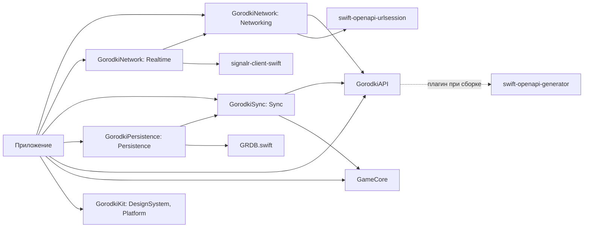
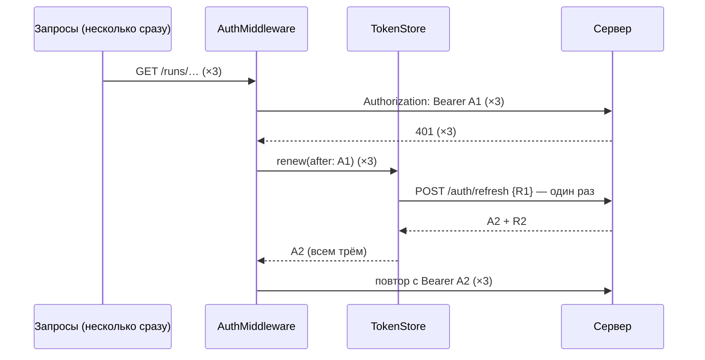

# Приложение: как собраны сеть, вход и синхронизация

Код: `ios/App/AppDependencies.swift` и пакет `ios/Packages/GorodkiNetwork` (библиотеки `Networking` и `Realtime`).
Сетевой слой — чистый Swift без UIKit и SwiftUI, его тесты идут на Linux в CI (`ios-core`). Keychain есть только
на платформах Apple, поэтому он спрятан за протоколом `TokenStorage`, а в тестах его заменяет память.

## Пакеты



Клиент API генерирует плагин при сборке ([ADR 0004](../adr/0004-openapi-swift.md)). Поэтому `xcodebuild` из командной
строки запускается с `-skipPackagePluginValidation` (`ios.yml`, `ipa.yml`, `ios-snapshots.yml`). В Xcode при первой
сборке нужно один раз нажать «Trust & Enable» у плагина. Внешние зависимости пакетов (генератор, SignalR, GRDB и их
зависимости) повторены в `ios/project.yml` точными версиями из `Package.resolved` пакетов: у сгенерированного проекта
своего `Package.resolved` нет, и без этого приложение собиралось бы с новейшими версиями, а не с проверенными.

## `AppDependencies`

Создаётся один раз при запуске (`AppDependencies.shared`), экраны получают его параметром.

| Что | Откуда | Если сервер не настроен |
|---|---|---|
| `serverURL` | Info.plist `GorodkiServerURL` ← `GORODKI_SERVER_URL` | `nil` |
| `tokens` | `TokenStore` поверх Keychain (сервис — bundle ID + `.auth`) | Работает: вход хранится и без сервера |
| `api` | `ClientFactory.make` — сгенерированный `Client` с `AuthMiddleware` | `nil` |
| `signIn` | `SignInService` — вход и выход ([ниже](#вход)) | `nil` |
| `realtime` | `RealtimeClient` с подключением `SignalRConnector` ([ниже](#реальное-время)) | `nil` |
| `territory` | `TerritoryCache` — земля «Бега» по тайлам с видимыми версиями ([territory-map.md](territory-map.md)), карта берёт тайлы отсюда ([ниже](#карта)) | `nil` |
| `fog` | `FogCache` — свой туман «Пешком» ([fog.md](fog.md)) | `nil` |
| `tileLocation` | Земля и туман на диске — `Caches/gorodki-tiles` ([ниже](#данные-на-телефоне)) | Работает |
| `account` | `AccountService` — зоны приватности, `DELETE /me`, `GET /me/export`, `DELETE /fog`, `PUT /me/public-profile`; экраны — «Настройки» и «Приватные зоны» ([ниже](#профиль-и-настройки)) | `nil` |
| `history` | `RunHistory` — законченные забеги с точками (в той же базе, что очередь) | Работает |
| `exports` | `ExportFolder` — `Documents/Exports`, видна в «Файлах» | Работает |
| `syncStore` | Очередь синхронизации, общая для `RunRecorder` и `SyncEngine` | Работает: забеги копятся |
| `rules` | `RulesStore` — правила для нового забега (`GET /config`, файл `rules.json`) | Работает: версия 1, с которой собрано приложение |
| `installation` | `InstallationID` — `deviceId` забегов (Keychain, сервис — bundle ID + `.install`) | Работает |
| `startRun(league:motionAuthorized:)` | Забег с правилами последней известной версии, установкой и игроком → `RunSession`, проход синхронизации | Забег копится в очереди; без входа — `nil` |
| `startProbeRun(league:motionAuthorized:)` | Пробный забег «Лаборатории» ([ниже](#пробный-забег-лаборатории)): то же, но без входа — хозяин `lab`, без синхронизации | Работает |
| `syncEngine()` | `SyncEngine` вошедшего игрока (`sub` из access-токена), один на игрока | `nil` |
| `wipeLocalData()` | Стереть всё об игроке на телефоне ([ниже](#данные-на-телефоне)) — выход и удаление аккаунта | Работает |
| `deleteAccount()`, `exportMyData()`, `exportRunGPX(_:)` | Удалить аккаунт и стереть телефон; «мои данные» и след забега (GPX 1.1) — файлом в `Exports/` | Сервер — `nil`; GPX работает |
| `RunController.shared` | Забег для экрана: «Старт», «Финиш», снимок, Live Activity, продолжение при запуске, демо-повтор ([sync.md](sync.md#трекер-runtracker), [ниже](#запуск-и-фон)). Разрешение на геопозицию не спрошено — `locationNotDetermined`, экран зовёт `requestLocationAuthorization()`; запрещено — `locationDenied`, только Настройки | «Старт» — `notSignedIn` |

Очередь хранится в базе приложения (`GRDBSyncStore`, [sync.md](sync.md#хранилище-очереди-grdb)) и переживает выгрузку
приложения и перезапуск телефона. Если базу не открыть, `AppDependencies.live()` берёт очередь в памяти
(`queueSurvivesRestart == false` — забег, не доставленный до выгрузки, пропадёт; экран забега предупредит).

## Данные на телефоне

| Что | Где | Стирается |
|---|---|---|
| Вход | Keychain ([ниже](#keychain)) | `wipeLocalData` |
| Очередь синхронизации | `gorodki.sqlite`, таблицы `sync*` ([sync.md](sync.md#хранилище-очереди-grdb)) | После подтверждения сервером; `wipeLocalData` — вся, с недоставленными забегами; пробные забеги — «Удалить пробные забеги» |
| История забегов | `gorodki.sqlite`, таблица `runHistory` | `wipeLocalData`; предел хранения — `RunHistory.defaultRetention` (`nil` — все, число за Никитой) |
| Правила | `Application Support/rules.json` | `wipeLocalData` |
| Запись демо-повтора | `Application Support/demo-recording.json` | `wipeLocalData` |
| «Дом» | `Application Support/home.json` (`HomeStore`) — только на телефоне, сервер его не знает | `wipeLocalData`; «Настройки → Дом → Убрать» |
| Земля и туман | `Caches/gorodki-tiles/v1/<игрок>/<кэш>/<x>_<y>.tile` | `reset()` кэша (вход и выход, `SessionRelay`), `wipeLocalData`; iOS может очистить `Caches` сама |
| Выгрузки | `Documents/Exports` (GPX, `gorodki-my-data.json`) | Нет — это файлы игрока |

- **Тайлы на диске** (`TileDiskStore`): файл на тайл — JSON с версией, временем загрузки, полезной нагрузкой (земля —
  участки, туман — биты как пришли, пустой — без бит) и CRC32, покрывающим и заголовок. Испорченный файл стирается
  и запрашивается заново. Восстановленный тайл перепроверяется у сервера со своей версией (подсказки, пока приложение
  было выгружено, потеряны); версия с диска не уменьшается — старый ответ её не затирает, как и в памяти. Стёртый
  очисткой истории тайл тумана и на диске — пустой с версией 0 ([fog.md](fog.md#приложение-кэш-тумана)). Перед каждым
  чтением кэш сверяет, кто вошёл (`TokenStore.sessionOwner`): другой игрок или выход — файлы прежнего стираются, даже
  если событие выхода потерялось; недоступный Keychain — не выход, файлы остаются. На диске — до 400 тайлов на кэш:
  лишние, давно записанные, стираются при первом обращении после запуска.
- **История забегов** (`RunHistory`): на «Финише» (и при запуске — прерванные забеги) законченные забеги очереди
  копируются с точками кусков по номеру; уже сохранённый не перезаписывается. Очередь стирает куски, как только сервер
  подтвердил забег, — GPX выгружается из истории (`GPX` в GameCore, `exportRunGPX`).
- **Выход** (`RunController.signOut`): «Финиш» идущего забега → отзыв входа на сервере → `wipeLocalData`. Удаление
  аккаунта: `DELETE /me` → `wipeLocalData`; сервер не ответил — на телефоне ничего не стёрто.
- **«Файлы».** В Info.plist `UIFileSharingEnabled` и `LSSupportsOpeningDocumentsInPlace`: папка приложения видна
  в «Файлах» («На iPhone» → «Городки») — пункт 6 листика, внешняя FS.

## Запуск и фон

`AppDelegate` (`didFinishLaunching`) работает до экрана — и при перезапуске в фоне (геопозиция забега, фоновая задача),
когда сцена может не подключиться:

1. `RunController.resumeAtLaunch()`, `WalkLab.resumeIfNeeded()` и `ProbeRun.resumeAtLaunch()` — продолжить забег,
   прогулку или пробный забег «Лаборатории».
2. `BackgroundSync.register()` — фоновые задачи досылки ([sync.md](sync.md#в-фоне)). Идентификаторы — из Info.plist
   (`BGTaskSchedulerPermittedIdentifiers`, подставляется при сборке), а не из bundle ID во время работы: Sideloadly может
   его сменить, и iOS не приняла бы задачи. Отказ регистрации и ошибку последней заявки показывает «Проверка установки».
3. `NetworkWatcher`, `SessionRelay`, `RealtimeRelay` — слушатели сети, входа и подсказок ([ниже](#реальное-время)).
   При запуске соединение они не открывают: оно открывается только на переднем плане — при переходе в `.active`
   (`GorodkiApp`) или при входе в открытом приложении (`SessionRelay`).

- **Live Activity.** У забега, прогулки и пробного забега «Лаборатории» и проверки установки один тип атрибутов,
  поэтому каждый хранит идентификатор своей плашки в UserDefaults (`LiveActivitySlot`) и после перезапуска закрывает
  или подхватывает только её. Забегу, продолженному в фоне, плашка показывается, когда приложение откроют: из фона
  ActivityKit её не запускает.
  Идентификатор забывается только после закрытия плашки (и только если за это время не запомнили новый): забег,
  закончившийся по пределу длины в фоне, может не успеть закрыть плашку до того, как iOS усыпит или выгрузит
  приложение: усыпит — плашку закроет начатое закрытие, когда приложение проснётся; выгрузит — `RunController` при
  следующем запуске.
- **Демо-повтор** держит настоящую геопозицию, но её точки выбрасывает (`RunLocationSource.keepAlive`): без неё iOS
  усыпила бы приложение на заблокированном экране, и повтор встал бы (PLAN.md, §7.2). Без разрешения на геопозицию
  сессии нет: не спрошенное разрешение она запросила бы посреди повтора. Тогда повтор встаёт на заблокированном экране —
  для демо это допустимо.
- **Манифесты приватности** — `App/PrivacyInfo.xcprivacy` и `Widgets/PrivacyInfo.xcprivacy`, ресурсы в `project.yml`.
  API «с обязательной причиной»: UserDefaults (CA92.1) и `ProcessInfo.systemUptime` (35F9.1, `RealtimeClient`); данные
  на сервер: точная геопозиция, движение и шаги, аккаунт, идентификатор установки. Расширение ни того ни другого не
  использует. Без манифеста App Store Connect не примет сборку Paid.

## Пробный забег «Лаборатории»

Вход через Google ждёт Client ID, поэтому настоящий забег на телефоне пока не начать, а прогулка S1 идёт своими
источниками мимо трекера и базы. «Лаборатория → Пробный забег (без сервера)» (`ProbeRun`, `ios/App/Lab/`) проходит
весь путь забега: `RunLocationSource`/`RunMotionSource` → `RunTracker` → `RunSession` (судья, петли, туман) →
`RunRecorder` → очередь в базе ([проба на прогулке](../guides/probe-walk.md)).

- **Без входа и сервера:** забег пишется с хозяином `LocalRun.labOwnerId` («lab») и правилами последней известной
  версии (без сервера — с которыми собрано приложение). Синхронизация берёт только забеги вошедшего игрока, история
  забегов пробные не сохраняет — они остаются в очереди на телефоне до «Удалить пробные забеги» (`removeLabRuns`)
  или `wipeLocalData`.
- **Трекер один за раз:** пока занят `RunController` (забег, «Старт», повтор, продолжение), пробный не начинается,
  и наоборот (`TrackerError.alreadyRunning`); выход из аккаунта сначала заканчивает пробный (не закончился — выхода
  нет).
- **Перезапуск** — как у настоящего: подсказка в UserDefaults, `RunTracker.recover(labProbe: true)`, своя плашка
  (слот `lab.probe.activityID`). Продолжения разделены по хозяину: пробный и настоящий забеги не закрывают друг друга.
  Счёт экрана (принято, отброшено судьёй, петли, туман) переживает перезапуск — прежний хранится в UserDefaults;
  туман после перезапуска считается заново, и пройденные снова клетки прибавляются ещё раз.
- **По очереди** (`QueuedRunSummary`): куски и точки в базе, разрывы GPS длиннее 15 с, на сколько отметка датчиков
  отстаёт от последней записанной точки (обычно 10–15 с; больше — таймер трекера вставал). Перезапуск даёт один разрыв:
  время до нового запуска и незапечатанный хвост (до минуты).

## Адрес сервера

Пока сервер не развёрнут, адрес пуст, и это обычное состояние: клиента нет, синхронизация не запускается,
«Лаборатория → Сервер» показывает «адрес не задан».

Свой адрес задаётся в `ios/Config/Local.xcconfig` (он в `.gitignore`). В xcconfig `//` начинает комментарий, поэтому:

```
GORODKI_SERVER_URL = https:/$()/gorodki.example.com
```

`ServerURL.parse` принимает только `https` или `http` с хостом и убирает `/` на конце: пути API начинаются с `/`.
`http` нужен для своего сервера на компьютере: App Transport Security не блокирует `localhost` и IP-адреса. Логин,
пароль, параметры и `#` отвергаются. Info.plist можно прочитать из IPA, поэтому ключей и паролей в адресе быть не должно.

## Вход

`SignInService` (библиотека `Networking`) — `POST /auth/google` и `POST /auth/logout`. ID-токен даёт Google Sign-In
на телефоне; он подключится вместе с экраном входа, когда будет Client ID (#4).

1. **Первая попытка — только ID-токен.** Существующий игрок входит сразу (`.signedIn`). Для нового сервер отвечает, чего
   не хватает; первым он проверяет возраст, поэтому `age_confirmation_required`, `consent_required` или
   `invite_required` на запрос без регистрации значат «игрок новый» → `.registrationNeeded`.
2. **Регистрация** — инвайт (пробелы по краям убираются), 16+ и согласие, затем повтор с тем же ID-токеном (Google
   выдаёт его на час). Версия соглашения — та, текст которой показывает приложение (`SignInService.consentVersion` = 1).
   Согласие не отмечено — «прими правила»; отмечено, а сервер ждёт новее — «обнови приложение».
3. **Ответы → текст для игрока** (`SignInFailure.message`): неверный или закончившийся инвайт, нет 16+, аккаунт
   удаляется, Google не подтвердил, сервер не настроен, нет сети. `sign_in_conflict` (409) повторяется один раз сам.
4. **Выход** — сначала отзыв токенов на сервере (`POST /auth/logout` с refresh-токеном), потом стирание с телефона;
   без сети выход всё равно выполняется. Смену входа подхватывает `SessionRelay` (реальное время, синхронизация).

## Вход и обновление токена

Контракт сервера описан в [auth.md](auth.md): access-токен живёт 15 минут, refresh-токен — 30 дней и меняется при каждом
обновлении. После замены у старого refresh-токена есть 60 секунд льготного окна, потом его повтор считается кражей.



- **Одно обновление на все 401.** Второй `POST /auth/refresh` с тем же токеном сервер принял бы за повтор, а позже
  60 секунд — за кражу. `TokenStore.renew` ждёт уже идущее обновление, а если пару уже обновили, сразу отдаёт новую.
- **Повтор — один.** Второй 401 возвращается вызывающему как есть.
- **Выход — только по ответу сервера.** Если `/auth/refresh` отвечает 401 (`refresh_invalid`, `refresh_reused`), токены
  стираются, в `TokenStore.events` приходит `signedOut(.sessionExpired(code:))`, а вызывающий получает исходный 401:
  `SyncEngine` остановит проход с `unauthorized`. При сбое сети, 5xx или 429 запрос завершается ошибкой
  (синхронизация: `offline`), вход сохраняется, и следующий 401 попробует обновить пару снова.
- **Без чужого входа.** Если игрок вышел и вошёл, пока запрос был в пути, запрос не повторяется с токеном нового входа,
  а ответ обновления прежнего входа ничего не меняет.
- **Запросы входа** (`signInWithGoogle`, `refreshSession`, `logout`) не подписываются: ключ у них в теле.
  Само обновление идёт отдельным клиентом без `AuthMiddleware`.
- Тело запроса нужно отправить дважды. Тела сгенерированного клиента уже лежат в памяти, а одноразовый поток
  читается в память до 8 МБ.

## Реальное время

Протокол и что приходит — в [realtime.md](realtime.md). В приложении одно соединение (`RealtimeClient`) — под тем, кто
сейчас вошёл. `Realtime` — отдельная библиотека пакета, чтобы остальным не тянуть SignalR.

| Событие приложения | Что делает |
|---|---|
| На переднем плане (`scenePhase == .active`) | `start()`: подключиться; если ждёт повтора — подключиться сейчас |
| В фоне (`.background`) | `stop()`: закрыть соединение — подсказки некому показывать, а сервер держит не больше трёх соединений на игрока |
| Сеть вернулась (`NWPathMonitor`) | `wake()`: не ждать паузы, шаг повторов сначала |
| Вход или выход (`SessionRelay`) | `stop()`: соединение держит токен прежнего входа; кэши земли и тумана — `reset()` (видимые версии и туман у каждого игрока свои); после входа — `start()` (если приложение открыто) и проход синхронизации без ожидания: выход во время долгого прохода не ждёт его конца |
| `.connected`, `.captureDecided` | Проход синхронизации (`SyncScheduler.trigger(.hint)`, без ожидания — подсказки во время прохода склеиваются в один следующий); после `.connected` ещё `fog.invalidate()` — подсказки за время разрыва потеряны |
| `.fogChanged` | `fog.invalidate()`: свои тайлы тумана перезапросятся с версиями, когда карта их покажет |
| `.tilesChanged` | Лига «Бег» — `territory.markChanged(tiles)`: карта перезапросит эти тайлы с известными версиями (раз в минуту и при сдвиге) |

- **Повторы.** Соединение, прожившее 30 секунд и больше, закрылось (обычно — истёк токен): переподключение сразу. Иначе
  паузы 1, 2, 4, 8, 16, 30 секунд и дальше по 30, без конца. Стандартная политика SignalR (0, 2, 10, 30 с — и сдаться)
  короче холодного старта Render Free, поэтому встроенное переподключение выключено: каждое подключение — новое
  соединение SignalR. `wake()` во время попытки тоже работает: если попытка не удалась, следующая идёт без паузы.
- **Токен.** Он передаётся один раз при подключении, а 401 здесь не исправить повтором запроса. Поэтому перед
  подключением `TokenStore.validAccessToken` проверяет, что токену жить ещё минуту, и иначе обновляет пару заранее — тем
  же единственным обновлением, что и после 401. Срок токена, полученного в этом запуске, считается от минуты получения по
  его длительности (`exp − iat`), а не по часам телефона: со сбитыми часами каждый новый токен казался бы истёкшим, и
  пара менялась бы на каждой попытке. Если сервер всё же ответил 401 на согласовании (сменился ключ подписи), пара
  обновляется для следующего подключения.
- **Особенности клиента SignalR 1.0.** `invoke` ждёт ответа без отмены, а закрытие соединения ожидающие вызовы не
  завершает — вызов, ответ на который потерялся (сервер закрыл четвёртое соединение игрока, деплой), висел бы вечно.
  Поэтому `Subscribe` уходит через `send`, без ожидания ответа. `start` не замечает отмены, поэтому отмена и срок
  60 секунд закрывают подключение явно — остановленный цикл не оставляет висящих соединений.
- **Входа нет** — цикл подключения останавливается без повторов; после входа его запускает `SessionRelay`. Экран входа
  ждёт Client ID (#4).
- **Лига** — `run`, смена — `select(_:)`: подписка меняется на текущем соединении и действует для следующих.
- **Диагностика** (`diagnostics`) — для «Лаборатории → Сервер» (спайк S7): состояние, «нужен вход» (цикл остановился
  без входа), сколько раз соединение восстановилось само после разрыва (новое после `stop`/`start` — не в счёт)
  и сколько секунд назад пришла последняя подсказка сервера (`.connected` — не подсказка).
- **Потоки событий** (`RealtimeClient.events`, `TokenStore.events`) слушают `RealtimeRelay` и `SessionRelay` всё время
  жизни приложения, а не `.task` экрана: отмена чтения закрыла бы поток навсегда. Запускает их `AppDelegate`
  ([выше](#запуск-и-фон)).

## Keychain

Одна запись `kSecClassGenericPassword`, в ней JSON с обоими токенами. Поэтому «новый access при старом refresh» не бывает.

- **Доступ** — `AfterFirstUnlockThisDeviceOnly`. Фоновые трекинг и синхронизация работают при заблокированном экране.
  В резервную копию и на новый телефон токены не переезжают: восстановленный старый refresh-токен сервер принял бы
  за кражу.
- **Недоступный Keychain — ещё не выход.** Так бывает до первой разблокировки после включения. `current()` вернёт `nil`,
  но не запомнит этого и прочитает Keychain снова при следующем вызове.
- **Запись не удалась.** Вход работает по копии в памяти, запись повторяется при следующем обращении. После обновления
  на сервере действует только новая пара, так что терять её нельзя.
- **При переустановке** Keychain не чистится: еженедельная переустановка через Sideloadly не требует входить заново.
- **При печати** `AuthTokens` показывает только игрока, сами токены в журналы не попадают.

## Оболочка и онбординг

Корень — `RootView`: не вошёл — онбординг, вошёл — вкладки. Вошёл ли игрок, знает `AppSession` (`App/Session`): его
обновляет `SessionRelay` — при запуске читает вход из Keychain, дальше по событиям `TokenStore.events`. Роль — claim
`role` access-токена (`AuthTokens.role`).

- **Вкладки** (`App/Shell`): системный `TabView` — Карта · Рейтинги · Клан · Профиль («Поиск» убран, PLAN.md, §5 и §15).
  «Карта» — земля, зоны «спорная», туман и лист участка ([ниже](#карта)); «Старт» ведёт в экраны забега
  ([ниже](#экраны-забега)). «Рейтинги» и «Клан» пока заглушки.
  «Профиль» — [ниже](#профиль-и-настройки): шапка, сезон, плитки, «скоро», «Забеги» (история,
  [ниже](#экраны-забега)), «Отладка», «Настройки». Выход (в «Настройках») — только после вопроса:
  идущий забег закончится, неотправленные забеги (их число — `AppDependencies.unsentRunCount`) сотрутся
  (`RunController.signOut`). Не вышло закончить забег — вход остаётся, текст ошибки под кнопкой; вход стёрт, а данные
  нет — сообщение поверх онбординга (`AppSession.notice`).
- **Онбординг** (`App/Onboarding`, PLAN.md, §3.18): три карточки интро → код приглашения (заглавными, без пробелов по
  краям — `InviteCode`) → «Мне 16 лет или больше» → «Правила игры»: «Принимаю пользовательское соглашение» со
  ссылками на соглашение и политику → «Согласие на обработку данных»: только текст согласия и отметка «Даю согласие…»
  (статья 5 Закона — «отдельно от иной информации», [consent-v1](../legal/consent-v1.md)) → «Войти через Google».
  Серверу уходит одна отметка согласия: обе обязательны ([docs/legal/README.md](../legal/README.md)). «Уже играю — войти» ведёт сразу ко входу; если аккаунта нет
  (`registrationNeeded`) — обратно к коду, а вход после согласия повторяется с тем же ID-токеном Google, без второго
  окна (токен живёт час; истёк — `googleRejected`, и окно откроется снова). Ошибки — тексты `SignInFailure.message`,
  каждая на своём шаге: «код не подошёл» — на поле кода, «подтверди возраст» — на 16+, «нужно согласие» — на
  согласии; остальные — на шаге входа. «Дом» — позже, вместе с картой.
- **Тексты docs/legal — ресурсы приложения** (`project.yml`): `LegalDocument` показывает сами файлы как есть, с
  отметками черновика; второй копии текста нет. Отметку согласия экран рисует сам — флажком под текстом, подпись —
  строка «☐ …» из раздела «Отметка» документа. Имена файлов — `*-v<SignInService.consentVersion>`: поднимут версию —
  тест приложения не найдёт файлов новой версии в сборке.
- **Google Sign-In ещё не подключён** (нет SDK и Client ID, #4): `OnboardingModel.googleToken` — `nil`, кнопка выключена
  с надписью «Вход через Google появится после настройки». Появится Client ID — подключить SDK и передать сюда функцию,
  которая возвращает ID-токен; остальное (`SignInService`, регистрация, ошибки) уже работает.
- **Отладочное меню** (`DebugMenuView`) — «Лаборатория» и «Проверка установки», бывший стартовый экран. PLAN.md, §5:
  «только роли demo и admin». Сборки команды открывают его всем (`DebugAccess`): вход ждёт Client ID, а проверки на
  телефоне нужны уже сейчас. Сборка команды — это Debug (Xcode, снимки) и **пробная сборка IPA**: ipa.yml, ручной
  запуск с галочкой `probe` — флаг `GORODKI_PROBE` (`GORODKI_PROBE_FLAG` в `project.yml`), артефакт
  `gorodki-free-ipa-probe-…`. **IPA для игроков — без галочки** (в том числе автоматический после слияния в main):
  там меню и «Посмотреть без входа» видят только роли demo и admin, и «Лаборатория» не запишет след до отметок 16+ и
  согласия. Где меню: «Профиль → Отладка» и кнопка «Отладка» в панели онбординга (только сборки команды). Там же на
  шаге входа — «Посмотреть без входа»: вкладки без аккаунта, до перезапуска.

## Карта

Вкладка «Карта» (`App/Map`, PLAN.md, §5, экраны 3–5; дизайн — docs/design/tokens.md, §3 и §8). Правило Никиты —
«не усложнять, просто чтобы задумка работала»: всё, чего нет в ответах сервера, не рисуется.

- **Модель** — `MapModel` (`@Observable`, простые значения): слой, окраска, земля (`LandMap` из GameCore) и туман
  видимых тайлов, «сейчас», выбранный участок. Данные — через протоколы: `MapDataSource`
  (живые — `CachedMapData` поверх `TerritoryCache` и `FogCache`, фикстура — `MapFixture`), `PlayerNames`
  (`GET /players/{id}`).
- **Что грузится.** Окно карты (`MapWindow`, GameCore) → тайлы земли UTM 1×1 км и тумана z14 → кэши с известными
  версиями; кэши сами решают, что перезапросить. Грузится в конце жеста и раз в минуту (запасной опрос кэша и подсказки
  реального времени, которые кэш уже пометил). Окно дальше города (больше 200 тайлов земли или 60 тумана) не грузится.
  Ошибка сети не показывается: остаётся то, что уже есть, — с диска или из прошлого ответа.
- **Слои** — «Захват | Исследование» (PLAN.md, §5; tokens.md, §8): на «Захвате» тумана нет, на «Исследовании» земли
  скрыты. Слоя «оба» в дизайне нет. На «Захвате» под переключателем — окраска «Игроки | Отношения» (моё — мой цвет,
  соперники — Red, если мой Red — Orange); «Кланы» — когда в `/territory` появится клан (#64). На «Исследовании» —
  карточка «Открыто N га · слой «Пешком»» из `GET /fog/summary`, с полем E9 — «Открыто 1,37 % Бреста · N га»;
  «+N га сегодня» — позже (fog.md).
- **Земля** (`GameMapView`, MKMapView как у стенда S4): слой MapKit на группу кусков (`LandGroup`: отношение, номер цвета
  владельца, уровень) из всех тайлов, кромки — своими слоями над заливками. Стиль — `LandStyle`: отношение
  `TerritoryRelation` (своя / соперник / призрак; клана и «Ничейных земель» в ответе нет), заливка — `PlayerColor.fill`
  уровня × множитель отношения, кромка — толщина и пунктир отношения, ночью у своей — свечение 3 pt.
  - **Слои создаются один раз** (`LandLayerOverlay` на весь мир) и дальше меняют только содержимое (новые тайлы),
    цвет (окраска, тема) и видимость (слой карты) с перерисовкой своих тайлов. Снимки показали, что после
    `removeOverlays` и `addOverlays` MapKit оставлял на экране прежнюю картинку: «Отношения» не перекрашивали землю,
    хотя рендереры для новых слоёв он создал. Смена окраски и темы теперь ничего не пересобирает.
  - **Заливка группы — одним путём** с правилом чёт-нечет (`LandLayerRenderer`): `MKMultiPolygonRenderer` закрашивал
    куски по отдельности, и по линии тайла внутри участка была видна светлая нить.
  - Карта следит за моделью сама (`withObservationTracking` в координаторе): `updateUIView` на смену окраски не пришёл;
    он передаёт только тему и «Уменьшить движение».
- **Кромки без линий сервера.** Контура, объединённого через тайлы (серверная задача C14), ещё нет, поэтому кромка
  куска — его кольца **без сторон, лежащих на линии тайла** (`LandBorders`, GameCore; допуск 5 см): соседние куски
  одного участка сходятся без шва. Остаётся: граница между двумя участками одного владельца и уровня рисуется дважды
  (не видно), а граница, идущая ровно по линии тайла, пропадает (у следа GPS почти не бывает). Придёт C14 — кромки
  брать у сервера.
- **Зоны «спорная»** — отдельный слой поверх земли: `CAShapeLayer` над картой (подложка `ants-halo` 2,6 pt, пунктир
  4/4 pt `ants-ink` 1,7 pt, фаза −8 pt за 1,2 с; «Уменьшить движение» — пунктир стоит), путь пересчитывается при
  движении карты. Только неистёкшие: версия тайла при истечении зоны не меняется, поэтому карта сравнивает `untilMs`
  с «сейчас» при отрисовке и раз в минуту (`tick`). `TerritoryCache` хранит зоны вместе с кусками и на диске; файл
  прежнего вида (только куски) читается без зон и запрашивается целиком.
- **Туман** — `MapFogRenderer`: дымка `FogStyle.haze` над дорогами, открытое вырезано маской тайла (как у стенда S4,
  с тем же переворотом маски), кромка открытого `FogStyle.edge` шириной 1,8 pt на экране — маска, сдвинутая в восемь
  сторон, минус открытое. Край мягкий: вторая маска тайла размыта один раз при сборке (σ ≈ 2 клетки,
  `FogStyle.softEdgeSigmaCells` — два прохода окна 5 клеток) вместе с краями соседних тайлов — на линии тайла шва нет
  (первый вариант размывал тайл отдельно — на снимке был виден срез). Дымка за кромкой нарастает по мягкой маске,
  кромка и прозрачное открытое — по чёткой.
- **Лист участка** — касание → `LandMap.parcel(at:tolerance:)` (`ParcelHitTest` по тайлу касания и соседним, допуск —
  22 pt в метрах текущего масштаба) → нижний лист без стекла: владелец (свой ник сразу, чужой — `GET /players/{id}`:
  ник с согласия или «Игрок #…»; не ответил — «Владелец не загрузился»), отношение, уровень «N из 3», последний визит,
  действующие щит и осада «до …», зона «спорная», если палец в живой зоне. Моменты — `MomentText` (GameCore):
  «сегодня в 14:30», «до завтра, 02:30». Площади в ответе нет — в листе её нет.
- **«Старт»** — единственная цветная кнопка: `RunStartButton` экранов забега ([ниже](#экраны-забега)) — лист
  «Новый забег» с подсказками к разрешениям, затем HUD. Своих подсказок у карты нет.
- **Движение** — только нативное и из утверждённых приёмов (tokens.md, §7): смена слоя — стекло строки окраски
  перетекает в карточку «Исследование» (`glassEffectID` в `GlassEffectContainer`), карта — кроссфейдом
  (`MotionSpec.LayerSwitch`, 0,35 с); муравьи — `CAShapeLayer`; цифры листа — `.contentTransition(.numericText())`;
  хаптика — `.selection` при выборе участка. «Уменьшить движение» — всё сразу, без переходов.
  Чего нет и почему: «дыхания» «Старта» (tokens.md, §7: блик — системный, «своё — не делать», «никаких бесконечных
  пульсаций на кнопках»), появления земли по тайлам с масштабом (оверлей MapKit так не анимируется, а перерисовка тайлов
  каждый кадр — то, от чего предостерегает §3.1), перехода листа «от точки касания» (источник перехода — вид SwiftUI,
  а касание — в MKMapView; проверить можно только на телефоне).
- **Проверки.** GameCore (`LandTests`, `MomentTextTests`, Linux): отношение, уровень, щит и осада, истёкшие зоны,
  кромки без сторон на краю тайла (и разрез посреди кольца, дыры), касание через тайл, окно карты, моменты по-русски.
  `TerritoryCache`: зоны в ответе и после перезапуска, файл прежнего вида. Приложение (`MapModelTests`, симулятор):
  цвет по отношению и уровню, «Отношения», скрытие зоны по таймеру, касание и ник, строки листа, подсказки «Старта»,
  окно и подгрузка, фикстура, слой не зависит от окраски. Снимки 24–28 (`ScreenSnapshotTests`): 28 проверяет цвет заливки
  соперника после «Отношений», 27 — смену слоя нажатием.
- **Только на телефоне:** производительность на настоящих данных (слои перестраиваются целиком при каждом новом тайле),
  жесты (касание рядом с двойным касанием-зумом, лист поверх карты), свечение своей кромки ночью, ориентация маски
  тумана (буква «Т» стенда S4), альфы на снимках MapKit Бреста (спайк S4).

## Экраны забега

PLAN.md, §5 (экраны 6, 7, 8, 10), §6.7–§6.10; логика и решения 25.09 — [run-hud.md](run-hud.md); вид — утверждённый
макет (design/APPROVALS.md). Код — `App/Run/`: модель `RunScreenModel` и `RunResultModel` (`@Observable`, простые
значения, без SwiftUI), виды — `RunStartViews`, `RunHUDView`, `CaptureCeremonyView`, `RunResultView`, `RunMapViews`,
системная часть — `RunSystem` (разрешения, голос, вибрация, компас). Всё, что считается, — в пакете Sync
(`RunScreens.swift`: числа и тексты HUD, кольцо, стрелка, сцена церемоний, Live Activity, итог) и в GameCore
(`NumberText.clock`, `pace`, `meters`) — под тестами на Linux.

- **«Старт».** Одна точка подключения к карте — `RunStartButton` (вкладка просто ставит кнопку; забег идёт — кнопка
  «Забег» открывает HUD). Лист «Новый забег»: «Бег»; «Вело» — с замком и пояснением «с Сезона 1» (D16). «Начать» →
  подсказки перед разрешениями, которых ещё не спрашивали (геопозиция «При использовании», потом «Движение и
  фитнес», одна кнопка «Продолжить», §6.6) → `RunController.start`. Геопозиция запрещена — шаг «Открыть Настройки»;
  приблизительная — запрос точной на время забега; без входа — «Забег начнётся после входа». HUD открывается, когда
  лист закрылся (два окна сразу SwiftUI не показывает).
- **HUD** — полноэкранный слой (`fullScreenCover`, zoom-переход из «Старта» или плашки). Карта Apple Maps (`.muted`):
  след цветом кромки игрока на подложке, временные контуры петель — пунктир и бледная заливка (до итога сервера,
  отказ — контур убирается; решение 9), пунктир до точки замыкания, «я» с дышащим кольцом; камера — за бегущим.
  Сверху — до двух плашек-предупреждений (`RunHUD.warnings`, тексты — `RunWarning.text`), тосты второй фазы,
  «ПОВТОР». Снизу — одна стеклянная панель: «До замыкания 140 м» (78 pt, `numericText`), стрелка в круге —
  по компасу (`CLHeading`, `HeadingSource`), без него — по курсу последних 10 м следа, без обоих — точка вместо стрелки;
  кольцо вокруг — `trim` «сколько пройдено к цели» (`ClosureProgress`), на сигналах 50/15 м пульсирует; строка «Замкни
  петлю — будет ≈ +1,2 га» (маленькая и слишком большая петля — сказать заранее); время (`Text(timerInterval:)`,
  у повтора — по времени точек), дистанция, средний темп; «+0,80 га тумана» («≥» при неизвестных тайлах); кнопки
  64 pt: «Свернуть», «Финиш — удерживай» (удержание 1 с; нажатие — вопрос «Закончить забег?»), «Голос и вибрация».
  Без «Движения» число, стрелка и сигналы спрятаны, плашка объясняет почему (решение 10).
- **Свернуть** — плашка `tabViewBottomAccessory` над таб-баром: время, дистанция, «до замыкания», значок
  пропущенных петель; нажатие — HUD. С iOS 26.1 плашка включается флагом `isEnabled`, на 26.0 модификатор ставится,
  только пока забег идёт.
- **Сигналы** (§6.9): на экране — вибрация (`UIImpactFeedbackGenerator`: 50 м — лёгкий удар, 15 м — сильный; петля,
  решение сервера, разрыв следа), в кармане и при свёрнутом HUD — голос по-русски (`AVSpeechSynthesizer`,
  `.playback`/`.voicePrompt`/`.duckOthers`, фоновый режим `audio` — PLAN.md, §7.2). Оба канала выключаются в «Голос
  и вибрация» (UserDefaults).
- **Церемония в две фазы** (решения 6–8): по номеру заявки (`CeremonyQueue`) → `CeremonyStage` (Sync). HUD виден —
  фаза 1 сразу: карта на петлю, обводка по следу, заливка от точки замыкания, кольцо-импульс и частицы цвета игрока
  (`Canvas`), «≈ +1,2 га» — по числам `MotionSpec.Capture` (≤ 2 с), как в «Лаборатории → Дизайн»; две петли подряд —
  по очереди. Фаза 2 — из `SyncReport.settledClaims` (`SyncScheduler(onReport:)` → `RunController.syncReported`): в той
  же карточке «+1,25 га», «подтверждено · 12 480 м² · 125 соток» с отскоком галочки и вибрацией, отказ — «не засчитана
  · причина» (`RefusalText`, решение 14); карточка уже закрыта — тост. Разбивки в церемонии нет. HUD не виден
  (карман, свёрнут, приложение в фоне) — Live Activity с оповещением (`AlertConfiguration`) и голос, а петли — в список
  пропущенных, он открывается, когда HUD снова на экране. «Уменьшить движение» — итог сразу.
- **Live Activity** — те же числа строками (`RunActivityText`): «До замыкания 140 м» (без стрелки; разрыв следа —
  первой строкой), «3,21 км · 5:32 /км · +0,80 га тумана»; не чаще раза в 5 с.
- **«≈+N га тумана»** — против своего тумана за всё время: `CachedAllTimeFog` поверх `FogCache` «Пешком» (трекер просит
  каждый новый тайл забега один раз). На `FogChanged` — ещё `SyncEngine.refreshFog()` (итог узнаёт «+N га» сервера).
- **Итог** — в том же полноэкранном слое, HUD «превращается» в итог после «Финиша» (и после конца по пределу длины).
  `RunResult` → `RunResultReadout`: дистанция, время, темп (накатываются), след (`trim`), «взятое» сервера рядом
  с «≈» телефона, петли с решениями, туман сервера, визиты (`visitedParcels`), разбивка по видам — после границы
  публичности, до неё «позже», разрывы следа по причинам, отказ забега. Открытие — `refreshResults(of:)`; новый отчёт
  прохода с решениями этого забега — итог пересобирается.
- **История и детали** — «Профиль → Забеги» (`RunHistory` + итог из очереди), строка раскрывается в детали
  zoom-переходом: карта следа, итог, «Экспорт GPX» (`ShareLink` на файл из `exportRunGPX`).

## Профиль и настройки

PLAN.md, §5, экраны 12, 15, 24, 26, 27; §3.10 («Дом»), §3.16 (приватность). Код — `App/Settings/`, `App/Shell/`
(`ProfileOverview`, `ScreenStates`); модели — `@Observable` с простыми значениями, запросы — через протоколы
(`SettingsAccount`, `PrivacyZoneService`), тесты моделей — `AppTests/ProfileSettingsTests.swift`. Всё, что считается, —
в пакетах под тестами на Linux: `ExplorationSummary`, `SeasonProgress` (Sync), `HomeCircle` (GameCore), `HomeStore`
(Persistence), `RequestFailure` и новые запросы `AccountService` (Networking).

- **Профиль** (экран 12, tokens.md, §8): шапка (аватар в кольце цвета игрока, ник, лига «Бег», «Ник скрыт» без
  согласия), карточка сезона — «день 10 из 14» и полоса дней (`SeasonProgress` из `/seasons`), открыто за сезон, место
  в «Кто открыл больше» (`/me/stats`); четыре плитки: открыто тумана (zoom-переход в статистику), за сезон, забеги,
  засчитанные километры (`/me/stats`; сервер без задачи #116 — «—»). Очков сезона и мест в Арене в ответах нет —
  строка «скоро». Короны, коллекция, дуэли, рюкзак, карточка недели — карточка «Скоро в профиле» (следующая волна на
  контрактах C15). Не загрузился `GET /me` — карточка «Нет сети» / «Сервер недоступен» с «Повторить».
- **Настройки** (экран 26, список без стекла): «Дом» (`HomeView`), «Приватные зоны», «Очистить историю
  исследований» (`DELETE /fog` после вопроса; `503 fog_clear_busy` — «ничего не стёрто, попробуй через минуту»; удалось —
  `FogCache.invalidate()`, карта забывает свой туман и перезапрашивает, профиль — сводку; «Дом» остаётся), «Показывать
  мой ник» (`PUT /me/public-profile` — на экране сразу, отказ — отметка обратно и причина; сервер до задачи #71
  отвечает 500 — «Сервер ответил ошибкой (500), ничего не изменилось»), документы (`LegalDocumentSheet`), «Выйти»
  (перенесён из профиля, прежний вопрос с числом неотправленных забегов), «Удалить аккаунт» (вопрос: что и в какой
  срок сотрётся; идущий и пробный забеги заканчиваются, `AppDependencies.deleteAccount`; удалось — онбординг и
  сообщение «Аккаунт удалён» со сроком `deleteByMs` сервера; нет — «аккаунт не удалён, на телефоне ничего не стёрто»),
  версия сборки. Без адреса сервера кнопки запросов выключены.
- **Приватные зоны** (экран 24): карта со всеми зонами и список («радиус 400 м · с 26 сентября»), «Убрать» после вопроса,
  «Добавить зону» — `PlacePicker`: карта двигается под неподвижной меткой, круг радиуса зоны следует за центром (радиус
  назначает сервер; до ответа — 400 м из конфига v1). Зон не больше трёх (`privacy.maxZones`; 409 `zone_limit` — текст).
  Внутри зоны визиты не засчитываются (privacy-v1.md) — так и написано на экране, больше ничего не обещано.
- **«Дом»** (§3.10): только «Настройки → Дом» (шаг онбординга не делали — решение 26.09). Точка — в `home.json`, круг
  500 м — клетки тумана `HomeCircle.fog`, карта рисует `HomeCircle.display(свой туман, круг)`: круг открыт только
  на экране, в статистику и «+N га» не идёт, очистка истории его не трогает. Метка «Дома» — на обоих слоях.
- **Статистика «Исследования»** (экран 15): герой — «% Бреста» (поля E9 `brestPercent`, `districts` в
  `/fog/summary`; у сервера без набора OSM они `null`) или гектары и клетки с «% Бреста — появится позже»; по периодам (всё время, текущий сезон «· идёт»), районы (доли с полосами цвета
  `explore-fill`; нет — «появится позже»), «Достижения — скоро». Цифры накатываются при появлении (`numericText`,
  `Motion.numericAppear`), «Уменьшить движение» — сразу итог.
- **Состояния** (экран 27): один компонент `ContentStateView` (DesignSystem) — на весь экран или карточкой, значок,
  заголовок, текст, «Повторить» (значок подпрыгивает `symbolEffect(.bounce)` после неудачной попытки). Тексты —
  `RequestFailure`: нет сети, сервер недоступен (502–504, таймаут, хост не найден), ошибка сервера (500), вход истёк,
  аккаунта нет, отказ по коду (`zone_limit`, `zone_invalid`, `fog_clear_busy`), сервер не настроен. Подключён к профилю,
  статистике, приватным зонам, настройкам и заглушкам «Рейтинги» и «Клан».
- **Карта**: «Бег | Вело» справа от слоя (tokens.md, §8, `LeaguePicker`; «Вело» с замком — нажатие показывает «с Сезона
  1» на 3 с), «Где я» — `MapGlassButton` справа под ними: геопозиция разрешена — слежение за игроком
  (`setUserTrackingMode(.follow)`), не спрашивали — подсказка с одной кнопкой «Продолжить» и системный запрос
  (§6.6, тот же запрос, что у «Старта»), запрещена — «Открыть Настройки». Своё место на карте — только при разрешении.

## Режим фикстур

Только Debug (`App/Fixtures`): аргументы запуска открывают экран сразу, без сервера, входа и нажатий — для снимков
(`ios/UITests/ScreenSnapshotTests.swift`, `ios-snapshots.yml`) и для Xcode.

| Аргумент | Значения |
|---|---|
| `-GorodkiScreen` | `intro`, `invite`, `age`, `consent`, `sign-in`, `map`, `leaderboards`, `clan`, `profile`, `debug`; карта с землёй и туманом фикстуры — `map-parcel` (лист своего участка с зоной «спорная»), `map-explore` («Исследование»), `map-home` («Исследование» с кругом «Дома»); экраны забега (`RunFixture`) — `hud`, `hud-ceremony`, `hud-collapsed`, `run-result`, `run-details`, `run-history`; профиль и настройки (`ProfileFixtures`) — `settings`, `privacy-zones` (`-GorodkiFixture empty` — зон нет), `home`, `exploration-stats` (образец с «% Бреста» и районами; `no-osm` — без них, `offline`, `server-down` — ошибка), `offline` (профиль без сети) |
| `-GorodkiFixture` | `player` — вошедший игрок из образцов `contracts/samples` (`me.json`, `fog-summary.json`, `seasons.json`); `player-map` — он же и карта (`MapFixture`: образцы `territory.json` и `fog.json` через те же типы API и перевод, что у живых данных, и земля вокруг — куски по тайлам UTM, все уровни, призрак, щит, осада, живая и истёкшая зоны; ники выдуманные, «сейчас» зафиксировано); `google-ready` — кнопка Google активна; `offline`, `invite-invalid`, `google-rejected`, `account-deleting` — ошибка входа на открытом шаге |
| `-GorodkiTheme` | `day`, `night` — светлая или тёмная тема поверх системной |

Образцы лежат в Debug-сборке папкой `samples` (`project.yml`; в Release их исключает `EXCLUDED_SOURCE_FILE_NAMES`, это
проверяет шаг ios-build «Образцы ответов — только в Debug») и
разбираются в сгенерированные типы API — фикстуры не расходятся с контрактом. Модели экранов (`OnboardingModel`,
`ProfileModel`, `ShellModel`, `RunScreenModel`, `RunResultModel`) — `@Observable` с простыми значениями: фикстура
просто задаёт их. Экраны забега берут вошедшего игрока (`player`) сами: петля вокруг квартала и открытая петля, числа
макета (3,2 км за 17:42, до замыкания 140 м, петля 12 480 м²), итог до границы публичности и детали после неё.

## Дизайн-система

Модуль `DesignSystem` пакета `GorodkiKit` — утверждённый дизайн в коде ([design/tokens.md](../design/tokens.md), «ок» —
[design/APPROVALS.md](../../design/APPROVALS.md)). Его берут приложение и расширение (Live Activity, виджеты).

- **Токены — данные без SwiftUI** (`Tokens/`): `Palette`, `PlayerColor` (кромки, текст на «Старте», заливки L1–L3),
  `TerritoryRelation`, `FogStyle`, `BadgeMetal`, `TypeRole`, `Radius`, `Metrics`, `MotionSpec`. Тесты проверяют их
  прямо по hex.
- **Тема — системная.** `Themed<RGBA>.color` — динамический `UIColor` по `userInterfaceStyle`, как Color Set с вариантами
  Any / Dark. Рендерер карты рисует вне дерева SwiftUI и берёт тему явно: `PlayerColor.fill(.two, theme: .night).uiColor`.
- **Стекло — только нативное** (iOS 26): `panelGlass()`, `capsuleGlass()`, `segmentedGlass()` поверх `.glassEffect`,
  `StartButton` (`.glassProminent` цвета игрока), `MapGlassButton`; соседние — в `GlassEffectContainer`.
- **Движение** — `Motion`: `Animation`, `Spring` и `UnitCurve` из чисел `MotionSpec`. «Уменьшить движение» —
  `Animation.unlessReduceMotion(_:)`.
- **«Лаборатория → Дизайн»** (`App/Lab/DesignLabView.swift`, `DesignLabCeremonies.swift`) показывает систему
  на телефоне: палитру с уровнями, отношения, шрифт, стекло поверх карты Apple, редкости и находку, церемонию захвата,
  перекатку цифр. Переключатель темы есть только там.
- **Проверки.** `GorodkiKit` на Linux не собирается (SwiftUI, ActivityKit), поэтому в `ios-core` его тестов нет. Тесты
  токенов (`AppTests/DesignTokensTests.swift`) идут в тестах приложения на симуляторе (`ios-build`), снимки экрана
  «Дизайн» днём и ночью — в `ios-snapshots`.

## Проверки

`swift test --package-path ios/Packages/GorodkiNetwork`, в CI — шаг `ios-core`.

- **`AuthMiddleware` отдельно:**
  - подпись;
  - одно обновление и повтор;
  - 20 одновременных 401 — ровно одно обновление;
  - отказ → выход;
  - нет сети → вход сохранён;
  - второй 401;
  - старый токен после обновления;
  - чужой вход;
  - выход во время обновления;
  - повтор одноразового тела.
- **`TokenStore`:** перезапуск, выход, недоступный и испорченный Keychain, повтор записи, «кто вошёл» для кэша тайлов.
- **Тайлы на диске:** перезапуск без сети, версия с диска и после перезапуска не уменьшается, время загрузки из файла
  (угасание, часы назад), 6 видов порчи файла, смена аккаунта (и в работающем приложении), выход (и потерянное событие),
  недоступный Keychain, `reset` во время запроса, стёртый очисткой тайл тумана после перезапуска.
- **`AccountService`** на сгенерированном клиенте: пути и методы, тело новой зоны, 404 при удалении зоны — успех,
  409 `zone_limit`, `DELETE /me` и 404, «мои данные».
- **`SignInService`** на сгенерированном клиенте с сервером-подменой: существующий игрок — один запрос без регистрации;
  новый — регистрация и повтор тем же токеном; каждый код ответа → итог; конфликт — один повтор; нет сети; выход —
  отзыв и стирание (и без сети). Мутационная проверка: 7 поломок — все пойманы.
- **Токен для реального времени:** запас минута (ровно минута — ещё годится), истёкший или без срока, часы телефона
  сбиты на ±20 минут, после перезапуска, отказ, нет сети, выход и вход во время обновления, три одновременных запроса —
  одно обновление.
- **`RealtimeClient`** с подменой соединения и часов (без сети):
  - подписка и порядок подсказок;
  - паузы 1…30 с;
  - сразу после долгого соединения и с паузой после короткого;
  - отказ подписки;
  - нет входа;
  - остановка во время рукопожатия, подписки и паузы;
  - `wake` во время паузы и попытки, повторный `start`;
  - смена лиги до, во время и после подписки, отказ при смене.

  Мутационная проверка: 13 намеренных поломок (сброс шага, повтор подписки, закрытие после остановки, запас токена,
  срок от получения и другие) — каждую ловит хотя бы один тест.
- **Проба против настоящего хаба** (24.09, не в CI): `SignalRConnector` и `RealtimeClient` против сервера с настоящим
  `GameHub` и той же настройкой входа, что в `Program.cs`, — подключение и подписка, разбор `TilesChanged`
  и `CaptureDecided`, смена лиги (подсказки прежней больше не приходят), закрытие сервером по сроку токена →
  одно обновление пары → переподключение с той же лигой, 401 на согласовании → обновление → подключение. На Linux
  клиент 1.0 умеет только LongPolling (WebSocket не поддержан, Server-Sent Events роняет URLSession бесконечным
  тайм-аутом) — `SignalRConnector` там выбирает его сам. На iPhone — WebSocket; он ещё не проверен на устройстве.
- **Сквозные тесты** на сгенерированном клиенте с транспортом, который ведёт себя как сервер входа: `POST /auth/refresh`
  без подписи с refresh-токеном в теле, отказ с кодом, 503.
- **Сборка:** код Keychain и экранов собирает `ios-build` (Xcode).
