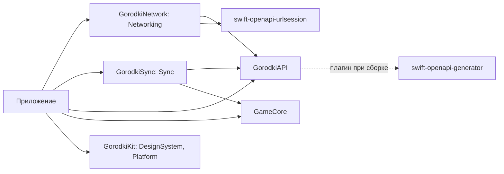
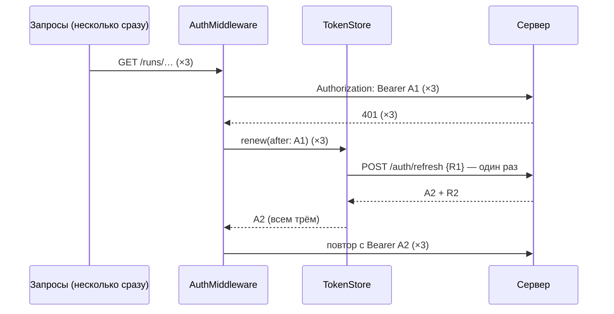

# Приложение: как собраны сеть, вход и синхронизация

Код: `ios/App/AppDependencies.swift` и пакет `ios/Packages/GorodkiNetwork` (библиотека `Networking`).
Сетевой слой — чистый Swift без UIKit и SwiftUI, его тесты идут на Linux в CI (`ios-core`). Keychain есть только
на платформах Apple, поэтому он спрятан за протоколом `TokenStorage`, а в тестах его заменяет память.

## Пакеты



Клиент API генерирует плагин при сборке ([ADR 0004](../adr/0004-openapi-swift.md)). Поэтому `xcodebuild` из командной
строки запускается с `-skipPackagePluginValidation` (`ios.yml`, `ipa.yml`). В Xcode при первой сборке нужно один раз
нажать «Trust & Enable» у плагина.

## `AppDependencies`

Создаётся один раз при запуске (`AppDependencies.shared`), экраны получают его параметром.

| Что | Откуда | Если сервер не настроен |
|---|---|---|
| `serverURL` | Info.plist `GorodkiServerURL` ← `GORODKI_SERVER_URL` | `nil` |
| `tokens` | `TokenStore` поверх Keychain (сервис — bundle ID + `.auth`) | Работает: вход хранится и без сервера |
| `api` | `ClientFactory.make` — сгенерированный `Client` с `AuthMiddleware` | `nil` |
| `syncStore` | Очередь синхронизации, общая для `RunRecorder` и `SyncEngine` | Работает: забеги копятся |
| `syncEngine()` | `SyncEngine` вошедшего игрока (`sub` из access-токена), один на игрока | `nil` |

Очередь хранится в базе приложения (`GRDBSyncStore`, [sync.md](sync.md#хранилище-очереди-grdb)) и переживает выгрузку
приложения и перезапуск телефона. Если базу не открыть, `AppDependencies.live()` берёт очередь в памяти.

## Адрес сервера

Пока сервер не развёрнут, адрес пуст, и это обычное состояние: клиента нет, синхронизация не запускается,
«Лаборатория → Сервер» показывает «адрес не задан».

Свой адрес задаётся в `ios/Config/Local.xcconfig` (он в `.gitignore`). В xcconfig `//` начинает комментарий, поэтому:

```
GORODKI_SERVER_URL = https:/$()/gorodki.example.com
```

`ServerURL.parse` принимает только `https` или `http` с хостом и убирает `/` на конце: пути API начинаются с `/`.
`http` нужен для своего сервера на компьютере: App Transport Security не блокирует `localhost` и IP-адреса. Логин,
пароль, параметры и `#` отвергаются. Info.plist можно прочитать из IPA, поэтому ключей и паролей в адресе быть не должно.

## Вход и обновление токена

Контракт сервера описан в [auth.md](auth.md): access-токен живёт 15 минут, refresh-токен — 30 дней и меняется при каждом
обновлении. После замены у старого refresh-токена есть 60 секунд льготного окна, потом его повтор считается кражей.



- **Одно обновление на все 401.** Второй `POST /auth/refresh` с тем же токеном сервер принял бы за повтор, а позже
  60 секунд — за кражу. `TokenStore.renew` ждёт уже идущее обновление, а если пару уже обновили, сразу отдаёт новую.
- **Повтор — один.** Второй 401 возвращается вызывающему как есть.
- **Выход — только по ответу сервера.** Если `/auth/refresh` отвечает 401 (`refresh_invalid`, `refresh_reused`), токены
  стираются, в `TokenStore.events` приходит `signedOut(.sessionExpired(code:))`, а вызывающий получает исходный 401:
  `SyncEngine` остановит проход с `unauthorized`. При сбое сети, 5xx или 429 запрос завершается ошибкой
  (синхронизация: `offline`), вход сохраняется, и следующий 401 попробует обновить пару снова.
- **Без чужого входа.** Если игрок вышел и вошёл, пока запрос был в пути, запрос не повторяется с токеном нового входа,
  а ответ обновления прежнего входа ничего не меняет.
- **Запросы входа** (`signInWithGoogle`, `refreshSession`, `logout`) не подписываются: ключ у них в теле.
  Само обновление идёт отдельным клиентом без `AuthMiddleware`.
- Тело запроса нужно отправить дважды. Тела сгенерированного клиента уже лежат в памяти, а одноразовый поток
  читается в память до 8 МБ.

## Keychain

Одна запись `kSecClassGenericPassword`, в ней JSON с обоими токенами. Поэтому «новый access при старом refresh» не бывает.

- **Доступ** — `AfterFirstUnlockThisDeviceOnly`. Фоновые трекинг и синхронизация работают при заблокированном экране.
  В резервную копию и на новый телефон токены не переезжают: восстановленный старый refresh-токен сервер принял бы
  за кражу.
- **Недоступный Keychain — ещё не выход.** Так бывает до первой разблокировки после включения. `current()` вернёт `nil`,
  но не запомнит этого и прочитает Keychain снова при следующем вызове.
- **Запись не удалась.** Вход работает по копии в памяти, запись повторяется при следующем обращении. После обновления
  на сервере действует только новая пара, так что терять её нельзя.
- **При переустановке** Keychain не чистится: еженедельная переустановка через Sideloadly не требует входить заново.
- **При печати** `AuthTokens` показывает только игрока, сами токены в журналы не попадают.

## Проверки

`swift test --package-path ios/Packages/GorodkiNetwork`, в CI — шаг `ios-core`.

- **`AuthMiddleware` отдельно:**
  - подпись;
  - одно обновление и повтор;
  - 20 одновременных 401 — ровно одно обновление;
  - отказ → выход;
  - нет сети → вход сохранён;
  - второй 401;
  - старый токен после обновления;
  - чужой вход;
  - выход во время обновления;
  - повтор одноразового тела.
- **`TokenStore`:** перезапуск, выход, недоступный и испорченный Keychain, повтор записи.
- **Сквозные тесты** на сгенерированном клиенте с транспортом, который ведёт себя как сервер входа: `POST /auth/refresh`
  без подписи с refresh-токеном в теле, отказ с кодом, 503.
- **Сборка:** код Keychain и экранов собирает `ios-build` (Xcode).
