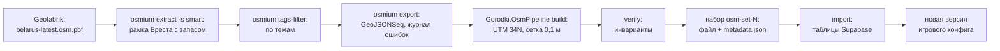

# Конвейер OSM (`osm-pipeline` v1)

> **Статус 26.09.2026: v1 реализован** (задача C6) — инструмент `backend/tools/Gorodki.OsmPipeline`, таблицы
> (миграция `OsmPipelineSets`), маски в шаге A захвата и чтение «достижимого» на сервере. Запуск —
> [osm-pipeline-run.md](../guides/osm-pipeline-run.md); что сделано и чего нет — [ниже](#что-сделано-в-v1-2609).
> Набор 1 собран на выгрузке Geofabrik от 24.09.2026 и проверен загрузкой в локальную базу; в Supabase не загружен и
> не включён: ждёт утверждения списков Никитой.
>
> Проект писался до кода, 24.09. Числа (ширины буферов), списки тегов и объектов OSM, границы Арены решены 25.09 по
> рекомендациям Claude с разрешения Никиты: [вопросы по OSM](../decisions/osm-questions.md), строки «Решено 25.09», и
> [PLAN.md](../PLAN.md) §3.3, §3.6, §3.10. Здесь они — именованные параметры (`osm-pipeline.json`); чего в решениях нет
> (ширина погранполосы, список мемориалов), остаётся пустым. Срок v1 — этап 2, к 04.11 (PLAN.md, §10).

Что говорит план:

- §3.3: маски — «вода, ж/д, магистрали, военные объекты, кладбища, погранполоса»; «мемориалы (Брестская крепость и
  др.) — только значок «Посетил»»; «маски готовятся офлайн из OSM»; порядок правил — «маски → щиты → клан → …»;
- §3.2: сервер строит контур P, снапит «к сетке 0,1 м в UTM 34N» и вычитает «минус маски (§3.3)»;
- §3.10: «% Бреста от «достижимой» площади: пешеходные пути OSM с буфером 25 м в границах города минус маски, иначе
  100% недостижимы»; «% по районам и кварталам Арены»;
- §3.6: Арена — «радиус ~1,5 км вокруг корпусов и общежитий», «6–8 «кварталов»»; «Ничейные земли» «засевают Арену
  уровнем L1 как цели»;
- §3.19: в воротах Сезона 0 (15.11) — «Арена и «Ничейные земли»» и «% Бреста»;
- §3.15: карточка недели — «открыто +1,3% Бреста»;
- §7.1: «Офлайн-конвейер OSM (ноутбук/CI): Geofabrik → osmium → PostGIS локально → маски, «достижимая» площадь,
  точки-кандидаты фишек → импорт в Supabase»;
- §7.3: «% = `popcount(explored & reachable) / popcount(reachable)`; маски районов и кварталов»;
- §8: «`osm-pipeline` — вручную или раз в сезон, результат — версионированный набор»;
- §3.11 и §9: «атрибуция OSM (ODbL) — «© OpenStreetMap»».

## Что сделано в v1 (26.09)

| Часть | Где | Состояние |
|---|---|---|
| osmium: вырезка `smart`, темы, экспорт с `-a type,id` и журналом ошибок, границы по id | `Extract.cs` (команда `extract`) | сделано |
| Маски по видам: вода, ж/д (±10 м и площади), «магистрали» (±12 м, признак доступа общий с путями), военные, кладбища | `Themes.cs`, `SetBuilder.cs` | сделано; тоннели не берутся |
| Погранполоса | параметр `borderStripMeters` | код есть, **слоя нет**: ширины из официальных правил нет (1.3) |
| Мемориалы | параметр `memorials.objects` | код есть (площадь; точка → круг 50 м), **список пуст** — утверждает Никита (6.6) |
| «Вне игрового поля» | параметр `playZone` | сделано: рамка минус город или Арена; тайл вне рамки — целиком «вне поля» (`MaskStore`) |
| «Достижимое» на сетке тумана: пути ±25 м ∩ город − маски (кроме мемориалов) | `SetBuilder.cs`, `ReachableRaster` | сделано; центр клетки G22 → UTM → внутри вектора |
| Город, Ленинский и Московский районы, Арена и 6 кварталов, площадь без масок, клетки районов | `SetBuilder.cs`, `ArenaBuilder.cs` | сделано; Арена и кварталы — **предложение** (`proposal`), ждут Никиту |
| Слой ценности земли ×0,5 (6.8) | таблица `land_zones` | собран и загружается; читать будут очки SP (C9) |
| Инварианты, отпечаток по содержимому, файл `osm-set-N.zip` с `LICENSE.txt` | `SetVerifier.cs`, `OsmSetFile.cs` | сделано |
| Загрузка одной транзакцией, повтор — без изменений | `SetImporter.cs` (команда `import`) | сделано; проверено на локальной PostgreSQL |
| Карта-артефакт для Никиты (без тайлов, SVG из данных OSM) | `Preview.cs` (команда `preview`) | сделано |
| Маски в шаге A захвата: `OsmConfig.SetVersion` → `IMaskStore.CoveringAsync` → `CaptureShapeBuilder` | `Features/Osm/MaskStore.cs`, `CaptureProcessor` | сделано; без набора в конфиге — как раньше |
| Чтение «достижимого» и доли города и районов — опора для E9 | `Features/Osm/ReachableStore.cs`, `Gorodki.Domain/Osm/ReachableArea.cs` | сделано; в `/fog/summary` процента ещё нет (E9, правка контракта) |

**Не сделано в v1** (и почему):

- **Показ масок на карте** (`GET /masks?tiles=`) — правка контракта и заглушка в FakeServer телефона; по проекту — часть
  сервера после того, как пакет B отпустит `contracts/` ([ниже](#маски-на-карте)).
- **% Бреста в `/fog/summary`** — задача Егора E9 (опора готова: [egor-server.md](../guides/egor-server.md)); прирост за
  неделю в срезе (`leaderboard_snapshots`) — после E9.
- **«Ничейные земли»** — форма целей решена (блоки из сети улиц в Арене), но засев, учётная запись фракции и правила —
  задача C7; таблицы целей в v1 нет.
- **`osm-pipeline.yml`** (ручной запуск в GitHub Actions) — не заведён: v1 запускается с ноутбука, версии инструментов
  пишутся в `metadata.json`. Собственные тесты конвейера идут в обычном CI `backend`.
- **Проверка сборки мультиполигона на синтетическом `.osm` через osmium** — не автоматизирована (в CI `backend` osmium
  нет); на живых данных её заменяет инвариант «все площади собраны» — отношения и замкнутые пути темы площадей (26.09 —
  собраны все, из них 5 614 замкнутых путей; журналы ошибок пусты).
- **Удаление старых наборов** — вручную (`DELETE FROM app.osm_sets …`, каскад): [run-гайд](../guides/osm-pipeline-run.md).
- **Ручные добавления военных объектов** — файла нет, пока Никита не назовёт места.

**Что показал набор 1 (выгрузка 24.09.2026):** город 146,3 км² (без масок 129,0 км²); «достижимое» — 2 223 564 клетки
тумана (≈76,5 км², 52 % города); маски: вода 763 га, ж/д 461 га, «магистрали» 130 га, военные 309 га, кладбища 74 га;
Ленинский район 66,8 км², Московский 79,5 км²; Арена (предложение) 7,85 км², 6 кварталов. Граница города **доходит до
госграницы** — ≈17,6 км общей линии по Бугу, поэтому условие 6.4 «граница города не доходит» не выполнено: нужна ширина
погранполосы или временная линия Никиты. Московская, пр. Республики, Октябрьской Революции и Варшавское шоссе размечены
в OSM как `trunk` в основном без тега тротуара — по решению 1.2 они в маске 12 м, пока Никита не назовёт исключения.

## Что делает v1

**Входит:** граница Бреста; маски по видам (вода, ж/д, «магистрали», военные объекты, кладбища, погранполоса,
мемориалы); «достижимая» маска на сетке тумана; районы, Арена и её кварталы — контуром и клетками; маска «вне
игрового поля», если захват в Сезоне 0 ограничат городом или Ареной ([вопрос 6.4][q64]); заготовки целей «Ничейных
земель», если Никита выберет их форму из OSM ([вопрос 4][q4]). «Ничейные земли» — Must ворот Сезона 0 (§3.19),
поэтому форма целей нужна до 15.10, вместе с остальными входами v1.

**Не входит** (позже, тем же конвейером): точки-кандидаты фишек и маски их размещения (§3.11, этап 4); «достижимое»
для вело-слоя (с Сезона 1); освещённые пути; мемориалы как места значка «Посетил». Ценность земли для очков (§3.5:
«поле, лес, промзона 0,5») — тоже слой из OSM, но в перечне этапа 2 его нет: [вопрос 6.8][q68]. Показ масок на карте —
часть сервера, а не конвейера ([ниже](#маски-на-карте)).

**Главное правило: конвейер — инструмент, а не часть сервера.** Сервер работает на 0,1 CPU (Render Free) и только
читает готовые таблицы. Разбора OSM, буферов и растеризации на горячем пути нет.

## Инструмент: osmium + C# (NTS), без локальной PostGIS

| | A. osmium → PostGIS (§7.1) | **B. osmium → C#/NTS (рекомендую)** | C. Только C# |
|---|---|---|---|
| Геометрия масок | GEOS, потом перенос на сетку 0,1 м в NTS | Фасад `GeoOps`, как у участков | Как B |
| Клетки тумана | Сетку G22 повторить на SQL | `FogGrid`, `Utm34` — сверены с телефоном | Как B |
| Мультиполигоны OSM | osmium или osm2pgsql | osmium | Сами или библиотекой — не проверено |
| Тесты | Нужна база с данными | xUnit в CI `backend`, синтетика | Как B |
| Что установить | osmium, osm2pgsql, Docker с PostGIS | osmium (`osmium-tool`), .NET | .NET, библиотека PBF |

Мультиполигоны OSM — реки, парки и военные зоны, собранные из нескольких линий, иногда с «дырами».

**Почему B.**

1. **Один движок геометрии.** D14: «для записи геометрии — один движок (NTS или PostGIS, выбор по спайку S13)»; S13
   выбрал NTS ([ADR 0003](../adr/0003-territory-engine.md)). Маски вычитаются из контура захвата в
   `CaptureShapeBuilder` через `GeoOps.Difference`. Если строить их тем же OverlayNG на той же сетке, они сразу
   правильные для NTS. Не нужен второй перенос на сетку, и нет места для расхождений GEOS и NTS в краевых случаях.
2. **Бит в бит с туманом.** «Достижимая» маска — растр на сетке тумана. Код клетки (`FogGrid`) уже есть на C# и Swift,
   их сверяют эталоны `contracts/fog.v1.json`. Реализация на SQL стала бы третьей, которую надо держать в согласии.
3. **Проверяемость и защита.** Шаги — чистые функции, их проверяет обычный CI `backend`. Егор пишет на C# и может
   разобрать конвейер к защите.
4. **Меньше частей.** Не нужны локальная база, импорт в неё и схема osm2pgsql.

**Почему osmium остаётся.** Он вырезает Брест из выгрузки Беларуси, отбирает объекты по тегам и собирает многоугольники
из отношений-мультиполигонов. Последнее своими руками делать долго и рискованно.

**Чем платим.** Буфер и объединение тысяч линий в NTS могут идти медленнее, чем в PostGIS; скорость не замерена.
Конвейер офлайн и работает по тайлам 1×1 км, каждый тайл отдельно, поэтому память не растёт с городом. Если окажется
слишком медленно, сначала замер, потом параллельная обработка тайлов.

**Это отступление от §7.1** («PostGIS локально»). По §0 архитектура согласуется с Никитой: [вопрос 6.1][q61].
Решено 25.09: согласиться — отступление 8 в [plan-deviations.md](../plan-deviations.md), [PLAN §7.1](../PLAN.md#71-схема). Путь кода —
`backend/tools/Gorodki.OsmPipeline`, рядом с `Gorodki.GeoBench` (в плане — `tools/osm-pipeline`, но инструменты в
репозитории уже живут в `backend/tools`).

## Поток данных



1. **Выгрузка.** `belarus-latest.osm.pbf` с Geofabrik (§9: «Беларусь ~333 МБ, ODbL»). В `metadata.json` набора
   записываются дата репликации из заголовка файла и его SHA-256: набор всегда можно собрать заново из того же входа.
2. **Вырезка.** `osmium extract` по рамке Бреста с запасом (рамка — параметр). Запас нужен, чтобы буферы у края города
   видели соседние объекты: реку или пути за границей города. Стратегия — **`smart`** для отношений `multipolygon` и
   `boundary`. Стратегия по умолчанию (`complete_ways`) оставляет от отношения только части, задевающие рамку: Мухавец,
   Буг, лес или военная зона, выходящие за рамку, остаются неполными. `osmium export` такой многоугольник не собирает
   и **молча пропускает**, и маска реки пропала бы без единой ошибки. `smart` дописывает отношения-площади целиком.
   Но только из того, что есть во входе: если отношение (например, площадь Буга) обрезано уже в самой выгрузке
   Беларуси — как Geofabrik режет отношения на краю страны, не проверено, — его ловит инвариант «Проверки». Тогда
   запасной вход — выгрузки Беларуси и Польши, объединённые `osmium merge`.
3. **Отбор по темам.** `osmium tags-filter` — отдельный файл на тему (пути, вода, ж/д, границы…). Затем
   `osmium export` в GeoJSONSeq: многоугольники из замкнутых линий и мультиполигонов собирает osmium. Экспорт — с
   типом и id объекта OSM (`-a type,id`): по id работают «рецепты» кварталов и ручные исключения. Замкнутую линию без
   `area=no` osmium по умолчанию выдаёт и линией, и многоугольником, поэтому каждая тема берёт только свои типы
   геометрии (ниже, «Общие правила сборки»). И с `--show-errors`: ошибки сборки многоугольников идут в журнал
   `<тема>.errors.txt`. Но osmium при такой ошибке выходит с кодом 0 и молча выдаёт объект без многоугольника:
   самопересекающийся замкнутый путь («восьмёрка») — только линией, а в osmium 1.19.1 строка журнала id объекта не
   содержит («Geometry error: Could not build area geometry»). Поэтому главная проверка — сверка id: `extract` пишет
   отношения каждой темы (`<тема>.relations.opl`) и пути темы площадей (`areas.ways.opl`), а `build` сверяет их с
   экспортом (ниже, «Проверка»). Журнал `build` читает так: площади — непустой журнал нарушение (страховка сверх
   сверки id), если он не принят в параметрах по SHA-256 содержимого (`knownAreaErrors`, с причиной); здания и
   памятники — примечание (в маски они не идут); пути не читаются: самопересекающаяся замкнутая дорожка пишет ту же
   ошибку, а нужна ей только линия; границы сверяются по id при чтении.
4. **Сборка (C#).** Точки переводятся в UTM 34N (`Utm34.Forward`) и снапятся на сетку (`GeoOps.Snap`). Дальше по темам:
   буферы линий, объединение, обрезка городом, вычитание масок. Результат режется по тайлам и растеризуется (ниже).
5. **Проверка.** Инварианты (раздел «Проверка»). Хоть одно нарушение — набор не выпускается.
6. **Набор.** Один файл: куски масок в TWKB по тайлам (`Twkb` — тот же формат без потерь, что у журнала захватов),
   биты клеток, районы и `metadata.json` (вход, параметры, **версии инструментов**, число объектов и клеток, размеры).
   Сборка **детерминирована при закреплённых инструментах**: тот же вход, те же параметры и те же версии
   osmium/libosmium, NTS и .NET SDK дают тот же набор. Версии пишутся в `metadata.json` и в `osm_sets`. Отпечаток
   набора (SHA-256) считается по содержимому — распакованные биты клеток, TWKB, параметры, — а не по сжатым байтам и
   без времени сборки. Причина: сжатие Deflate (`FogTileCodec`, `CompressionLevel.Optimal`) зависит от версии zlib,
   которую несёт .NET, и другая версия может сжать те же биты иначе. От osmium зависят порядок объектов при экспорте и
   сборка мультиполигонов.
7. **Импорт** — вручную, с ноутбука. Строка подключения — из переменной окружения, не из репозитория. Новый набор
   ложится одной транзакцией рядом со старым, прежний не трогается.
8. **Включение** — новой версией игрового конфига (ниже, «Маски в обработке захвата»).

Набросок команд (флаги сверить с документацией osmium при реализации):

```bash
curl -LO https://download.geofabrik.de/europe/belarus-latest.osm.pbf
osmium fileinfo -g header.option.osmosis_replication_timestamp belarus-latest.osm.pbf
osmium --version   # версии osmium и libosmium — в metadata.json
osmium extract -s smart -S types=multipolygon,boundary -b "$WEST,$SOUTH,$EAST,$NORTH" \
    belarus-latest.osm.pbf -o brest.osm.pbf
osmium getid -r belarus-latest.osm.pbf "r$BELARUS_ID" "r$CITY_ID" -o borders.osm.pbf   # границы — по id
osmium tags-filter brest.osm.pbf wr/highway wr/place=square -o paths.osm.pbf
osmium export paths.osm.pbf -f geojsonseq -a type,id --show-errors -o paths.geojsonseq 2> paths.errors.txt
dotnet run -c Release --project backend/tools/Gorodki.OsmPipeline -- build --params osm-pipeline.json --out osm-set/
```

## Координаты и хранение — как у движка участков

- **Векторы** (маски, районы, Арена, цели) — метры EPSG:32634, вершины на сетке 0,1 м, каждое наложение — через
  `GeoOps` (OverlayNG со snap-rounding). Это геометрический контракт §7.3 и [ADR 0003](../adr/0003-territory-engine.md).
  Буфер (`BufferOp`) даёт точки вне сетки, поэтому после него — `GeoOps.Snap`.
- **Маски режутся по тайлам UTM 1×1 км** (`TileKey`): «одна строка = один простой полигон внутри тайла», как у
  `parcels`. Почему: захват читает маски только тех тайлов, которые задевает его петля (`TileKey.Covering`); ключ
  тот же, что у блокировок и кэша; размер строки ограничен.
- **Растры** («достижимое», районы) лежат по тайлам тумана — веб-меркатор уровня 14, 256×256 клеток G22 (~5,87 м в
  Бресте). Формат тот же, что у `fog_tiles`: `FogTileBits`, сжатые `FogTileCodec` (Deflate). Поэтому сервер считает %
  пословно: AND и popcount, без перевода координат.

Таблицы (миграция `OsmPipelineSets`, 26.09; только добавление, существующие данные не трогаются):

- `osm_sets` — строка на набор: версия, вход (дата выгрузки, SHA-256), параметры, версии инструментов, рамка
  конвейера, отпечаток набора, когда собран и загружен. Вход, параметры и версии — это и «метод» для ODbL (ниже).
- `masks` — куски масок: `set_version`, `kind` (вид маски), `tile_x`, `tile_y` (UTM, км), `geometry` (Polygon,
  EPSG:32634). База отвергает неправильную геометрию (`st_isvalid`), как у `parcels`.
- `reachable_tiles` — «достижимые» клетки: `set_version`, тайл z14, биты (Deflate), `cell_count`.
- `districts` — город, районы, Арена, кварталы: `set_version`, вид, название, контур EPSG:32634 и площадь без масок
  (знаменатель доли клана в квартале, §3.6).
- `district_tiles` — достижимые клетки района: как `reachable_tiles` плюс `district_id`; биты = район ∩ «достижимое».
- `land_zones` — слой ценности земли ×0,5 (вопрос 6.8, в v1): как `masks`, вид `low_value`. Прочитают очки SP (C9).

У `osm_sets` — рамка конвейера в тайлах UTM и зона игры (`play_zone`): по ним хранилище масок решает, что тайл вне
рамки — «вне поля»; у `districts` — ключ (`city`, `district:<id>`, `arena`, `quarter:<n>`), пометка `proposal` и число
достижимых клеток. Геометрию проверяет сама база (`st_isvalid`), как у `parcels`. Загрузка берёт блокировку
`pg_advisory_xact_lock(5, номер)`: пространство 5 — конвейер OSM (ADR 0005: 1–4 и 100 + лига заняты).

Цели «Ничейных земель» — отдельная таблица, если Никита выберет форму целей из OSM ([вопрос 4][q4]).

**Объём.** В рамке Бреста по комментарию `TileKey` (X ≈ 680–700, Y ≈ 5770–5780 км) — порядка сотни тайлов z14
(~1,5 × 1,5 км). Тайл до сжатия — 8 КБ, поэтому «достижимое» даже без сжатия меньше мегабайта, районы — несколько
мегабайт сверху. Размер масок зависит от числа вершин и станет известен после первой сборки, он пишется в
`metadata.json`. Храним не больше двух наборов: старый удаляется, когда на него не может сослаться ни один забег
(забег — до 4 ч, незавершённый сервер закрывает через сутки после этого предела, [runs.md](runs.md)).

## Маски

Каждый вид — отдельный `kind`: причину отказа можно объяснить игроку («часть петли — железная дорога»), а виды можно
по-разному применять в других правилах (вело-античит, §3.9: «маски магистралей и `bicycle=no`»; фишки, §3.11).
Теги ниже — **стартовое предложение**. Окончательные списки проверяются на данных Бреста и утверждаются Никитой.

- **Вода** — площади `natural=water`, `waterway=riverbank`, `landuse=reservoir` и `basin`, как есть.
- **Ж/д** — буфер линий `railway=rail`, `light_rail`, `narrow_gauge` полушириной `RailHalfWidth` плюс площади
  `landuse=railway` ([вопрос 1.1][q11]). Линии в тоннеле (`tunnel` — любое значение, кроме `no`) не берутся: земля
  над ними обычная.
- **«Магистрали»** — буфер от оси полушириной `MajorRoadHalfWidth` у дорог без пешеходного доступа. Признак доступа
  общий с «достижимым» ([вопрос 2][q2]): дорога, которая входит в пешеходные пути, в маску не входит, и наоборот.
  Какие классы `highway=*` и что значит «без тротуара» — [вопрос 1.2][q12]. Тоннели не берутся, как у ж/д. Ручные
  исключения по id пути (тротуар есть, а тега нет) — в параметрах.
- **Военные объекты** — площади `landuse=military`, `military=*`; ручные добавления — [вопрос 6.6][q66].
- **Кладбища** — площади `landuse=cemetery`, `amenity=grave_yard`.
- **Погранполоса** — полоса ширины `BorderStripWidth` по обе стороны линии государственной границы, обрезанная городом.
  Брест лежит в Беларуси, поэтому обрезка городом сама оставляет белорусскую сторону. Линия — граница многоугольника
  Беларуси (отношение `boundary=administrative`, `admin_level=2`; id — параметр, проверяется на данных) в рамке.
  Отношение страны берётся целиком из полной выгрузки (`osmium getid -r` по id), и его многоугольник собирает
  `osmium export`: так не важно, стоят ли теги границы на самих линиях. Если город до границы не доходит, полоса
  пуста. Ширина — [вопрос 1.3][q13]; пока её нет, слоя нет, и это видно в `metadata.json`.
- **Мемориалы** — объекты по списку, утверждённому Никитой (по id OSM): площадь как есть, точечный памятник — круг
  ([вопрос 6.6][q66]).
- **Вне игрового поля** (`outside`) — только если захват ограничат городом или Ареной ([вопрос 6.4][q64]): рамка
  конвейера минус зона игры. За рамкой строк нет, поэтому хранилище масок считает тайл вне рамки целиком «вне поля»
  (ниже, «Маски в обработке захвата»). Из «достижимого» эта маска не вычитается: «% Бреста» считается по всему
  городу, даже если захват открыт только в Арене.

Общие правила сборки:

- **Типы геометрии по темам.** Пути, ж/д и дороги — только линии (`LineString`). Многоугольники берутся из тем-площадей
  (вода, военные объекты, кладбища, мемориалы, `landuse=railway`), а у путей — только пешеходные площади:
  `highway=pedestrian` с `area=yes` или отношением-мультиполигоном и `place=square`. Иначе замкнутая дорожка вокруг
  пруда или парка стала бы многоугольником, и её буфер закрыл бы всё внутри: пруд попал бы в знаменатель %.
- **Буфер линии** — в метрах UTM, с круглыми концами. При 8 отрезках на четверть окружности (по умолчанию в NTS)
  вершины дуги лежат на окружности через π/16, и хорда отходит от дуги не больше чем на `r·(1 − cos(π/32))`: для
  r = 25 м это ≈0,12 м, около 2 % клетки тумана. Число отрезков — параметр.
- **Упрощение масок** — параметр `MaskSimplifyMeters`, по умолчанию 0 (без упрощения). Включаем, только если число
  вершин окажется большим для захвата на 0,1 CPU: замер покажет.
- **Ручные добавления** (военный объект, которого нет в OSM) — файл в репозитории, если Никита решит, что они нужны.
  Это наши данные, а не производные OSM, если не обводить их по карте OSM.

## «Достижимая» маска и сетка тумана

По §3.10: `reachable = (∪ Buffer(путь, 25 м)) ∩ город − маски`. Какие пути пешеходные — [вопрос 2][q2]; какие маски
вычитать — [вопрос 6.2][q62]. Буфер 25 м равен радиусу открытия тумана (`ExplorationConfig.RevealRadiusMeters` = 25),
и это не случайно: полоса «достижимого» — ровно та, что открывает прогулка по оси пути. Пешеходная площадь входит
целиком и с тем же запасом 25 м по краю.

1. **Вектор — в UTM, по тайлам.** Для тайла 1×1 км берутся линии, задевающие тайл с запасом 25 м. Затем буфер,
   объединение (`GeoOps.UnionAll`), обрезка тайлом, городом и вычитание масок. Объединение кусков всех тайлов равно
   целому, это проверяется тестом. Буфер строится в метрах UTM, а не в веб-меркаторе: в Бресте (широта ≈52,1°)
   «25 м» в единицах меркатора — это ≈15 м на местности (множитель cos φ ≈ 0,614).
2. **Растр — по центрам клеток.** Для каждой клетки G22 в рамке города центр (`FogGrid.Center`) переводится в UTM
   (`Utm34.Forward`) и проверяется на попадание в вектор тайла (`IndexedPointInAreaLocator`). Клетка достижима, если
   центр внутри или на границе. Правило то же, что у тумана: `FogLayer.RevealAround` открывает клетку, «если её центр
   в круге», граница включительно. Поэтому открытое и достижимое — одинаково определённые клетки одной сетки.
3. **Формат** — `FogTileBits` по тайлам z14, сжатие `FogTileCodec`: как `fog_tiles`.

**100 % почти недостижимы даже по этой маске.** GPS-след отстоит от оси пути в OSM на метры (D3: «±5–10 м»), поэтому
открытая полоса сдвинута относительно достижимой, и край достижимой полосы часто остаётся закрытым. Для процента это
честно. Для достижений вроде «100% Арены» (§3.10) нужен порог: [вопрос 6.7][q67].

## Как считается % Бреста

По §7.3: `% = popcount(explored & reachable) / popcount(reachable)`.

- **Числитель** — открытые клетки игрока в слое и сезоне (`fog_tiles`), только в тайлах, где есть достижимые клетки.
  Тайлы тумана вне «достижимого» не распаковываются вовсе. Поэтому работы на игрока не больше, чем тайлов z14 в городе
  (порядка сотни): распаковать ≤8 КБ, 1 024 AND и popcount на тайл.
- **Знаменатель** — сумма `cell_count` достижимых тайлов набора; считается один раз при загрузке набора.
- **Открытое вне «достижимого»** (двор без дорожек в OSM, пригород) идёт в гектары (`GET /fog/summary`), но не в %.
  Поэтому % не превышает 100.
- **Районы и кварталы Арены** — та же формула по `district_tiles`. «% Бреста» — район вида «город».
- **«Всего» — объединение слоёв, а не сумма:** `popcount((foot | bike) & reachable)`. Сумма «Пешком» и «Вело» могла бы
  дать больше 100 %. Гектары рейтинга «Всего» по плану — сумма (§3.10, [fog.md](fog.md#рейтинг-кто-открыл-больше)),
  для процента так нельзя. Нужно к Сезону 1 (вело-слой), тогда же — вело-«достижимое».
- **Где.** Процент добавляется в ответ `GET /fog/summary` и считается при чтении. Это правка контракта, её делаем после
  того, как пакет B отпустит `contracts/`. Если замер на Render покажет, что чтение дорогое, запасной путь —
  колонка `reachable_cells` в `fog_tiles`. Её пишет `FogProcessor` под той же блокировкой игрока, а при смене набора
  она пересчитывается фоновой задачей. Для колонки нужна миграция, поэтому начинаем с подсчёта при чтении.
- **Карточка недели** (§3.15: «открыто +1,3% Бреста»). Прирост за неделю — разница с процентом на её начало, а процент
  считается только при чтении и нигде не хранится. В ежедневном срезе (`leaderboard_snapshots`) сейчас только площадь
  ([fog.md](fog.md#рейтинг-кто-открыл-больше)). Поэтому в срез добавляются число открытых «достижимых» клеток и версия
  набора. Срезы хранятся 7 дней (`LeaderboardSnapshots.KeepDays`), и срез ровно недельной давности ещё на месте. Срез
  тогда распаковывает тайлы тумана раз в сутки — не больше, чем тайлов в городе, на игрока и слой. Это миграция, после
  BE-01. Какой процент в карточке и что делать в неделю смены набора — [вопрос 6.10][q610].
- **Смена набора.** Процент считается по действующему набору — и числитель, и знаменатель. Наборы меняются только между
  сезонами (ниже; кроме срочной правки), поэтому сезонный % внутри сезона не прыгает. **Пожизненный % при смене набора
  может сдвинуться в обе стороны**: изменились маски или пути, а карта игрока та же. Истории процентов нет, и по старому
  набору его не пересчитать. Это честно — изменилась мерка, а не карта. Чтобы телефон мог сказать «пересчитано по
  новой карте», рядом с процентом можно отдавать версию набора.
- **Приватность.** Процент выведен из карты исследования, а она — персональные данные (§3.10). Он виден только самому
  игроку, как `GET /fog/summary`; в карточке недели — только числа (§3.15).

## Граница Бреста, районы, Арена и кварталы

- **Граница города** — отношение `boundary=administrative` из OSM. Какое именно (id и `admin_level`), проверяется на
  данных, а не угадывается. Id записывается в параметры. Граница обрезает «достижимое» и маски (§3.11: «обрезка по
  границе Бреста (bbox захватывает Тересполь)») и сама лежит в `districts` как вид «город».
- **Районы** для «% по районам» — [вопрос 6.3][q63].
- **Арена и кварталы** — [вопрос 3][q3]. Как в §3.12 («Claude предлагает кандидатов из OSM → Никита утверждает
  список»): Claude строит карту-артефакт с кандидатами, Никита правит и утверждает.
- **Зона игры** для маски «вне игрового поля» — город или Арена, по [вопросу 6.4][q64].
- **В репозитории — «рецепт», а не геометрия:** id зданий и улиц OSM, по которым режутся кварталы, и правило разреза.
  Геометрию строит конвейер, и она попадает в набор. Так в git не лежат производные данные OSM.
- Площадь квартала без масок хранится в `districts`: это знаменатель доли клана при контроле квартала (§3.6: «доля
  ≥15%»).

## Где и когда запускается

- **Где:** ноутбук (WSL, пакет `osmium-tool`) или GitHub Actions `osm-pipeline.yml` с ручным запуском
  (`workflow_dispatch`), как в §8. Это не обязательная проверка PR. Собственные тесты конвейера (синтетические примеры,
  без данных OSM) идут в обычном CI `backend`. Версии osmium и .NET SDK в `osm-pipeline.yml` закрепляются явно, а
  на ноутбуке сверяются с ними: иначе наборы с ноутбука и из CI не совпадут (выше, «Набор»).
- **Результат** — набор `osm-set-N`. В git он **не коммитится**. Публикуется отдельным релизом GitHub под ODbL — решено 25.09
  ([вопрос 5][q5], PLAN §3.11).
- **Импорт** — командой `import` с ноутбука; строка подключения к Supabase — из переменной окружения, в CI её нет.
  Одна транзакция добавляет строки с `set_version = N`, прежний набор остаётся.
- **Частота.** v1 — к 04.11 (этап 2). На Сезон 0 (16–29.11) набор заморожен. Новый набор — только на границе сезонов
  (30.11, 14.12, §3.4) и только если есть причина: правки OSM, ошибка в маске. С заморозки кода Д−7 новых наборов нет.
  Срочная правка посреди сезона (опасное место не закрыто маской) — по согласованию с Никитой. Что делать с землёй,
  которая уже лежит в новой маске, — [вопрос 6.5][q65].

## Лицензия ODbL и атрибуция

План: «Лицензия: атрибуция OSM (ODbL) — «© OpenStreetMap»» (§3.11); Geofabrik — «ODbL, атрибуция» (§9).

Что требует ODbL 1.0. Это пересказ, а не юридическое заключение, разделы надо перечитать перед решением:

- **4.3** — у публично используемого «произведённого результата» (Produced Work) нужна заметная пометка, что данные
  взяты из базы OSM и доступны под ODbL;
- **4.4** — публично используемая **производная база** должна быть под ODbL (или совместимой лицензией). Это условие
  лицензии, а не обязанность базу публиковать. Производная база считается используемой публично, если публично
  используется результат из неё (4.4 c);
- **4.5 b** — если из базы только делают произведённый результат, производной базы от этого не возникает;
- **4.6** — тому, кто получает производную базу или результат из неё, нужно **предложить** в машиночитаемом виде
  (a) всю производную базу или (b) файл со всеми изменениями или **метод** их получения («например, алгоритм»),
  включая добавленное содержимое. Через интернет — бесплатно.

Что это значит у нас:

- **Набор `osm-set-N`** (маски, «достижимое», районы, цели) — производная база под ODbL. По 4.6 предлагаем (a) сам
  набор — рекомендация — или (b) метод: этот документ, параметры, версии инструментов, какая выгрузка Geofabrik.
  Выбор — [вопрос 5][q5].
- **Произведённые результаты** — проценты в приложении, маски, Арена, районы и цели на карте, карточка недели. На них —
  пометка 4.3.
- **Участки игроков** (контур петли минус маски). Производная ли это база, неочевидно; наше прочтение — нет. Если
  признают производной, 4.6(a) невозможно: участки — персональные данные (закон 99-З, §3.16). Остаётся только 4.6(b):
  метод (набор масок и правило вычитания) без данных игроков. Слова «включая добавленное содержимое» оставляют риск,
  что и этого мало.
- **Где проверять прочтение:** руководства OSMF по лицензии — «Collective Database», «Horizontal Map Layers»,
  «Substantial», «Produced Work», «Attribution Guidelines»; при сомнении — Licensing Working Group OSMF или форум
  сообщества OSM.

**Где атрибуция** (предложение; где именно на экранах — решение Никиты по дизайну):

- **карта в приложении** — «© участники OpenStreetMap» в углу или за кнопкой «i», пока на карте видны слои из OSM:
  маски ([6.9][q69] — да), граница Арены и кварталов, районы, цели «Ничейных земель». Ссылка «Правовая
  информация» у MapKit относится к данным Apple, наши слои она не покрывает. Руководство OSMF по атрибуции ждёт
  пометку на самой карте или в одно касание от неё (формулировку сверить перед решением);
- экран «О приложении» — «© участники OpenStreetMap», ссылка на `openstreetmap.org/copyright` и **предложение по
  4.6**: ссылка на набор (или метод) и текст ODbL;
- статистика «Исследования» — рядом с процентом;
- карточка недели — если на ней процент или закраска районов (это результат из OSM, 4.3): короткая подпись;
- `/live` в вебе: MapLibre с тайлами на данных OSM — атрибуция там нужна в любом случае; там же ссылка на набор и
  лицензию;
- записка — у рисунков и цифр, построенных по OSM;
- `metadata.json` и файл лицензии внутри набора.

Репозиторий — «все права защищены» (PLAN.md, §1, §8). Как это совместить с ODbL — [вопрос 5][q5].

## Маски в обработке захвата

Сделано 26.09 (BE-01 слита): интерфейс `IMaskStore` и реализация `MaskStore` (кэш байтов TWKB по набору и тайлу),
`OsmConfig` в игровом конфиге (`osm.setVersion`; в контракте `game-config.v1.json` — `null`) и точка подключения в шаге A
`CaptureProcessor` — ровно как ниже. **Без набора в конфиге поведение захвата не меняется** (интеграционный тест: конфиг
без набора и набор без масок дают ту же площадь). Если конфиг ссылается на незагруженный набор, заявка не судится без
масок: она повторяется с ошибкой в журнале и после пяти попыток получает `too_many_attempts` — поэтому набор загружают
до того, как его номер попадёт в конфиг.

Шаг A принимает маски: `CaptureShapeBuilder.Build(trail, closing, Geometry? masks, settings)` вычитает их через
`GeoOps.Difference` до фильтров.

```csharp
// Gorodki.Api — чтение масок одного набора по тайлам UTM.
public interface IMaskStore
{
    /// Маски набора setVersion во всех тайлах, которые задевает рамка (TileKey.Covering), — объединением
    /// через GeoOps.UnionAll; null, если масок там нет. Если захват ограничен зоной игры (вопрос 6.4), тайл
    /// вне рамки конвейера входит целиком как «вне игрового поля». Каждый вызов даёт новые объекты: геометрии NTS
    /// изменяемы.
    Task<Geometry?> CoveringAsync(Envelope envelope, int setVersion, CancellationToken cancellationToken);
}

// Gorodki.Domain.Config — новая часть игрового конфига.
public sealed record OsmConfig
{
    /// Набор масок, по которому судятся захваты; null — масок нет (как сейчас).
    public int? SetVersion { get; init; }
}

// Шаг A в обработчике захвата:
var masks = rules.Osm.SetVersion is { } set
    ? await maskStore.CoveringAsync(EnvelopeOf(ring.Ring), set, cancellationToken)
    : null;
var shape = CaptureShapeBuilder.Build(ring.Ring, ring.ClosingTolerance, masks, rules.Capture.Shape);
```

- **Версия набора — в игровом конфиге.** По §3: «Забег проверяется той версией, с которой начат». Тогда петли забега,
  начатого до смены набора, судятся по старому набору, а повторная обработка даёт тот же результат. `null` — поведение
  как сейчас, поэтому поле можно добавить заранее. Конфиг — контракт `game-config.v1.json` для сервера и телефона
  ([contracts/README.md](../../contracts/README.md)).
- **Все грани P лежат внутри рамки петли,** поэтому масок тайлов из `TileKey.Covering` хватает. Куски соседних тайлов
  сходятся по краю тайла на сетке, и объединение точное.
- **Кэш.** Маски набора не меняются, поэтому кэш по (набор, тайл) хранит байты TWKB и собирает геометрию при каждом
  чтении. Общий объект NTS между потоками — лишний риск (`GeoOps.EmptyPolygon`).
- **Порядок правил не меняется:** маски — в шаге A, до фильтров §3.2, затем шаг B (§3.3: «маски → щиты → клан → …»).
  Петля целиком в маске получает уже существующий отказ `empty` («пустой после масок»). Отдельный код `masked` для
  понятного объяснения — возможная правка контракта позже.
- **Вне игрового поля** — маска как все остальные. Петля целиком вне поля получает `empty`, петля через границу поля
  обрезается по ней. Правки контракта не нужно.
- **Что не меняется:** визиты (кусок земли и так не заходит в маску), туман (открывается и над маской, маска влияет
  только на знаменатель %), журнал и откат.
- **В оценке площади телефон масок не учитывает.** Оценка «≈+1,2 га» в церемонии (§6.8) — без масок, точную площадь
  присылает сервер. Это нормально по §6.8: «≈+1,2 га» → «подтверждено». Показ масок на карте — отдельно,
  [ниже](#маски-на-карте).
- **«Ничейные земли»** засеваются серверной задачей через тот же `TerritoryMap`, под блокировками тайлов — тоже после
  BE-01. Форма целей — из набора или вручную ([вопрос 4][q4]). Это Must ворот (15.11), и при рекомендованных ответах
  до ворот надо построить: системную учётную запись фракции (роль и миграция), освобождение её земли от угасания,
  правку правила новичка (сейчас `CaptureRules` на любой чужой земле отдаёт `NewAccountLimited`, а землю фракции
  новичок должен брать как ничью) и саму задачу засева. Проверка — на полевом тесте №2 (14–15.11).

## Маски на карте

Решено 25.09: показывать ([вопрос 6.9][q69], PLAN §6.3). Сейчас этого нет ни на сервере, ни в контракте, ни на
телефоне.

- **Источник** — та же таблица `masks` действующего набора. «Вне игрового поля» на карте — не заливкой, а линией
  границы зоны игры (стиль — решение по дизайну).
- **Запрос** — например, `GET /masks?tiles=…` (тайлы UTM, как у `/territory`) с версией набора в ответе: GeoJSON,
  **упрощённый только для показа** (§7.3: «упрощение только для показа»), допуск — параметр. Захват по-прежнему
  судится по точным маскам. Это правка контракта — после того, как пакет B отпустит `contracts/`; телефону нужна и
  заглушка нового запроса в FakeServer `GorodkiSync`.
- **Кэш и версия.** Набор не меняется, поэтому ответ по (набор, тайл) можно хранить сколько угодно: телефон — на
  диске, сервер — готовые байты. Новую версию телефон узнаёт из игрового конфига (`OsmConfig.SetVersion`) и
  выбрасывает старый кэш. Данные не персональные, поэтому `/live` в вебе может брать тот же ответ.
- **Атрибуция** — пока маски на экране, на карте есть «© участники OpenStreetMap» (выше, «Где атрибуция»).
- **Стиль** — решено 25.09: серая полупрозрачная заливка без обводки (штриховка занята землёй клана, §6.3); на
  устройстве проверить, что её не спутать с туманом и «призраком».

## Проверка

Сделано 26.09: юнит-тесты `Gorodki.OsmPipeline.Tests` (синтетика, без OSM и osmium) и `ReachableAreaTests`,
интеграционные `OsmSetTests` (загрузка идемпотентна, маски по тайлам, петля через реку, петля целиком в маске — `empty`,
без набора — как раньше, чтение «достижимого»), мутационная самопроверка (итог — в журнале 26.09). Список ниже — проект;
пункты «Сервер» про `/fog/summary`, «Всего» и недельный прирост закроет E9.

- **Юнит-тесты конвейера** на синтетических примерах (не на данных OSM):
  - пешеходный путь через реку — в «достижимом» разрыв;
  - замкнутая дорожка вокруг пруда — «достижимое» кольцом, а не кругом;
  - ширина буфера ж/д точная; ж/д и «магистраль» в тоннеле — маски нет;
  - «магистраль» с пешеходным доступом — в «достижимом» и не в маске; без доступа — наоборот;
  - погранполоса обрезана городом и не выходит за него;
  - куски тайлов в объединении дают целое;
  - каждый кусок правильный, на сетке и внутри своего тайла, TWKB читается обратно без потерь;
  - растр совпадает с прямой проверкой центров клеток;
  - нет достижимой клетки, центр которой в маске;
  - два запуска на одних версиях инструментов дают одинаковый отпечаток набора (по содержимому).
- **Проверка сборки OSM** — там, где есть osmium (ноутбук или `osm-pipeline.yml`, не CI `backend`): синтетический
  файл `.osm` с мультиполигоном, который выходит за рамку вырезки; после `extract` и `export` многоугольник есть
  целиком.
- **Инвариант набора: все площади собраны** (`InputLoader`, сделано 26.09). Сверка id на входе и выходе `osmium
  export`:
  - каждое отношение-площадь темы (`multipolygon`, `boundary` после `tags-filter`) есть в выходе многоугольником;
  - каждый замкнутый путь темы площадей (от четырёх ссылок, первая совпадает с последней) со **своими** тегами маски,
    пешеходной площади или земли ×0,5 и без `area=no` есть в выходе многоугольником с тем же id. Непомеченные
    пути-члены отношений, которые `tags-filter` тянет за отношениями, правилам не отвечают и в сверку не идут.

  Не собрана площадь маски (отношение; путь воды, ж/д, военного объекта, кладбища) — набор не выпускается. Путь
  пешеходной площади или земли ×0,5 — примечание: потеря консервативна (нет лишней «достижимой» площади, нет скидки
  ×0,5). Непустой журнал `areas.errors.txt` — тоже нарушение: страховка, раз строка журнала без id. Исключения — только
  явными списками в параметрах, с причиной: отношения (`knownBrokenRelations`, только вне города), пути
  (`knownBrokenWays`), разобранный журнал (`knownAreaErrors` — по SHA-256 содержимого, так что новый журнал при
  пересборке снова требует разбора). Границы берутся не фильтром по тегам, а по id (город и страна), поэтому соседние
  страны, чьи отношения в выгрузке Беларуси заведомо неполны, в проверку не попадают.
- **Мутации:** без вычитания масок, со сдвигом центра клетки на полклетки или без обрезки городом тесты падают.
- **Живые данные:** Никита смотрит маски, «достижимое» и Арену на карте-артефакте. Точечные проверки: Мухавец, вокзал
  и пути, крепость, граница у Буга.
- **Сервер** (после BE-01 и пакета B): пустой туман даёт 0 %, туман, равный «достижимому», — 100 %; открытое вне
  «достижимого» % не меняет; «Всего» ≤ 100 %; петля через реку — участок без реки; петля целиком в маске — `empty`;
  петля целиком вне игрового поля — `empty`, через его границу — обрезана (если [6.4][q64] ограничивает захват);
  прирост за неделю из двух срезов одного набора совпадает с разницей процентов; новый инвариант property-тестов: ни
  один кусок земли не заходит в маску своего набора.

[q11]: ../decisions/osm-questions.md#11-железная-дорога
[q12]: ../decisions/osm-questions.md#12-магистрали
[q13]: ../decisions/osm-questions.md#13-погранполоса
[q2]: ../decisions/osm-questions.md#2-какие-теги-osm-считать-пешеходными-путями
[q3]: ../decisions/osm-questions.md#3-арена-здания-бргту-граница-кварталы
[q4]: ../decisions/osm-questions.md#4-ничейные-земли-как-засевать
[q5]: ../decisions/osm-questions.md#5-лицензия-odbl-и-все-права-защищены
[q61]: ../decisions/osm-questions.md#61-инструмент-без-локальной-postgis
[q62]: ../decisions/osm-questions.md#62-достижимое-минус-какие-маски
[q63]: ../decisions/osm-questions.md#63-какие-районы-для--по-районам
[q64]: ../decisions/osm-questions.md#64-где-можно-захватывать-в-сезоне-0
[q65]: ../decisions/osm-questions.md#65-земля-которая-уже-лежит-в-новой-маске
[q66]: ../decisions/osm-questions.md#66-мемориалы-и-военные-объекты
[q67]: ../decisions/osm-questions.md#67-порог-достижения-100-арены
[q68]: ../decisions/osm-questions.md#68-ценность-земли-для-очков
[q69]: ../decisions/osm-questions.md#69-показывать-ли-маски-на-карте
[q610]: ../decisions/osm-questions.md#610-процент-в-карточке-недели
