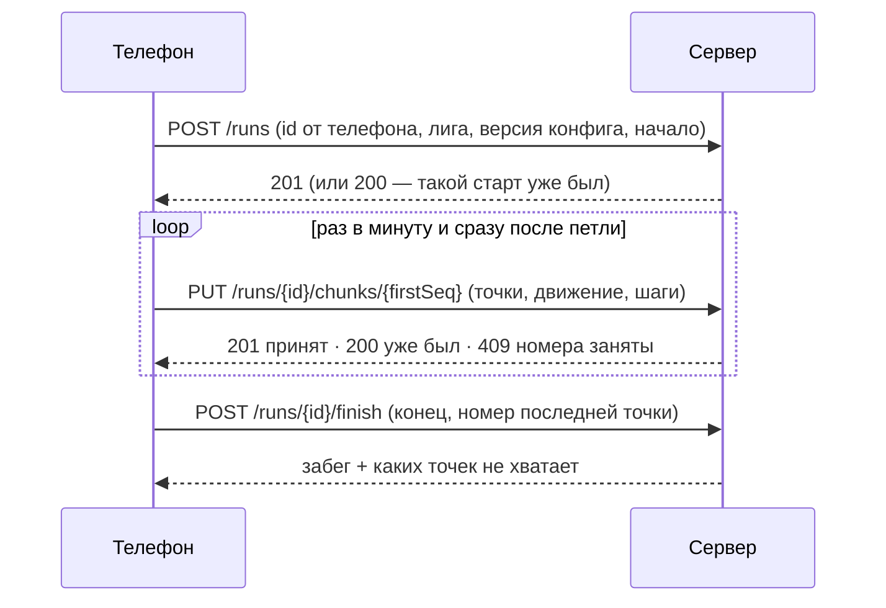

# Забеги и приём точек

Код: `backend/src/Gorodki.Api/Features/Runs` (адреса), `backend/src/Gorodki.Domain/Runs` (формат хранения и правила куска).
Главная идея: телефон работает **без сети**. Забег создаётся с идентификатором, который придумал телефон, точки досылаются
кусками, **любой запрос можно повторить** — сервер узнает повтор и ничего не сломает.

## Адреса

| Адрес | Что делает | Ошибки (`code`) |
|---|---|---|
| `POST /runs` | Старт. Повтор того же старта — 200 без изменений | `device_clock_invalid`, `run_invalid`, `start_in_future`, `run_too_old` (400) · `account_deleting`, `replay_forbidden` (403) · `run_conflict` (409) · `config_invalid` (422) · `daily_run_limit` (429) |
| `PUT /runs/{id}/chunks/{firstSeq}` | Кусок: точки подряд с номера `firstSeq` + данные датчиков | `chunk_invalid` (400, список `problems`) · `account_deleting` (403) · `run_not_found` (404) · `chunk_conflict` (409, список `overlaps`), `upload_window_closed` (409) · `run_storage_limit` (413) · `daily_storage_limit` (429) |
| `POST /runs/{id}/finish` | Конец и номер последней точки. Повтор — без изменений | `finish_invalid`, `ended_in_future` (400) · `run_not_found` (404) · `last_seq_too_small` (409) |
| `GET /runs/{id}` | Статус, какие точки уже есть (`received`) и каких не хватает (`missing`) | `run_not_found` (404) |

Все адреса — только для вошедшего игрока; чужой забег для него «не существует» (404).

## Правила для телефона (контракт)

- **Время** — целые миллисекунды Unix **по часам телефона**. В каждом запросе `sentAtMs` — «сейчас» по тем же часам:
  по нему сервер сам считает, насколько часы сбиты. Отказ только если больше чем на 12 часов (`device_clock_invalid` →
  «включите автоматическое время»).
- **Номера точек** — подряд с нуля. Точки с отрицательной точностью, устаревшие и «время назад» телефон выбрасывает
  **до** нумерации; отрицательная скорость → `null`. `flags`: 1 — координаты подставлены программой, 2 — от внешнего устройства.
- **Точность хранения**: телефон приводит измерения к шагам сервера до проверки судьёй и до отправки — тогда сервер,
  повторяя проверки, получает те же вердикты ([контракт судьи](../../contracts/README.md)).
- **Границы куска** фиксируются при первой попытке отправки (в GRDB); повтор — ровно тот же кусок. Следующий кусок
  начинается с `lastSeq + 1`.
- **409 `chunk_conflict`**: в ответе `overlaps` — какие куски уже заняли эти номера. Дослать нужно только номера,
  которых там нет.
- **404 `run_not_found`** на кусок: повторить `POST /runs` (ответ мог потеряться) и отправить кусок снова — не выбрасывать.
- **Датчики** приходят с задержкой: запоздавшие записи движения и шагомера едут со следующим куском.
  `sensorsCompleteThroughMs` — до какого момента всё уже отправлено.
- **Демо-повтор** (`source = replay`, только роли `demo` и `admin`): время записи сдвигается в прошлое —
  начало = «сейчас» − длина записи, интервалы между точками прежние. Так при ускорении ×20 точки никогда не оказываются
  «из будущего». Проверено тестом «сценарий показа».
- **Завершение** сообщает `lastSeq` (−1, если точек не было); `GET` после этого показывает `missing`.
- **Новичок**: если в ответе на старт `newcomer = true`, весь забег судится с порогом точности
  `capture.newcomerMaxAccuracyMeters` (35 м) вместо порога лиги — и на телефоне, и на сервере.
- **Датчики только дописываются**: отметка `sensorsCompleteThroughMs` — обещание «всё до этого момента уже отправлено».
  Запись датчика со временем не позже отметки более раннего куска сервер отбрасывает (и учитывает как признак доверия):
  иначе можно было бы задним числом поменять уже вынесенные вердикты.

## Что гарантирует сервер

- **Один активный забег** на игрока — уникальный индекс в базе. Активен только самый поздний по времени начала:
  более ранний закрывается (`abandoned`), а забег, пришедший из офлайна «между» двумя другими, сразу создаётся закрытым.
  Забеги одного игрока не пересекаются по времени; закрытый сервером забег телефон ещё может честно завершить.
- **Куски не пересекаются** по номерам — ограничение `EXCLUDE` в базе (расширение `btree_gist`). Одинаковые куски,
  пришедшие одновременно, сохраняются один раз.
- **Лимиты** (`RunLimits`): 1 200 точек в куске, 400 кусков и 1 МБ на забег, 10 забегов и 5 МБ на игрока в сутки,
  60 запросов в минуту (запас до 120), куски принимаются неделю после того, как сервер узнал о забеге.
  Бесплатная база — 500 МБ, при переполнении она только для чтения: лимиты защищают всю игру от одного скрипта.
- **Приватность**: в ошибках только поле и правило (`points[37]: lat_range`), без координат. Сдвиг часов, `deviceId`,
  версия приложения и разрешение «Движение» хранятся для оценки доверия (PLAN.md, §3.9).
- **Версия конфига**: забег можно начать только с действующей версией или с заменённой меньше недели назад.
- **Готовность к обработке** считается без чтения точек: у забега хранится конец непрерывного начала следа (от точки 0 без дыр)
  и отметка полноты датчиков **только по кускам этого начала** — кусок за дырой не может объявить, что всё отправлено.
- Хранение: [двоичный формат](../../backend/src/Gorodki.Domain/Runs/TrackChunkCodec.cs) — 21 байт на точку,
  SHA-256 по нему узнаёт повтор.

## Хранение

PLAN.md, §3.16: «сырые точки 14 дней». Код — `RunRetention`, раз в час в фоновом обработчике.

- **Точки забега, начатого больше 14 дней назад, стираются**: содержимое кусков (координаты и датчики) становится пустым,
  у забега ставится `points_purged_at`. Номера точек, время первой и последней точки и отпечаток остаются — сервер
  по-прежнему отвечает, какие точки получены (`received`, `missing` не меняются), и телефону нечего досылать.
- Куски в забег со стёртыми точками не принимаются (`409 upload_window_closed`, как после окна приёма). Отметка ставится
  раньше стирания и проверяется в той же команде, что резервирует место под кусок, — кусок, пришедший во время стирания,
  не ляжет после него.
- Туман и визиты по стёртым точкам не считаются (к этому времени они давно посчитаны), судья отрезков пустые куски пропускает.
- Заявки петель в такой забег (и после окна приёма) тоже не принимаются — `409 upload_window_closed`: судить петлю не по
  чему. Заявка, которая ждала до стирания, получает `stale`.
- **Забытый забег** — активный, который телефон так и не завершил (приложение удалили, телефон потерялся), — закрывается
  через сутки после предела длины (4 ч): `abandoned`, конец — начало + 4 ч. Иначе он остался бы активным навсегда и не открыл
  бы туман. Телефон, если вернётся, ещё может завершить его сам.

## Что сделаем вместе с обработкой захватов (следующие PR)

- Явные разрывы: если часть точек не придёт никогда (переустановка, неделя без сети), после завершения недостающие
  номера станут разрывом следа, иначе обработка забега встанет на дыре.
- Петля ждёт, пока `sensorsCompleteThroughMs` дойдёт до её конца; без данных «Движения» захват в «Беге» не засчитывается.
- Сутки, ночь и устаревание — по часам сервера с поправкой на сдвиг часов телефона.
- Удаление своего забега игроком.
