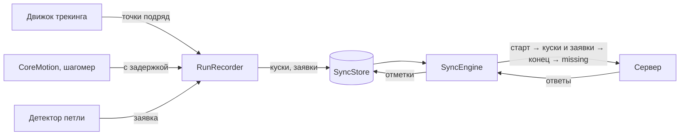

# Офлайн-синхронизация на телефоне

Код: `ios/Packages/GorodkiSync` (библиотека `Sync`). Чистый Swift без платформенных зависимостей — тестируется на Linux
в CI вместе с GameCore. Хранилище очереди — за протоколом `SyncStore`: в приложении это `GRDBSyncStore` из пакета
`GorodkiPersistence` ([ниже](#хранилище-очереди-grdb)), в тестах — `InMemorySyncStore`; запуск по расписанию (BGTasks) —
в приложении (PLAN.md, §7.2: актор `SyncEngine`, outbox). Как движок получает клиент API с подписью запросов и игрока —
в [ios-app.md](ios-app.md) (`AppDependencies.syncEngine()`).

Главная идея: **телефон никогда не ждёт сервер.** Забег пишется в очередь на телефоне, синхронизация доставляет её, когда
есть сеть. Любой запрос можно повторить (сервер узнаёт повтор — [контракт](runs.md)), поэтому проход можно оборвать где
угодно — нет сети, приложение выгружено — и начать заново: после каждого ответа состояние уже в хранилище.

**Очередь — не история.** После подтверждения сервером куски стираются; след для экранов итогов и истории приложение
хранит отдельно.

## Запись: `RunRecorder`

Сервер отвергает кусок **целиком** за любую неверную запись (TrackChunkRules), а без куска теряется вся дальнейшая
территория забега: сервер обрабатывает только след без дыр от первой точки. Поэтому запись отсекает всё неверное
по одной записи — до того, как оно попадёт в кусок.

- **Точки** приходят пронумерованными подряд с нуля и сразу приводятся к [точности хранения](../../contracts/README.md)
  сервера — судья на телефоне и на сервере видит одни и те же числа. Рядом хранится источник координат (`flags`:
  подставлены программой, от внешнего устройства — признак для доверия, PLAN.md §3.9).
- **Окно забега**: точка раньше начала больше чем на минуту или позже предела длины (`capture.maxRunHours` + 10 минут) —
  ошибка `outsideRunWindow`: пора завершать забег. Время точек строго растёт в миллисекундах (`timeNotIncreasing` —
  номер не израсходован, движок трекинга отбрасывает точку).
- **Кусок запечатывается** раз в минуту, по 120 точек, при 1 200 записях датчиков одного вида или **сразу при петле**
  (PLAN.md: «петля → немедленная отправка чанка и /loops»). Границы куска после этого не меняются — повтор шлёт то же.
- **Датчики только дописываются.** Отметка `sensorsCompleteThroughMs` — «всё до этого момента уже отправлено»; она не
  уменьшается, а пока о датчиках ничего не известно, равна началу окна забега. Запись не позже отметки запечатанного
  куска сервер отбросил бы и учёл как признак недоверия — она не записывается (`lateSensorRecords`). Записи вне окна,
  интервалы шагомера, начатые до окна (обрезка исказила бы темп), и записи сверх предела куска — тоже
  (`droppedSensorRecords`).
- **Вид движения до старта.** CoreMotion сообщает «текущий» вид движения с давним временем начала. Самый поздний такой
  уходит с первым куском со временем начала окна — иначе сервер не узнал бы, что человек уже ехал в машине. Судья на
  телефоне должен получать те же записи, что ушли в куски, — иначе его вердикты разойдутся с серверными.
- **Петля**: не короче трёх отрезков и не с тем же концом, что уже заявленная (сервер узнаёт заявку по концу петли).
- **Конец** — сначала запечатать остаток, потом записать время конца и номер последней точки (−1, если точек нет):
  увидев конец, синхронизация уже видит все куски.
- **После перезапуска** приложения запись продолжается (`resume`) с номера после последней запечатанной точки — он
  записан в забеге при каждом запечатывании, поэтому не зависит от того, какие куски уже отправлены и стёрты. Движок
  трекинга берёт его из `nextSeq`, CoreMotion дозапрашивает с `acceptsSensorsAfterMs`. Незапечатанный хвост (до минуты)
  теряется, но дыры в номерах нет.
- **Прерванный забег** (приложение выгрузили, запись не продолжена) закрывается при старте следующего или при запуске
  приложения (`closeInterrupted`): конец — последняя сохранённая точка. Иначе его петли ждали бы данных датчиков вечно.

## Доставка: `SyncEngine.syncOnce()`

Одновременно идёт только один проход: второй вызов (таймер и возврат сети сработали вместе) дожидается первого.
Синхронизируются только забеги вошедшего игрока — после смены аккаунта чужие не уходят под новым. Забеги — от раннего
к позднему (сервер закрывает более ранний активный забег, когда начинается следующий).

| Шаг | Ответ | Что делает телефон |
|---|---|---|
| `POST /runs` | 201, 200 | Забег известен серверу |
| | `run_too_old`, `run_conflict` | `GET /runs/{id}`: сервер проверяет возраст раньше повтора, и принятый забег (ответ потерялся) мог «состариться». Есть у сервера — продолжаем, нет — забег отвергнут |
| | `run_invalid`, `replay_forbidden`, `config_invalid` | Забег отвергнут навсегда, куски стираются |
| | `daily_run_limit`, `start_in_future` | Только этот забег ждёт следующего прохода |
| | `device_clock_invalid` | Проход остановлен: «включите автоматическое время» |
| Куски по порядку | 201, 200 (повтор) | Кусок доставлен; сразу уходят заявки, чьи точки теперь все у сервера |
| | 409 `chunk_conflict` | Номера из `overlaps` уже у сервера — остальное уходит новыми кусками (одной транзакцией), датчики с первым |
| | 400 `chunk_invalid`, только датчики | Кусок уходит без датчиков: точки важнее |
| | 400 `chunk_invalid`, `time_future` | Кусок ждёт: часы перевели назад |
| | 400 `chunk_invalid`, остальное | Кусок выбрасывается, остальные идут |
| | 409 `upload_window_closed`, 413 `run_storage_limit` | Неотправленные куски забега выбрасываются |
| | 429 `daily_storage_limit` | Куски ждут завтрашнего прохода; заявки на доставленные точки уходят сейчас |
| | 404 `run_not_found` | Сервер не знает забега: старт заново, всё хранимое — заново (повторы сервер узнает) |
| Заявки петель | 202, 200 (повтор) | Заявка доставлена, итог — из ответа |
| | `claim_invalid`, `claim_conflict`, `claim_limit` | Отказ окончательный, заявка не повторяется |
| `POST …/finish` | 200 | Когда забег закончен и все куски доставлены. Конец — не позже «сейчас» по тем же часам |
| | `finish_invalid`, `last_seq_too_small` | Отказ записан в забеге (`finishRejectCode`) |
| `GET /runs/{id}` | статус не `finished` | `missing` ничего не значит (сервер считает его только от последней точки) — завершение повторяется |
| | `missing` пуст | Куски стираются с телефона |
| | `missing` не пуст | Куски с этими номерами — снова в очередь (409 дорежет их до недостающих) |
| `GET …/captures` | | Итоги ещё не решённых заявок; 404 у закрытого забега — заявки помечаются неудачными |

Досылка и повтор завершения — не больше трёх кругов: сервер, который «не видит» точки, не держит забег вечно.

**Остановка прохода** (`SyncReport.stop`): нет сети (и любая ошибка 5xx) — `offline`; 401 — `unauthorized` (войти заново);
429 без кода лимита — `rateLimited`; `account_deleting` — `accountDeleting`. Ответы 401 и 429 от проверки входа
и ограничителя частоты приходят без тела; как их разбирает настоящий сгенерированный клиент, проверено тестом
(`ClientStopTests`).

## Две записи одновременно

Запись забега и синхронизация — разные акторы и пишут в хранилище одновременно. Забег меняется только через
`updateRun` — атомарно, каждый трогает свои поля: запись — прогресс, конец и последнюю точку, синхронизация — состояние
на сервере. Без этого синхронизация, начавшая проход до конца забега, затёрла бы время конца, и забег на сервере не
завершился бы никогда. Куски и заявки не конфликтуют: запись только добавляет новые, синхронизация меняет, режет
и стирает уже запечатанные.

## Хранилище очереди: GRDB

Код: `ios/Packages/GorodkiPersistence` (библиотека `Persistence`) — PLAN.md, D5: GRDB 7, SQLite, WAL, файл
`Application Support/gorodki.sqlite`.

- Таблицы `syncRun`, `syncChunk`, `syncClaim`: ключи и порядок — столбцами (забег; забег и номер первой точки; забег
  и номер заявки), сама запись — JSON модели из `Sync`. Схема ведётся миграциями (`DatabaseMigrator`), имена шагов
  не меняются никогда.
- Каждая операция — одна транзакция. `updateRun` читает, меняет и пишет забег внутри одной записи в базу: запись
  забега и синхронизация, меняющие разные поля одновременно, не затирают друг друга. `replaceChunk` (разрезание
  после 409) — тоже одной транзакцией.
- **Совместимость**: новое поле модели очереди должно читаться из старого JSON (необязательное или с миграцией,
  дописывающей значение) — иначе очередь, записанная прошлой версией приложения, не прочитается после обновления.
  Это ловит тест «Запись очереди версии 1 читается» (замороженный JSON).
- Если базу не открыть (нет места), приложение берёт очередь в памяти и не падает.
- Проверено: один и тот же набор тестов поведения — для очереди в памяти и в базе; очередь переживает закрытие
  и повторное открытие файла; одновременные «прочитать и прибавить» не теряют ни одного шага (мутация «чтение и запись
  отдельно» этот тест роняет); замороженный JSON версии 1 читается. На Linux GRDB собирается с системной SQLite
  (в CI — `libsqlite3-dev`).

## Проверки

`swift test --package-path ios/Packages/GorodkiSync`, в CI — шаг `ios-core`. Поддельный сервер (`FakeServer`) повторяет
правила настоящего: проверку куска, повтор того же куска и 409 для другого на тех же номерах, `overlaps` не больше 20,
заявки по концу петли, `missing` только после завершения, счёт запоздавших датчиков — и умеет терять ответы и сеть.
Мутационная проверка — в журнале.
