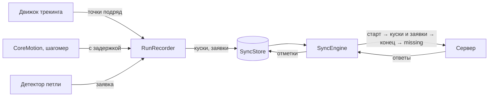

# Офлайн-синхронизация на телефоне

Код: `ios/Packages/GorodkiSync` (библиотека `Sync`). Чистый Swift без платформенных зависимостей — тестируется на Linux
в CI вместе с GameCore. Хранилище очереди — за протоколом `SyncStore`: в приложении это `GRDBSyncStore` из пакета
`GorodkiPersistence` ([ниже](#хранилище-очереди-grdb)), в тестах — `InMemorySyncStore`; фоновые пробуждения (BGTasks) —
в приложении ([ниже](#в-фоне); PLAN.md, §7.2: актор `SyncEngine`, outbox). Как движок получает клиент API с подписью запросов и игрока —
в [ios-app.md](ios-app.md) (`AppDependencies.syncEngine()`).

Главная идея: **телефон никогда не ждёт сервер.** Забег пишется в очередь на телефоне, синхронизация доставляет её, когда
есть сеть. Любой запрос можно повторить (сервер узнаёт повтор — [контракт](runs.md)), поэтому проход можно оборвать где
угодно — нет сети, приложение выгружено — и начать заново: после каждого ответа состояние уже в хранилище.

**Очередь — не история.** После подтверждения сервером куски стираются; след для экранов итогов и истории приложение
хранит отдельно.

## Забег: `RunSession`

Точка GPS проходит на телефоне тот же путь, что на сервере (PLAN.md, §7.2 «Трекинг»): `RunSession` даёт ей номер,
округляет до точности хранения, отдаёт судье отрезков (`SegmentJudge`) и записывает в очередь (`RunRecorder`);
принятые точки идут в детектор петли и туман, замкнутая петля — сразу заявка. Как точки берутся из CoreLocation
и показываются на экране забега — этап 2; сейчас тот же путь (без записи) проходит «Лаборатория» (`WalkLab`).

| Событие | Что делает `RunSession` |
|---|---|
| Точка | В очередь уходят **все** точки, и отброшенные судьёй: сервер судит тот же след теми же правилами. Судья видит точку уже округлённой — так же, как её увидит сервер |
| Время не выросло (GPS повторил точку) | Отбрасывается целиком, номер не расходуется (`.dropped`) |
| Точка старше 10 с по часам телефона (CoreLocation часто первой отдаёт запомненную) | Не нумеруется и не уходит на сервер (`.ignored(.staleFix)`): сервер проверяет свежесть по номерам, которые телефон дал только свежим точкам |
| Точка раньше начала больше чем на минуту | Не этого забега: отбрасывается (`.dropped`), забег продолжается |
| Судья: принята | Дистанция, туман, детектор петли; петля → `RunRecorder.claim` (кусок запечатывается сразу), событие `.loopClaimed` |
| Судья: отброшена (плохая точность…) | Записана, но в след не идёт; причина — в `stats.lastIssue` для подсказки |
| Судья: след порван | Детектор сбрасывается: петля не соединяет отрезки (D16); с этой точки начинается новый отрезок |
| Точка за пределом длины забега | Забег завершается сам (`.finishedAtLimit`) |
| Перезапуск приложения | `resume` продолжает нумерацию после записанных точек; судья и детектор начинают заново |

Точки обрабатываются **по одной**: следующая ждёт, пока предыдущая записана (запись куска — ожидание диска, и актор
в это время принял бы новую точку с тем же номером).

**Правила — той версии конфига, с которой начат забег.** Сервер судит забег версией `configVersion` из `POST /runs`,
поэтому телефон берёт числа той же версии: `PhoneRules` (GameCore) — судья для лиги забега, детектор петли, туман,
предел длины. Их даёт `RulesStore`: «Старт» не ждёт сервер и берёт последнюю известную версию (файл `rules.json`
в каталоге приложения; до первого ответа — версия 1, с которой собрано приложение), свежую приложение запрашивает
в фоне (`GET /config`) при выходе на передний план. Сервер принимает версию, действовавшую при начале забега или
сменённую не больше недели назад (`RunLimits.ConfigGrace`). Ответ сервера разбирается тем же `PhoneRules`, что и
файл, — через типы сгенерированного клиента и JSON; образец сервера даёт ровно версию 1. **Новичок** (ещё ни одной
засчитанной заявки) судится с порогом точности `capture.newcomerMaxAccuracyMeters` (35 м) вместо порога лиги — как на
сервере; телефон считает игрока новичком, пока в его очереди нет засчитанной заявки (лишняя заявка с другого
телефона просто не пройдёт), и помнит это в забеге (`judgedAsNewcomer`) для продолжения после перезапуска.

**Туман на телефоне — по правилу сервера** (`JudgedPath`): судья рвёт след с запаздыванием (транспорт — после 20 с,
велосипед — после 30 с), поэтому путь за 30 с до разрыва (кроме телепорта) и сама точка разрыва туман не открывают.
Телепорт окно не обрывает: если за ним в пределах 30 с следует разрыв «слишком быстро», путь до телепорта в этом окне
тоже не открывается — как на сервере.
Точка открывает туман, когда после неё прошло больше 30 с без разрыва; в конце забега — весь хвост. Дистанция на
экране — сразу, по всем принятым точкам: это подсказка, а не правило.

## Запись: `RunRecorder`

Сервер отвергает кусок **целиком** за любую неверную запись (TrackChunkRules), а без куска теряется вся дальнейшая
территория забега: сервер обрабатывает только след без дыр от первой точки. Поэтому запись отсекает всё неверное
по одной записи — до того, как оно попадёт в кусок.

- **Точки** приходят пронумерованными подряд с нуля и сразу приводятся к [точности хранения](../../contracts/README.md)
  сервера — судья на телефоне и на сервере видит одни и те же числа. Рядом хранится источник координат (`flags`:
  подставлены программой, от внешнего устройства — признак для доверия, PLAN.md §3.9).
- **Окно забега**: точка раньше начала больше чем на минуту или позже предела длины (`capture.maxRunHours` + 10 минут) —
  ошибка `outsideRunWindow`: пора завершать забег. Время точек строго растёт в миллисекундах (`timeNotIncreasing` —
  номер не израсходован, движок трекинга отбрасывает точку).
- **Кусок запечатывается** раз в минуту, по 120 точек, при 1 200 записях датчиков одного вида или **сразу при петле**
  (PLAN.md: «петля → немедленная отправка чанка и /loops»). Границы куска после этого не меняются — повтор шлёт то же.
  Буферы куска забираются до записи на диск: точки и датчики, пришедшие во время записи, уходят в следующий кусок, а
  не стираются вместе с записанным; запись не удалась — буферы возвращаются.
- **Датчики только дописываются.** Отметка `sensorsCompleteThroughMs` — «всё до этого момента уже отправлено»; она не
  уменьшается, а пока о датчиках ничего не известно, равна началу окна забега. Запись не позже отметки запечатанного
  куска сервер отбросил бы и учёл как признак недоверия — она не записывается (`lateSensorRecords`). Записи вне окна,
  интервалы шагомера, начатые до окна (обрезка исказила бы темп), и записи сверх предела куска — тоже
  (`droppedSensorRecords`).
- **Вид движения до старта.** CoreMotion сообщает «текущий» вид движения с давним временем начала. Самый поздний такой
  уходит с первым куском со временем начала окна — иначе сервер не узнал бы, что человек уже ехал в машине. Судья на
  телефоне должен получать те же записи, что ушли в куски, — иначе его вердикты разойдутся с серверными.
- **Петля**: не короче трёх отрезков и не с тем же концом, что уже заявленная (сервер узнаёт заявку по концу петли).
- **Конец** — сначала запечатать остаток, потом записать время конца и номер последней точки (−1, если точек нет):
  увидев конец, синхронизация уже видит все куски.
- **После перезапуска** приложения запись продолжается (`resume`) с номера после последней запечатанной точки — он
  записан в забеге при каждом запечатывании, поэтому не зависит от того, какие куски уже отправлены и стёрты. Движок
  трекинга берёт его из `nextSeq`, CoreMotion дозапрашивает с `acceptsSensorsAfterMs`. Незапечатанный хвост (до минуты)
  теряется, но дыры в номерах нет.
- **Прерванный забег** (приложение выгрузили, запись не продолжена) закрывается при старте следующего или при запуске
  приложения (`closeInterrupted`): конец — последняя сохранённая точка. Иначе его петли ждали бы данных датчиков вечно.

## Доставка: `SyncEngine.syncOnce()`

Одновременно идёт только один проход: второй вызов (таймер и возврат сети сработали вместе) дожидается первого.
Синхронизируются только забеги вошедшего игрока — после смены аккаунта чужие не уходят под новым. Токен в запрос
подставляет общий клиент API — токен того, кто вошёл сейчас, поэтому движок перед каждым запросом сверяет игрока
(`signedInPlayer`): вошёл другой или никто — проход останавливается, прежний движок ничего не шлёт с чужим входом, а его
таймер останавливается при создании движка нового игрока. Забеги — от раннего
к позднему (сервер закрывает более ранний активный забег, когда начинается следующий).

| Шаг | Ответ | Что делает телефон |
|---|---|---|
| `POST /runs` | 201, 200 | Забег известен серверу |
| | `run_too_old`, `run_conflict` | `GET /runs/{id}`: сервер проверяет возраст раньше повтора, и принятый забег (ответ потерялся) мог «состариться». Есть у сервера — продолжаем, нет — забег отвергнут |
| | `run_invalid`, `replay_forbidden`, `config_invalid` | Забег отвергнут навсегда, куски стираются |
| | `daily_run_limit`, `start_in_future` | Только этот забег ждёт следующего прохода |
| | `device_clock_invalid` | Проход остановлен: «включите автоматическое время» |
| Куски по порядку | 201, 200 (повтор) | Кусок доставлен; сразу уходят заявки, чьи точки теперь все у сервера |
| | 409 `chunk_conflict` | Номера из `overlaps` уже у сервера — остальное уходит новыми кусками (одной транзакцией), датчики с первым |
| | 400 `chunk_invalid`, только датчики | Кусок уходит без датчиков: точки важнее |
| | 400 `chunk_invalid`, `time_future` | Кусок ждёт: часы перевели назад |
| | 400 `chunk_invalid`, остальное | Кусок выбрасывается, остальные идут |
| | 409 `upload_window_closed`, 413 `run_storage_limit` | Неотправленные куски забега выбрасываются |
| | 429 `daily_storage_limit` | Куски ждут завтрашнего прохода; заявки на доставленные точки уходят сейчас |
| | 404 `run_not_found` | Сервер не знает забега: старт заново, всё хранимое — заново (повторы сервер узнает) |
| Заявки петель | 202, 200 (повтор) | Заявка доставлена, итог — из ответа |
| | `claim_invalid`, `claim_conflict`, `claim_limit` | Отказ окончательный, заявка не повторяется |
| `POST …/finish` | 200 | Когда забег закончен и все куски доставлены. Конец — не позже «сейчас» по тем же часам |
| | `finish_invalid`, `last_seq_too_small` | Отказ записан в забеге (`finishRejectCode`) |
| `GET /runs/{id}` | статус не `finished` | `missing` ничего не значит (сервер считает его только от последней точки) — завершение повторяется |
| | `missing` пуст | Куски стираются с телефона |
| | `missing` не пуст | Куски с этими номерами — снова в очередь (409 дорежет их до недостающих) |
| `GET …/captures` | | Итоги ещё не решённых заявок; 404 у закрытого забега — заявки помечаются неудачными |

Досылка и повтор завершения — не больше трёх кругов: сервер, который «не видит» точки, не держит забег вечно.

**Остановка прохода** (`SyncReport.stop`): нет сети (и любая ошибка 5xx) — `offline`; 401 — `unauthorized` (войти заново);
429 без кода лимита — `rateLimited`; `account_deleting` — `accountDeleting`. Ответы 401 и 429 от проверки входа
и ограничителя частоты приходят без тела; как их разбирает настоящий сгенерированный клиент, проверено тестом
(`ClientStopTests`).

## Две записи одновременно

Запись забега и синхронизация — разные акторы и пишут в хранилище одновременно. Забег меняется только через
`updateRun` — атомарно, каждый трогает свои поля: запись — прогресс, конец и последнюю точку, синхронизация — состояние
на сервере. Без этого синхронизация, начавшая проход до конца забега, затёрла бы время конца, и забег на сервере не
завершился бы никогда. Куски и заявки не конфликтуют: запись только добавляет новые, синхронизация меняет, режет
и стирает уже запечатанные.

## Когда синхронизировать: `SyncScheduler`

Проход запускается по событиям приложения — выход на передний план, возврат сети (`NWPathMonitor`), вход, новое
в очереди, подсказка реального времени ([realtime.md](realtime.md)) — и по таймеру. Когда повторить, решает чистая функция
`SyncBackoff.next` по итогу прохода и остатку очереди (`SyncBacklog`):

| Итог прохода | Когда снова |
|---|---|
| Нет сети, 5xx | 15 с, 30 с, 1 мин… до 15 минут; возврат сети, выход на передний план и вход — шаг сначала |
| 429 без кода лимита | Не раньше чем через минуту |
| 401 | Только после входа (или выхода на передний план): без входа ни одного запроса |
| Часы сбиты, аккаунт удаляется | До действия игрока (выход на передний план) |
| Сервер попросил дослать точки, есть недоставленные забеги | 15 с (число кругов ограничивает `SyncEngine`) |
| Забег отложен, исчерпан суточный объём | Через час |
| Заявки ждут итога, приложение открыто | Опрос раз в 30 с (страховка: подсказка «заявка решена» обычно раньше) |
| Больше ничего | До следующего события |

Проходы не накладываются: событие во время прохода запускает ещё один после него. Проход по таймеру идёт в своей задаче —
новый таймер не обрывает чтение очереди и запросы. Расписание одно на игрока (`AppDependencies.syncScheduler()`);
события входа слушает `SessionRelay` (поток событий `TokenStore` — для одного подписчика) и после входа запускает проход.

## В фоне

Таймер расписания работает, пока приложение живо: во время забега (фоновая геопозиция) и на переднем плане. Когда
приложение уходит в фон и iOS его приостанавливает, очередь досылают фоновые задачи (PLAN.md, §4 п. 8). Код —
`ios/App/BackgroundSync.swift`, правило «когда будить» — чистая функция `BackgroundSyncPlan` в `Sync`.

1. **Уход в фон.** Приложение просит у iOS немного времени (`beginBackgroundTask`, около 30 секунд) и делает проход
   (`trigger(.backgroundTask)`: шаг повторов сначала, но истёкший вход и сбитые часы не обходятся). Если проход уже
   идёт, фоновая задача ждёт его и следующего — иначе она попросила бы пробуждения по состоянию до прохода.
2. **Заявка на пробуждение** — по итогу прохода (`SyncScheduler.backgroundRequests`):

   | Что осталось | Что просить у iOS |
   |---|---|
   | Недоставленные забеги | Короткое пробуждение (`BGAppRefreshTask`, около 30 с) и длинное с сетью (`BGProcessingTask`, несколько минут — успевает дослать большой забег) |
   | Только заявки без итога | Короткое — забрать итоги |
   | Ничего; вход истёк; часы сбиты; аккаунт удаляется | Ничего, прежние заявки снимаются |
   | Прохода ещё не было — очередь неизвестна | Прежние заявки не трогать (`backgroundRequests == nil`) |

   Не раньше, чем решило расписание (отложенный забег — через час), и не раньше чем через 15 минут. Когда именно будить,
   решает iOS: по заряду, сети и тому, как часто приложением пользуются.
3. **Пробуждение** — сразу новая заявка того же вида (разбудившая израсходована: если iOS оборвёт задачу раньше итога,
   без неё приложение больше не проснётся), затем проход и заявки по его итогу, пока очередь не опустеет. Если время
   вышло раньше, задача закрывается: всё, что сервер успел подтвердить, уже в базе, и следующий проход продолжит с того
   же места.

Идентификаторы задач — `<bundle ID>.sync.refresh` и `.sync.upload` (Info.plist, `BGTaskSchedulerPermittedIdentifiers`),
фоновые режимы `fetch` и `processing`. Регистрация — при запуске (`AppDelegate`): позже iOS её не принимает.

**Проверено:** правило пробуждений и новая причина прохода — тестами на Linux (вместе с мутациями); код с
`BackgroundTasks` собирает CI на Xcode. Как часто iOS будит на самом деле, видно только на телефоне: при пробной прогулке
нужно закончить забег без сети и посмотреть, дойдёт ли он, не открывая приложение.

## Хранилище очереди: GRDB

Код: `ios/Packages/GorodkiPersistence` (библиотека `Persistence`) — PLAN.md, D5: GRDB 7, SQLite, WAL, файл
`Application Support/gorodki.sqlite`.

- Таблицы `syncRun`, `syncChunk`, `syncClaim`: ключи и порядок — столбцами (забег; забег и номер первой точки; забег
  и номер заявки), сама запись — JSON модели из `Sync`. Схема ведётся миграциями (`DatabaseMigrator`), имена шагов
  не меняются никогда.
- Каждая операция — одна транзакция. `updateRun` читает, меняет и пишет забег внутри одной записи в базу: запись
  забега и синхронизация, меняющие разные поля одновременно, не затирают друг друга. `replaceChunk` (разрезание
  после 409) — тоже одной транзакцией.
- **Совместимость**: новое поле модели очереди должно читаться из старого JSON (необязательное или с миграцией,
  дописывающей значение) — иначе очередь, записанная прошлой версией приложения, не прочитается после обновления.
  Это ловит тест «Запись очереди версии 1 читается» (замороженный JSON).
- Если базу не открыть (нет места), приложение берёт очередь в памяти и не падает. Риск: забег, не доставленный до
  выгрузки приложения, пропадёт — поэтому `AppDependencies.queueSurvivesRestart` скажет экрану забега (этап 2)
  предупредить игрока.
- Проверено: один и тот же набор тестов поведения — для очереди в памяти и в базе; очередь переживает закрытие
  и повторное открытие файла; одновременные «прочитать и прибавить» не теряют ни одного шага (мутация «чтение и запись
  отдельно» этот тест роняет); замороженный JSON версии 1 читается. На Linux GRDB собирается с системной SQLite
  (в CI — `libsqlite3-dev`).

## Проверки

- **`RunSession`** (20 тестов на прогулках по плоскости): все точки подряд с нуля; квадрат → одна заявка, кусок
  запечатан; дубль по времени; устаревшая точка не нумеруется; точка раньше начала не завершает забег; плохая
  точность — записана, но не в следе; судья видит точку округлённой (25,04 м → 25,0); разрыв посреди квадрата — заявки
  нет; предел длины; перезапуск; датчики — судье и в очередь в точности хранения; туман отстаёт на 30 с; «машина» —
  30 с перед разрывом не открыты, телепорт путь до скачка не отменяет, а телепорт и следом машина — отменяют; две
  точки одновременно — по одной; точка во время записи куска не теряется; правила версии и новичок. Мутационные
  проверки: 8 поломок, затем ещё 5 по ревью — все пойманы.

`swift test --package-path ios/Packages/GorodkiSync`, в CI — шаг `ios-core`. Поддельный сервер (`FakeServer`) повторяет
правила настоящего: проверку куска, повтор того же куска и 409 для другого на тех же номерах, `overlaps` не больше 20,
заявки по концу петли, `missing` только после завершения, счёт запоздавших датчиков — и умеет терять ответы и сеть.
Мутационная проверка — в журнале.
