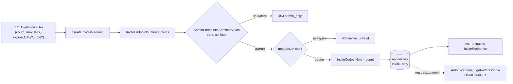

# Егор: сервер — твоя часть

> Для Егора (GitHub `trinotox64`). Составлено 25.09.2026 по решению Никиты: Claude делает 30–50 % оставшегося сервера,
> остальное — ты. Этот файл — карта сервера, правила работы и твои задачи по волнам с пошаговым разбором первых.
> Стартовые задачи (#34–#41: 2FA, Supabase, запуск у себя, первый PR…) — в [for-egor.md](for-egor.md), начни с них.
> Все твои задачи — [открытые, назначенные на тебя](https://github.com/Nikich196/gorodki/issues?q=is%3Aopen+assignee%3Atrinotox64);
> зонтик с порядком и правилами — [#117](https://github.com/Nikich196/gorodki/issues/117).
> Если что-то здесь расходится с кодом — прав код, а этот файл надо поправить (напиши в задаче).

## Оглавление

0. [Коротко](#0-коротко)
1. [Как мы делим сервер](#1-как-мы-делим-сервер)
2. [Карта сервера](#2-карта-сервера)
3. [Как работать](#3-как-работать)
4. [Приватность — что нельзя ломать никогда](#4-приватность--что-нельзя-ломать-никогда)
5. [Твои задачи по волнам](#5-твои-задачи-по-волнам)
6. [Волна 0 по шагам](#6-волна-0-по-шагам)
7. [Волны 1–4: карточки задач](#7-волны-14-карточки-задач)
8. [Если застрял](#8-если-застрял)

## 0. Коротко

- **Что ты делаешь:** новые адреса и таблицы по готовым образцам, данные для экранов (только чтение), админку, задачи по
  расписанию и чистые функции правил. Землю, журнал захватов и границу публичности трогает только Claude.
- **С чего начать:** волна 0 — [#71](https://github.com/Nikich196/gorodki/issues/71) → [#114](https://github.com/Nikich196/gorodki/issues/114)
  → [#115](https://github.com/Nikich196/gorodki/issues/115) → [#116](https://github.com/Nikich196/gorodki/issues/116).
  Всё для них уже лежит в `main`: заглушки `// ЗАДАЧА #NN`, запросы и ответы, тесты со `Skip = "ЗАДАЧА #NN"`.
- **Как понять, что готово:** снимаешь `Skip`, тесты зелёные у тебя и в CI, в PR 5 строк «своими словами».
- **Не успел — не страшно:** задачу доделывает Claude, а ты разбираешь решение — на защите объяснять нужно всё.
- **Нельзя:** отдавать телефону чужие координаты и ещё скрытые чужие захваты, показывать ник без согласия, забывать
  данные игрока при удалении аккаунта. Подробно — [раздел 4](#4-приватность--что-нельзя-ломать-никогда).
- **Застрял больше чем на 20 минут** — спроси ([раздел 8](#8-если-застрял)). Это дешевле, чем угадывать.

## 1. Как мы делим сервер

Решение Никиты 25.09: по объёму оставшегося сервера Claude — около 45 %, ты — около 55 %. Правило — «ничего не усложнять».

| Кто | Что | Почему так |
|---|---|---|
| **Claude** | Всё, что пишет в землю, журнал захватов и публичную проекцию (`TerritoryMap`, `CaptureProcessor`, `TerritoryReader`, `RevealScanner`); граница публичности; геометрия и OSM; миграции, которые правят уже лежащие данные; контракты между сервером и телефоном; каркасы (например, Hangfire) | Здесь одна ошибка тихо выдаёт, где человек находится прямо сейчас, или портит карту всем. Это держат сотни тестов и мутационные проверки |
| **Claude, перед каждой твоей задачей** | **Заготовка контракта**: адрес-заглушка `// ЗАДАЧА #NN`, запрос и ответ (DTO), пример ответа в `contracts/samples`, перегенерированное описание API и тесты со `Skip` — как в [#71](https://github.com/Nikich196/gorodki/issues/71) | Телефон (Никита) может строить экран, не дожидаясь тебя; ты не правишь `contracts/*.json` руками |
| **Ты** | Новые таблицы и адреса по готовым образцам; данные для экранов на чтение; админка; задачи по расписанию; чистые функции правил в `Gorodki.Domain` (их тесты идут без Docker) | Хорошо ложится на образцы, которые уже есть в коде, и хорошо объясняется на защите |

**Правило сроков.** Не успел к сроку — задачу доделывает Claude, а ты разбираешь решение. Для задач **«ворот»** (без них не
стартует Сезон 0 или рейтинг: E2, E5, E7, E9) строже: **нет PR за 3 дня до срока — задачу берёт Claude**. Это не штраф, а
страховка расписания.

**Честно о времени.** Весь твой список — около 90 часов. При 2 часах в неделю до 08.12 выходит около 20. Значит, волна 0
и часть волны 1 — точно твои, а многое из волн 2–4, скорее всего, доделает Claude. Это нормально: план так и устроен.
Лучше сделать меньше, но понимать каждую строку. Правило «до 1,5 часа» из [CONTRIBUTING.md](../../CONTRIBUTING.md#задачи-для-друга)
для этих задач работает так: большая задача делится на заходы по 1–1,5 часа (у кланов — прямо на части E5a, E5b, E5c).
Правило §8 плана «вне критического пути, одна в 2 недели» для серверных задач заменено этим файлом: волны, сроки, «ворота».

Задачи Claude по порядку (от них зависят твои): C1 разбивка итога захвата только после границы (сделано 25.09) · C15
заготовки контрактов · C5 каркас Hangfire · C18 инструмент калибровки · C3 большая петля (сделано 25.09) · C6 конвейер
OSM · C11 визиты в ответе забега и помощник границы публичности (сделано 25.09) · C14 линии границ · C2 #101 · C9 очки SP
за захват (сделано 25.09) · C4 смена сезона (сделано 25.09) · C7 «Ничейные земли» · C8 кланы в движке и на карте · C10 события уведомлений после
границы · C13 «Радар»/«Магнит» · C12 тайники в конвейере · C16 отрезки и вело · C17 демо-режим.

## 2. Карта сервера

### 2.1 Папки

```
backend/
├─ global.json               версия .NET SDK и запуск тестов — поэтому все команды dotnet запускаем из backend/
├─ Directory.Packages.props  версии всех NuGet-пакетов (только здесь)
├─ Directory.Build.props     общие настройки; в CI (CI=true) любое предупреждение — ошибка
├─ dotnet-tools.json         dotnet-ef нужной версии (dotnet tool restore)
├─ Dockerfile                образ для Render
├─ src/
│  ├─ Gorodki.Domain/        ПРАВИЛА ИГРЫ: чистый C#, без базы и без HTTP
│  │  ├─ Config/             игровой конфиг: все числа правил (GameConfig)
│  │  ├─ Fog/                туман «Исследования»: сетка, биты тайлов, площадь клетки
│  │  ├─ Geo/                геометрия и проекция UTM (GeoOps, Utm34, TileKey)
│  │  ├─ Leagues/            лиги «Бег» и «Вело»
│  │  ├─ Runs/               забег: куски точек, судья отрезков, заявки петель
│  │  ├─ Scoring/            очки сезона: ступени, бонусы, дистанция (Scores)
│  │  ├─ Territory/          участки: правила захвата, угасание, визиты, мягкий сброс сезона, движок TerritoryMap
│  │  └─ Time/               игровое время по Минску, сезоны (GameClock, SeasonCalendar)
│  └─ Gorodki.Api/           ВЕБ-СЕРВЕР
│     ├─ Program.cs          сборка приложения: сервисы, вход, лимиты, какие адреса подключены
│     ├─ Features/           по папке на возможность («вертикальный срез»): адреса + их логика
│     │  ├─ Admin/           откат нарушителя, инвайты (твоя #114)
│     │  ├─ Auth/            вход через Google, токены, правила регистрации
│     │  ├─ Captures/        заявки петель, обработчик захватов, визиты, фоновый CaptureWorker
│     │  ├─ Config/          GET /config, хранилище версий конфига
│     │  ├─ Fog/             GET /fog, /fog/summary, DELETE /fog
│     │  ├─ Health/          /health, /health/ready
│     │  ├─ Leaderboards/    рейтинг «Кто открыл больше», ежедневный срез, псевдоним «Игрок #1234»
│     │  ├─ Me/              профиль, согласие на ник (#71), статистика (#116), «Мои данные», удаление, приватные зоны
│     │  ├─ Players/         карточка игрока (твоя #115)
│     │  ├─ Realtime/        SignalR: подсказки «тайлы изменились», «заявка решена»
│     │  ├─ Runs/            забеги: старт, куски точек, финиш
│     │  ├─ Scoring/         книга очков сезона (ScoreBook): запись в захвате и визитах, чтение с границей публичности
│     │  ├─ Seasons/         GET /seasons, смена сезона — задача Hangfire (SeasonRollover)
│     │  └─ Territory/       GET /territory и публичная проекция (TerritoryReader)
│     └─ Infrastructure/
│        ├─ OpenApi/         описание API, удобное для Swift-клиента
│        └─ Persistence/     База: Entities.cs (таблицы), AppDbContext.cs (ключи, индексы, связи), Migrations/
├─ tests/
│  ├─ Gorodki.Domain.Tests/       правила игры — быстро, без базы и Docker
│  ├─ Gorodki.Api.Tests/          сервер в памяти без базы: контракт, открытые адреса, миграции, чистые функции Api
│  └─ Gorodki.IntegrationTests/   сервер в памяти + настоящая база PostgreSQL/PostGIS в Docker (образ Supabase)
└─ tools/Gorodki.GeoBench/        замер скорости движка участков (тебе не нужен)

contracts/                   общие файлы сервера и телефона — руками не правим (как обновлять — в разделе 2.5)
├─ openapi.v1.json           описание API; его копия — ios/Packages/GorodkiAPI/Sources/GorodkiAPI/openapi.json
└─ samples/*.json            «эталонные ответы» сервера, их разбирает клиент на телефоне
```

Подробнее про каждую часть — [docs/architecture/](../architecture/): вход — [auth.md](../architecture/auth.md),
забеги — [runs.md](../architecture/runs.md), захваты — [captures.md](../architecture/captures.md), карта —
[territory-map.md](../architecture/territory-map.md), туман и рейтинг — [fog.md](../architecture/fog.md), таблицы —
[data-model.md](../architecture/data-model.md).

### 2.2 Путь запроса: от телефона до базы и обратно

Разберём на живом примере — `GET /me` (профиль). Любой твой адрес проходит тот же путь.

```mermaid
sequenceDiagram
    participant Т as Телефон
    participant К as Конвейер ASP.NET (Program.cs)
    participant А as Адрес (MeEndpoints.GetMe)
    participant Б as База (AppDbContext → PostgreSQL)
    Т->>К: GET /me, заголовок Authorization: Bearer <токен>
    К->>К: ошибки → ProblemDetails; вход: проверка токена (JWT)
    К->>К: права: без входа — 401 (политика «по умолчанию закрыто»); лимит запросов
    К->>А: вызов метода; параметры подставлены сами
    А->>Б: LINQ: db.Users.Where(u => u.Id == userId)
    Б-->>А: UserEntity
    А-->>К: TypedResults.Ok(new MeResponse(...))
    К-->>Т: 200 и JSON { "id": …, "displayName": … }
```

По шагам — что где лежит:

1. **Регистрация адреса.** В `Program.cs` вызывается `app.MapMeEndpoints()`. Сам метод — в `Features/Me/MeEndpoints.cs`:
   `app.MapGet("/me", GetMe).WithName("getMe")…`. `WithName` — имя операции в описании API: из него получается имя метода
   в Swift-клиенте. `WithTags`, `WithSummary` — подписи в описании API и на странице Scalar.
2. **Конвейер (middleware)** — в `Program.cs` сверху вниз: `UseExceptionHandler` (исключение → ответ 500 в формате
   ProblemDetails), `UseAuthentication` (читает токен, заполняет `ClaimsPrincipal`), `UseAuthorization` (без входа —
   401: **всё закрыто по умолчанию**, открытые адреса помечаются `AllowAnonymous` явно), `UseRateLimiter` (лимиты).
3. **Параметры метода подставляет ASP.NET сам** (minimal API):
   - часть пути `{id:guid}` → параметр `Guid id` (не Guid — адрес просто не найдётся, 404);
   - тело запроса JSON → запрос-`record` (например, `PublicProfileRequest`); поле с `[JsonRequired]` не пришло — 400 ещё
     до твоего кода;
   - строка запроса `?layer=foot` → `string? layer`;
   - сервисы из контейнера зависимостей: `AppDbContext db` (база), `TimeProvider time` (часы), `ClaimsPrincipal
     principal` (кто вошёл), `CancellationToken` (запрос отменён — работа прекращается).
4. **Кто вошёл** — `principal.UserId()` (`Features/Auth/ClaimsPrincipalExtensions.cs`): номер игрока из токена или `null`.
   Роль администратора **проверяется по базе**, а не по токену — `AdminEndpoints.AdminIdAsync`.
5. **База** — через EF Core: `db.Users`, `db.Runs`, `db.Invites`… — это таблицы. LINQ (`Where`, `Select`, `OrderBy`,
   `CountAsync`, `SumAsync`) превращается в SQL. Для чтения — `AsNoTracking()`. Изменить много строк одной командой —
   `ExecuteUpdateAsync`, удалить — `ExecuteDeleteAsync`; добавить — `db.X.Add(...)` и `SaveChangesAsync`.
6. **Ответ** — `TypedResults.Ok(...)`, `Created(...)`, `NoContent()`, `NotFound()`, ошибка — `TypedResults.Problem(...)` с
   полем `code` (стабильный код для приложения, например `invite_not_found`). Тип результата пишется в сигнатуре:
   `Task<Results<Ok<MeResponse>, NotFound>>` — по нему строится описание API.
7. **JSON** настроен один раз в `Program.cs`: имена полей — camelCase (`displayName`), перечисления — строками (`"run"`),
   числа — только числами. Время в API — **миллисекунды Unix** (`…AtMs`), в базе — `DateTimeOffset`.

**Где лежат DTO (запросы и ответы).** Прямо над адресами в том же файле, как `record`: `MeResponse`,
`PublicProfileRequest`, `InviteResponse`… Ответ — **никогда не сама сущность базы** (`UserEntity`): в ней есть поля,
которые телефону видеть нельзя.

### 2.3 Где живут правила: Domain или Api

Вопрос для каждой функции: **можно ли её проверить без базы и без HTTP?**

- **Да → `Gorodki.Domain`.** Чистая функция: на входе числа и списки, на выходе решение. Пример — `CaptureRules.Decide`
  (что стало с куском земли), `DailyWindow`, `SeasonCalendar`. Тесты — в `Gorodki.Domain.Tests`, Docker не нужен, идут
  за секунды, отладчиком проходятся построчно. Сюда пойдут твои `ClanRules`, `NotificationBudget`, `TrustSignals`,
  `SegmentEffortDetector`.
- **Нет → `Gorodki.Api/Features/<Название>`.** Адреса, запросы к базе, фоновые задачи. Тесты — интеграционные.
- Бывает посередине: чистая функция, которая нужна только серверу (как `RegistrationRules` или `InviteCodes`), — лежит
  в `Gorodki.Api`, но тестируется в `Gorodki.Api.Tests` тоже без базы.

Числа правил (радиусы, пороги, очки) — **в игровом конфиге** (`Gorodki.Domain/Config/GameConfig.cs`,
`contracts/game-config.v1.json`), а не в коде: иначе их не поменять без выпуска. Новый раздел конфига — это изменение
контракта, его делает Claude. Время — **только через `TimeProvider`/`GameClock`**, никогда `DateTime.Now`: тесты
подменяют часы (`FakeTimeProvider`) и проверяют «через 72 часа», не ожидая 72 часа.

### 2.4 База: сущность → AppDbContext → миграция

Новая таблица — это всегда четыре связанных места. Пропустишь одно — упадёт страховочный тест (раздел 2.6).

1. **Сущность** в `Infrastructure/Persistence/Entities.cs` — класс с полями, например `PrivacyZoneEntity`
   (`Id`, `UserId`, `Latitude`, `Longitude`, `CreatedAt`). Время — `DateTimeOffset`, номер — `Guid` (`Guid.CreateVersion7()`).
2. **`AppDbContext.cs`**:
   - свойство `public DbSet<PrivacyZoneEntity> PrivacyZones => Set<PrivacyZoneEntity>();` — через него пишешь запросы;
   - в `OnModelCreating` — блок `model.Entity<PrivacyZoneEntity>(zone => { … })`: ключ (`HasKey`), индексы (`HasIndex`
     — по тому, по чему ищешь), **связь с игроком** `HasOne<UserEntity>().WithMany().HasForeignKey(z => z.UserId)
     .OnDelete(DeleteBehavior.Cascade)` (удалили игрока — строки ушли сами), проверки (`HasCheckConstraint`).
   - Имена в базе появляются сами: `snake_case` в схеме `app` (`app.privacy_zones`, столбец `user_id`).
3. **Миграция** — из папки `backend`:
   ```powershell
   dotnet tool restore
   dotnet ef migrations add Clans --project src/Gorodki.Api --output-dir Infrastructure/Persistence/Migrations
   ```
   Появятся три файла: `…_Clans.cs`, `…_Clans.Designer.cs` и обновлённый `AppDbContextModelSnapshot.cs`. Коммить все три.
   Посмотреть SQL — `dotnet ef migrations script --project src/Gorodki.Api`. Базу для этого запускать не нужно.
   Миграцию, которая **правит уже лежащие данные** (переносит, пересчитывает), делает Claude.
4. **Данные игрока — в удаление и выгрузку.** Если в таблице есть номер игрока:
   - удаление аккаунта (`Features/Me/AccountDeletion.cs`) — обычно хватает каскада из пункта 2; если номер лежит в поле
     без связи (например, «кто пригласил», «кто атаковал») — сотри или обезличь его там явно;
   - «Мои данные» (`Features/Me/AccountExport.cs`) — добавь раздел в `AccountExportResponse` (закон 99-З: всё, что храним,
     человек может выгрузить);
   - **и в оба теста** — `AccountDeletionTests` и `AccountExportTests` — строку Анны в новой таблице: они проверяют только
     то, что у Анны есть (раздел 2.6).

### 2.5 Контракт с телефоном

Телефон (Никита, Swift) и сервер договариваются через файлы в `contracts/`:

- `contracts/openapi.v1.json` — **описание API**. Сервер строит его сам по адресам (`WithName`, типы ответов), а из копии
  `ios/Packages/GorodkiAPI/Sources/GorodkiAPI/openapi.json` генерируется Swift-клиент. Тест `OpenApiContractTests` сравнивает
  живое описание с файлом и копией.
- `contracts/samples/*.json` — **эталонные ответы**: сервер сериализует их своими настройками JSON (тест `ApiSamplesTests`),
  а телефон разбирает каждый (тесты `GorodkiAPI`).
- **Кто меняет:** заготовку делает Claude. Ты меняешь адрес так, что его описание не меняется: реализуешь тело метода.
  Если всё же поменял сигнатуру или ответ (и это согласовано) — обнови файлы командой из `backend`:
  `$env:GORODKI_UPDATE_CONTRACTS = "1"; dotnet test --project tests/Gorodki.Api.Tests; Remove-Item Env:GORODKI_UPDATE_CONTRACTS`
  и напиши об этом в PR: телефон придётся пересобрать.
- **Адреса администратора** (`/admin/...`) в описание для телефона не входят: `MapGroup("/admin").ExcludeFromDescription()`.
  Поэтому их нет и на странице Scalar.

### 2.6 Тесты и страховочная сетка

Три проекта (раздел 2.1). Тест пишется по схеме «дано → действие → проверка», имя — английское предложение
(`Revoked_code_no_longer_lets_anyone_register`), комментарии — по-русски. В интеграционных тестах:

- `[Collection(DatabaseCollection.Name)]` и `database.RequireDatabase()` в начале — без Docker тест пропускается;
- `await using var api = new ApiFactory(database);` — сервер в памяти на общей тестовой базе, часы подставные (`api.Time`);
- `api.CreatePlayerClientAsync()` — игрок прямо в базе и готовый клиент с его токеном; `CreatePlayerClientAsync(UserRole.Admin)` —
  администратор; `newcomer: true` — свежий аккаунт без старых забегов;
- `api.Time.Advance(TimeSpan.FromHours(72))` — «прошло 72 часа»;
- база общая для всех тестов: каждый тест заводит своих игроков и ищет только своё (`Single(i => i.Code == code)`), а не
  «всё в таблице».

**Страховочная сетка** — тесты, которые ловят типичные ошибки сами, даже если ты о них не подумал:

| Тест | Что ловит | Упал — что делать |
|---|---|---|
| `IdorTests` (интеграционный) | Каждый адрес с параметром в пути (`{id}`, `{code}`) проверен: чужой ресурс — 404 (или 403 в админке), чужие данные в ответе не видны. Список адресов тест берёт у самого сервера | Новый адрес с `{…}` — добавь строку в `Expected` и запрос Бориса к ресурсу Анны. Адрес твоей задачи сейчас ждёт в `AwaitingTasks` — сделал задачу, убери строку оттуда |
| `AnonymousAccessTests` (`Gorodki.Api.Tests`) | Всё, кроме `/health` и `/auth/*`, без входа отвечает 401 | Никогда не ставь `AllowAnonymous` без решения Никиты. Упал — значит, адрес случайно открыт |
| `AccountDeletionTests` (интеграционный) | После удаления аккаунта номер Анны не остался ни в одном столбце-идентификаторе схемы `app` (и в списках `uuid[]`). **Ловит, только если у Анны в тесте есть строка в твоей таблице** | Новая таблица с номером игрока: добавь в тест такую строку (Анна создала клан…), потом — связь с каскадом (раздел 2.4) или явное стирание в `AccountDeletion` |
| `AccountExportTests` (интеграционный) | «Мои данные» содержат всё об игроке и ничего чужого — тоже только то, что в тесте есть у Анны и Бориса | Добавь свою таблицу в `AccountExport` и строку Анны (и Бориса — чтобы проверить «ничего чужого») в тест |
| `MigrationsTests` (`Gorodki.Api.Tests`) | Модель в коде изменилась, а миграции нет | `dotnet ef migrations add <Имя>` (раздел 2.4) |
| `OpenApiContractTests` (`Gorodki.Api.Tests`) | Описание API поменялось, а `contracts/openapi.v1.json` — нет | Вероятно, ты случайно поменял сигнатуру, имя или тип ответа. Верни как было или согласуй (раздел 2.5) |
| `ApiSamplesTests` (`Gorodki.Api.Tests`) | Сервер пишет эталонный ответ иначе, чем лежит в `contracts/samples` | Переименовал или убрал поле ответа — верни. Телефон сломался бы на разборе |

## 3. Как работать

### 3.1 Один раз

- Всё из [getting-started-windows.md](getting-started-windows.md) и задачи [#36](https://github.com/Nikich196/gorodki/issues/36):
  .NET 10 SDK, Git, среда (Rider, Visual Studio или VS Code), `git clone`, тесты и сервер у себя.
- `git config --global user.name "Trinoto"` и `user.email` (можно адрес `…@users.noreply.github.com`, см. [for-egor.md](for-egor.md#5-как-работать-с-репозиторием)).
- Docker Desktop — **по желанию**: без него интеграционные тесты у тебя пропускаются, их прогонит CI (раздел 3.4).

### 3.2 Цикл одной задачи

```powershell
git switch main
git pull                                  # свежий main: там заготовка твоей задачи
git switch -c feat/admin-invites          # ветка латиницей: тип/коротко
cd backend
dotnet build Gorodki.slnx                 # собирается?
```

1. Открой задачу на GitHub и заглушку `// ЗАДАЧА #NN` в коде (поиск по всему решению: `ЗАДАЧА #114`).
2. Сними `Skip` **у одного** теста — `[Fact(Skip = "ЗАДАЧА #114")]` → `[Fact]`. Запусти его — он красный. Напиши код, пока
   не станет зелёным. Потом следующий тест. Так понятно, что именно чинишь.
3. Все тесты своего класса зелёные → прогони всё (таблица ниже) → оформление кода.
4. Коммиты — маленькие и понятные, по-русски: `feat(backend): инвайт-коды XXXX-XXXX` (тип и область — [CONTRIBUTING.md](../../CONTRIBUTING.md#коммиты)).
5. `git push -u origin feat/admin-invites` → на GitHub **Compare & pull request** → шаблон PR (раздел 3.5).
6. Ждёшь зелёный CI (около 3 минут). Claude оставит комментарии, сливает Никита. После слияния: `git switch main`, `git pull`.

### 3.3 Команды (всё из папки `backend`)

| Что | Команда |
|---|---|
| Собрать | `dotnet build Gorodki.slnx` |
| Собрать как CI (предупреждения = ошибки) | `$env:CI = "true"; dotnet build Gorodki.slnx -c Release; Remove-Item Env:CI` |
| Все тесты | `dotnet test --solution Gorodki.slnx` |
| Один проект | `dotnet test --project tests/Gorodki.Api.Tests` |
| Один класс тестов | `dotnet test --project tests/Gorodki.Api.Tests --filter-class Gorodki.Api.Tests.Admin.InviteCodesTests` |
| Один тест | `dotnet test --project tests/Gorodki.IntegrationTests --filter-method "Gorodki.IntegrationTests.AdminInvitesTests.Only_an_admin_manages_invites"` |
| Оформление: проверить | `dotnet format Gorodki.slnx --verify-no-changes` (молчит — всё хорошо) |
| Оформление: исправить | `dotnet format Gorodki.slnx` |
| Запустить сервер | `dotnet run --project src/Gorodki.Api` → http://localhost:5080/scalar |
| Миграция | `dotnet tool restore`, затем `dotnet ef migrations add <Имя> --project src/Gorodki.Api --output-dir Infrastructure/Persistence/Migrations` |

`MSB1001: Unknown switch --solution` — ты не в папке `backend`. Сервер без базы запускается только с `/health` и
`/scalar` — так задумано; твои адреса проверяют тесты.

### 3.4 Интеграционные тесты: Docker или CI

- **С Docker Desktop:** `dotnet test --project tests/Gorodki.IntegrationTests` сам поднимет PostgreSQL + PostGIS (образ
  Supabase, первый раз скачивается несколько минут). Цикл «правка → тест» — секунды.
- **Без Docker:** тесты у тебя пропускаются («Нет Docker»). Пушь ветку и открой PR — CI прогонит их на Linux. Цикл дольше
  (около 3 минут на запуск), поэтому сначала добейся зелёного во всём, что идёт без базы.
- Упал тест у тебя, а в CI зелёный (или наоборот, только на Windows) — это наша ошибка, не твоя: пришли вывод целиком.

### 3.5 PR: шаблон и «5 строк своими словами»

Шаблон подставится сам ([.github/PULL_REQUEST_TEMPLATE.md](../../.github/PULL_REQUEST_TEMPLATE.md)): «Что сделано»,
«Зачем» (`Closes #114`), «Как проверено», чек-лист. Главное — **5 строк своими словами**, как это работает. Например,
для #114: какие адреса, кто может ими пользоваться и как это проверяется, почему код из `RandomNumberGenerator`, почему
погашенный код не удаляется, что увидит новый игрок с погашенным кодом. Эти строки — твоя подготовка к защите.

### 3.6 Частые красные CI и что с ними делать

| В логе CI | Что случилось | Что делать |
|---|---|---|
| `error CS…` на шаге «Сборка», а у тебя собиралось | В CI предупреждение — ошибка (неиспользуемая переменная, возможный `null`, `async` без `await`) | Собери как CI (раздел 3.3) и исправь предупреждения |
| Шаг «Оформление кода» красный | Отступы, пробелы, порядок `using` | `dotnet format Gorodki.slnx`, закоммить |
| `Модель изменилась, а миграции нет` | Поменял сущность без миграции | Раздел 2.4, пункт 3 |
| `Описание API изменилось…` | Поменялась сигнатура адреса | Раздел 2.5 |
| Упал `IdorTests.Every_route_with_an_identifier_is_checked` | Новый адрес с `{…}` без строки в `Expected` | Раздел 2.6 |
| Упал `AccountDeletionTests` | Номер игрока остался после удаления | Раздел 2.4, пункт 4 |

## 4. Приватность — что нельзя ломать никогда

Репозиторий публичный, игра — про то, где ходят люди. Эти правила важнее любого срока.

1. **Граница публичности.** Чужой захват другие видят только через 20 минут, пачками по 5 минут (`TerritoryReader.PublicHorizon`,
   PLAN §3.16): иначе карта показывала бы, где человек находится прямо сейчас. До границы на его месте земля такая, какой
   была раньше (публичная проекция). Поэтому:
   - никогда не считай ничего по **настоящим** кускам земли (`db.Parcels`) для ответа игроку — ни «площадь моей земли», ни
     «сколько у меня участков». Скрытый чужой захват твоей земли уменьшил бы число раньше, чем его покажет карта, — и выдал
     бы его. Такие числа — только через помощник `TerritoryReader.VisibleOwnedAreaAsync(userId, league, viewer, ct)`
     (C11): площадь своей земли в м² такой, какой её видит зритель на карте (угасшая не считается). Для экранов самого
     игрока («Статистика», #116) зритель — он сам, `new TerritoryViewer(userId, false)`: свои свежие захваты сразу, чужие
     скрытые — нет. Для того, что видят другие (рейтинги, лента, карточка недели), — посторонний,
     `new TerritoryViewer(null, false)`: и свой свежий захват прибавится через те же 20–25 минут;
   - **очки сезона** (рейтинги, срез E7, Зал славы) — только через `ScoreBook.Visible(db, now)` (`visible_at ≤ now`),
     `ScoreBook.SeasonTotalsAsync` или `ScoreBook.FinalTotalsAsync` (итог закрытого сезона): очки за захват видны с той же
     границы, что и сам захват на карте, — даже самому автору
     (по бонусам угадывалась бы разбивка итога). Площадь «тронутой в сезоне» земли для удержания — тот же
     `VisibleOwnedAreaAsync` с параметром `touchedSince` ([очки и сезоны](../architecture/scoring-and-seasons.md));
   - события о чужих захватах (лента, «Входящие», уведомления) получают `visible_at` через помощник
     `TerritoryReader.VisibleAtAsync(actorId, appliedAt, ct)` — не раньше границы. `appliedAt` — время **применения**
     захвата к карте (`captures.applied_at`), а не петли: петля из офлайна применяется позже. Визитам помощник не нужен:
     они записываются уже после границы и видны сразу (`runs.visits_processed_at`);
   - сам ничего не придумывай с задержками: если нужно время «когда можно показать» — спроси.
2. **Никаких координат на телефон**, кроме того, что уже есть на карте (контуры земли) и своих точек игрока. Тайники,
   «Коллекция», лента, карточка недели, рейтинги — **только числа**. Если в ответе появилось `lat`/`lon` — остановись и
   спроси. Тест на «Коллекцию» обязан проверять, что координат нет.
3. **Ник — только с согласия.** Без `users.public_profile` чужим показываем «Игрок #1234» — `LeaderboardEndpoints.Pseudonym(id)`.
   Себе — всегда свой ник.
4. **Удаление и выгрузка — полные.** Всё новое, где есть номер игрока, — в `AccountDeletion` (каскад или явное стирание) и в
   `AccountExport`. Закон 99-З: удалить не позже 15 дней, выгрузить по запросу.
5. **Чужое — «нет такого».** Условие «это ресурс этого игрока» — **в том же запросе** к базе
   (`Where(z => z.Id == id && z.UserId == userId)`), а не отдельной проверкой после. Чужое — 404, а не 403: 403 выдал бы, что
   такой ресурс существует. В админке не-админу — 403 `admin_only`.
6. **Секреты** — никогда в код, задачи, PR и скриншоты. Попал в коммит — сразу скажи Никите: ключ перевыпускаем.

## 5. Твои задачи по волнам

Волна — когда задачу можно начинать. «Заготовка» — Claude кладёт в `main` контракт и тесты со `Skip` перед стартом задачи;
до этого задачи на GitHub ещё нет. **Ворота** — правило «за 3 дня до срока» (раздел 1).

| Волна | Задача | Что | Срок | Зависит от | Задача на GitHub |
|---|---|---|---|---|---|
| 0 | E1 | Согласие на показ ника `PUT /me/public-profile` | 04.11 | — | [#71](https://github.com/Nikich196/gorodki/issues/71) |
| 0 | E2 **ворота** | Админка инвайтов `POST/GET /admin/invites`, `DELETE /admin/invites/{code}` | 01.11 (PR до 29.10) | — | [#114](https://github.com/Nikich196/gorodki/issues/114) |
| 0 | E3 | Карточка игрока `GET /players/{id}` | 01.11 (M1) | — | [#115](https://github.com/Nikich196/gorodki/issues/115) |
| 0 | E4 | Своя статистика `GET /me/stats` | 01.11 (M1) | — | [#116](https://github.com/Nikich196/gorodki/issues/116) |
| 1 | E6 | Часовые чистки → повторяющиеся задачи Hangfire | октябрь | C5 (каркас Hangfire) | после заготовки |
| 1 | E19 | `POST /admin/config` — новая версия игрового конфига | октябрь | полевой тест №1 (24–25.10) | после заготовки |
| 1 | E20 | Лимит `/auth` по IP ([#52](https://github.com/Nikich196/gorodki/issues/52)) | октябрь | деплой на Render | после заготовки |
| 1 | E5a–c **ворота** | Кланы: создать и вступить → выход, роли, лидерство → переименование, оттенки | 10.11 | — (решения по [#64](https://github.com/Nikich196/gorodki/issues/64) приняты 25.09: PLAN §3.3, §3.6) | после заготовки |
| 2 | E7 **ворота** | Суточный срез очков и рейтинг территории | 13.11 | C9 (очки за захват), C4 (смена сезона) — сделаны 25.09 | после заготовки |
| 2 | E9 **ворота** | % Бреста и районов в `/fog/summary` | 15.11 | C6 (конвейер OSM) | после заготовки |
| 2 | E12 | Карточка недели `GET /me/weekly` | 30.11 | E9 (для %) | после заготовки |
| 3 | E11 | «Припасы» и Рюкзак | 30.11 | — | после заготовки |
| 3 | E22 | Серия и «Заморозка серии» | 30.11 | — | после заготовки |
| 3 | E10 | «Входящие» и бюджет уведомлений | 30.11 | C10 (события после границы) | после заготовки |
| 3 | E13 | Оценка доверия, подозрительные забеги, бан | 30.11 | — | после заготовки |
| 3 | E14a, E14b | Друзья по коду; лента | 30.11 | помощник границы (C11) для ленты | после заготовки |
| 3 | E15 | «Коллекция» и админка тайников | 30.11 | C12 (тайники) | после заготовки |
| 3 | E8 | Зал славы | 30.11 | E7 | после заготовки |
| 3 | E23 | Бот-симулятор (20 ботов × 30 дней, CSV) | 30.11 | — | после заготовки |
| 4 | E17 | Дуэли | 08.12 | C5 | после заготовки |
| 4 | E16 | «Короли участков» | 08.12 | C16 (отрезки) | после заготовки |
| 4 | E18 | Нагрузка k6 и отчёт | 08.12 | деплой | после заготовки |
| 4 | E21 | `GET /admin/preflight` | 08.12 | — | после заготовки |

Порядок внутри волны 0: **E1 → E2 → E3 → E4** — от простого к сложному: E1 учит один запрос к базе, E2 — админку и
новую запись, E3 — правило приватности, E4 — сборку чисел из нескольких таблиц.

## 6. Волна 0 по шагам

Общее для всех четырёх: ветка от свежего `main`; миграции не нужны (таблицы уже есть); описание API уже готово — **имена
методов, полей и типы ответов не меняй**, только тело метода. Первым делом удали из заглушки две строки
`_ = (…);` и `throw new NotImplementedException(…)` и сделай метод `async`:

```csharp
// было (заглушка)
private static Task<Results<Ok<MeResponse>, NotFound>> SetPublicProfile(...)
// стало
private static async Task<Results<Ok<MeResponse>, NotFound>> SetPublicProfile(...)
```

### 6.1 E1 — согласие на показ ника (#71)

**Зачем.** PLAN §3.16: ник показывается чужим только с отдельного согласия; без него — «Игрок #1234». Флаг
`users.public_profile` есть, рейтинги его читают, но поменять его нельзя.

**Что открыть.**
- `backend/src/Gorodki.Api/Features/Me/MeEndpoints.cs` — заглушка `SetPublicProfile`, рядом образцы `GetMe` (прочитать
  игрока) и `RequestDeletion` (одна команда `ExecuteUpdateAsync`).
- `backend/tests/Gorodki.IntegrationTests/PublicProfileTests.cs` — три теста со `Skip`, один (контракт) уже зелёный.

**Что с чем связано.** `PUT /me/public-profile` с телом `{ "enabled": true }` → `PublicProfileRequest.Enabled` → строка
игрока в `app.users` (столбец `public_profile`, свойство `UserEntity.PublicProfile`) → ответ `MeResponse` (как `GET /me`).
Читают флаг: рейтинг (`LeaderboardEndpoints`) и будущая карточка игрока (#115).

**Шаги.**
1. `principal.UserId()` → `userId`; `null` — `TypedResults.NotFound()`.
2. Одна команда в базу: `db.Users.Where(u => u.Id == userId).ExecuteUpdateAsync(set => set.SetProperty(u => u.PublicProfile,
   request.Enabled), cancellationToken)` — вернёт число изменённых строк. 0 — аккаунт уже стёрт → 404.
3. Прочитай игрока и верни `MeResponse` — ровно как в `GetMe` (можно вынести общий кусок в маленький метод).
4. Сними `Skip` у трёх тестов, добейся зелёного (раздел 3.4 — без Docker их прогонит CI).
5. `docs/architecture/auth.md`, таблица адресов: у `PUT /me/public-profile` убери «**Задача #71 (Егор)**: пока заглушка».

**Подводные камни.** Повторный запрос с тем же ответом — тоже 200 (тест `Repeating_the_same_answer_changes_nothing`).
Меняется только своё согласие — условие по `userId` из токена, никаких номеров из запроса.

**Готово, когда** три теста зелёные без `Skip`, CI зелёный, пометка в `auth.md` снята, в PR 5 строк. Около часа.

### 6.2 E2 — админка инвайтов (#114)

**Зачем.** Регистрация закрытая: новый игрок входит только с инвайт-кодом (PLAN D10). Сейчас код можно завести только
SQL-запросом. Без админки некого пускать в Сезон 0 — это задача **ворот**: нет PR к 29.10 — её берёт Claude.

**Что открыть.**
- `Features/Admin/InviteCodes.cs` — `InviteCodes.New()`: одна чистая функция, **начни с неё**.
- `Features/Admin/InviteEndpoints.cs` — три заглушки, запрос `CreateInvitesRequest`, ответ `InviteResponse`, пределы
  `MaxCount = 50`, `MaxUsesLimit = 20`, `MaxNoteLength = 200`.
- `Features/Admin/AdminEndpoints.cs` — образец: `RequestRollback`; помощники `AdminIdAsync` (админ ли — по базе) и
  `Problem` (ошибка с кодом) — ими и пользуйся.
- `Infrastructure/Persistence/Entities.cs` — `InviteEntity` (`Code`, `MaxUses`, `UsedCount`, `ExpiresAt`, `Note`,
  `CreatedAt`); в `AppDbContext.cs` — её настройки: ключ — сам код, длина кода до 16, пометки — до 200, проверка
  `used_count <= max_uses`.
- `Features/Auth/AuthEndpoints.cs`, метод `SignInWithGoogle`, и `RegistrationRules.cs` — **как код расходуется**: ищется
  точным совпадением (`i.Code == request.InviteCode`), годен, пока `UsedCount < MaxUses` и `ExpiresAt` в будущем (или `null`).
- Тесты: `tests/Gorodki.Api.Tests/Admin/InviteCodesTests.cs` (без Docker), `tests/Gorodki.IntegrationTests/AdminInvitesTests.cs`,
  `IdorTests.cs` (строка в `AwaitingTasks`).

**Что с чем связано.**



Миграция не нужна (таблица есть). Описание API для телефона не меняется: `/admin` исключён из него
(`ExcludeFromDescription`), поэтому и образцов в `contracts/samples` нет.

**Шаги.**
1. **Код.** `InviteCodes.New()`: 8 случайных символов из `Alphabet`, дефис после четвёртого. Подсказка: в .NET есть
   `System.Security.Cryptography.RandomNumberGenerator.GetString(Alphabet, 8)`. Сними `Skip` в `InviteCodesTests`,
   `dotnet test --project tests/Gorodki.Api.Tests --filter-class Gorodki.Api.Tests.Admin.InviteCodesTests` — зелёный.
2. **Выпуск** (`CreateInvites`): админ? → проверка пределов → коды → сохранить → `201`.
   - Пределы: `Count` 1–50, `MaxUses` 1–20, `ExpiresAtMs` — если есть, позже «сейчас» (`time.GetUtcNow()`), `Note` — до 200
     символов. Любое нарушение — `400 invites_invalid` **и ничего не создано**.
   - Уникальность: код — ключ таблицы. Собирай коды в `HashSet<string>` и проверяй, что такого ещё нет в базе
     (`db.Invites.AnyAsync(i => i.Code == code, …)`); совпал — просто возьми следующий.
   - Сохранить: `new InviteEntity { Code = …, MaxUses = …, ExpiresAt = …, Note = …, CreatedAt = now }` → `db.Invites.AddRange(…)`
     → `await db.SaveChangesAsync(cancellationToken)`.
   - Ответ — **с типом в угловых скобках**, иначе не соберётся (почему — в «Подводных камнях»):
     `return TypedResults.Created<IReadOnlyList<InviteResponse>>("/admin/invites", список);`. Перевод времени:
     `DateTimeOffset.FromUnixTimeMilliseconds(ms)` и обратно `.ToUnixTimeMilliseconds()` — удобно сделать маленький
     `ToResponse(InviteEntity)`.
3. **Список** (`ListInvites`): админ? → все коды, `OrderByDescending(i => i.CreatedAt)` → `200`:
   `return TypedResults.Ok<IReadOnlyList<InviteResponse>>(список);` — тоже с типом в скобках.
4. **Погасить** (`RevokeInvite`): админ? → найти по коду (нет — `404 invite_not_found`) → `ExpiresAt = now`, если код ещё
   действует (уже погашенный не трогай) → `204`. **Строку не удаляй**: у игроков в `users.invite_code` записан код, по
   которому они пришли.
5. **IdorTests:** убери строку `DELETE /admin/invites/{code}` из `AwaitingTasks`. Тест `Someone_elses_resources_cannot_be_read_or_changed`
   упадёт и попросит запрос Бориса к этому адресу. Добавь: администратор выпускает код (как в `AdminInvitesTests`), Борис
   (обычный игрок) пробует его погасить — в словарь `answers` строка `["DELETE /admin/invites/{code}"] = await boris.DeleteAsync(…)`.
   Ожидается 403.
6. **Документация:** в `docs/architecture/auth.md` раздел «Инвайты»: что делают адреса и три примера `curl` —
   `curl -X POST https://<сервер>/admin/invites -H "Authorization: Bearer <токен администратора>" -H "Content-Type: application/json" -d '{"count":20,"maxUses":1,"note":"группа"}'`,
   `GET` и `DELETE`. В PowerShell пиши `curl.exe` (просто `curl` там — другая команда). В таблице адресов сними пометку
   «задача». Scalar эти адреса не покажет: админка исключена из описания API.
   **Попробовать эти `curl` на сервере пока нельзя** — и это не твоя ошибка: токена администратора сейчас не получить
   (`POST /auth/google` отвечает 503, пока Никита не завёл Google OAuth, [#4](https://github.com/Nikich196/gorodki/issues/4);
   роль администратора ставится только прямо в базе; Scalar админку не показывает). Поэтому примеры пиши по
   `AdminInvitesTests` — там те же запросы и ответы, а работу адресов доказывают тесты. Когда вход заработает, Никита
   выставит себе в базе `role = 2` (администратор, [deploy-render.md](deploy-render.md)) и проверит примеры.

**Подводные камни.**
- **`TypedResults.Created("/admin/invites", список)` без типа в скобках не соберётся** — ошибка `CS0029: Cannot implicitly
  convert type…`. Причина: из `List<InviteResponse>` компилятор выведет `Created<List<InviteResponse>>`, а метод обещает
  `Results<Created<IReadOnlyList<InviteResponse>>, ProblemHttpResult>` — тип внутри `Results<…>` должен совпасть **точно**,
  «похожий» список не подходит. Пиши тип явно: `TypedResults.Created<IReadOnlyList<InviteResponse>>(…)` и
  `TypedResults.Ok<IReadOnlyList<InviteResponse>>(…)`. Рабочий образец — последняя строка `CaptureEndpoints.ListCaptures`:
  `TypedResults.Ok<IReadOnlyList<CaptureResponse>>(described)`. То же правило — в любом твоём адресе, который отдаёт список.
- `Random` вместо `RandomNumberGenerator` тесты не поймают, но это ошибка безопасности: у `Random` следующий код можно
  вычислить по нескольким предыдущим. Код-приглашение — это пропуск.
- `request.ExpiresAtMs <= nowMs`, когда `ExpiresAtMs == null`, в C# даёт `false` — значит «бессрочный код» проходит проверку
  сам, отдельный `if` не нужен. Но убедись в этом тестом, а не на слово.
- Пометку длиннее 200 символов база отвергнет сама — но это будет 500, а нужен 400. Проверяй **до** записи.
- Регистр: коды выпускаются заглавными, а ищутся точным совпадением. Приводить к верхнему регистру код, который ввёл игрок,
  — дело телефона; на сервере эту задачу не расширяй.

**Готово, когда** `InviteCodesTests` и `AdminInvitesTests` зелёные без `Skip`, `IdorTests` зелёный без строки в
`AwaitingTasks`, в `auth.md` раздел «Инвайты» (примеры `curl` — по тестам, проверять их на сервере пока не нужно), CI
зелёный, в PR 5 строк. Около 3–4 часов, удобно в два захода: 1 — код,
2–4 — адреса.

### 6.3 E3 — карточка игрока (#115)

**Зачем.** На карте у куска земли есть только номер владельца (`ownerId`) и цвет. По нажатию телефон спросит, чей это
участок.

**Что открыть.**
- `Features/Players/PlayerEndpoints.cs` — заглушка `GetPlayer`, ответ `PlayerResponse(Id, Name, ColorIndex, IsMe)`.
- `Features/Leaderboards/LeaderboardEndpoints.cs` — `Pseudonym(id)` и функция `Entry` внутри `GetExploration`: ровно то же
  правило «ник — если согласие или это я, иначе псевдоним».
- `Features/Me/MeEndpoints.cs` — `GetMe`: как прочитать игрока и ответить 404.
- Тесты: `tests/Gorodki.IntegrationTests/PlayersTests.cs`, строка `GET /players/{id:guid}` в `IdorTests.AwaitingTasks`.

**Что с чем связано.** `GET /players/{id:guid}` → параметр `Guid id` → `app.users` (поля `display_name`, `color_index`,
`public_profile`, `deletion_requested_at`) → правило имени → `PlayerResponse` → 200. Ответ уже в контракте
(`contracts/openapi.v1.json`, образец `contracts/samples/player.json`) — телефон по нему уже может строить экран.

**Шаги.**
1. Один запрос: игрок с этим `id` и `DeletionRequestedAt == null`; выбери только нужные поля
   (`.Select(u => new { u.DisplayName, u.ColorIndex, u.PublicProfile })`). Нет — `404 player_not_found`
   (`TypedResults.Problem(…)` с `code` — заведи у себя такой же маленький метод `Problem`, как в `PrivacyZoneEndpoints`).
2. `isMe = principal.UserId() == id`. Имя: `isMe || PublicProfile ? DisplayName : LeaderboardEndpoints.Pseudonym(id)`.
3. `TypedResults.Ok(new PlayerResponse(…))`.
4. Сними `Skip` в `PlayersTests`.
5. **IdorTests:** убери строку из `AwaitingTasks`, добавь в `answers`
   `["GET /players/{id:guid}"] = await boris.GetAsync($"/players/{annaId}", Cancel)`. Здесь ожидается **200**: номер
   владельца и так виден всем на карте, поэтому карточка по номеру — не утечка (адрес уже в `ShowsOwnerId`). А вот ник
   Анны без её согласия в ответе быть не должен — это тест проверяет для всех адресов.
6. `auth.md`: у `GET /players/{id}` сними пометку «задача».

**Подводные камни.** Удаляемый аккаунт (`DeletionRequestedAt` задан) — уже 404, хотя строка ещё есть: человек попросил его
забыть. Не отдавай в ответ `UserEntity` целиком и не добавляй полей — контракт уже согласован с телефоном.

**Готово, когда** `PlayersTests` зелёные, `IdorTests` зелёный, CI зелёный, в PR 5 строк (в том числе — почему здесь чужой
номер можно, а ник без согласия нельзя). Около 1–1,5 часа.

### 6.4 E4 — своя статистика (#116)

**Зачем.** Экран профиля «Статистика»: забеги, километры, сколько открыто Бреста, место в рейтинге.

**Что открыть.**
- `Features/Me/MeEndpoints.cs` — заглушка `GetStats` и ответ `MyStatsResponse` (там же написано, чего в нём нет и почему).
- `Features/Fog/FogEndpoints.cs`, `GetSummary` — текущий сезон (`seasons.CalendarAsync(…).At(now)?.Number`) и площадь
  тумана: `CellCount × FogTileCodec.CellAreaSquareMeters(new FogTileKey(x, y))` — площадь клетки зависит от широты тайла.
- `Features/Leaderboards/LeaderboardEndpoints.cs`, `GetExploration` — как найти последний срез
  (`MaxAsync(s => (DateOnly?)s.Day)`) и строку игрока в нём.
- `Infrastructure/Persistence/Entities.cs` — `RunEntity` (`Source`, `Status`, `AcceptedMeters`), `FogTileEntity` (`Season`:
  −1 — «за всё время»), `LeaderboardSnapshotEntity`.
- Тесты: `tests/Gorodki.IntegrationTests/StatsTests.cs`.

**Что с чем связано.**
- `runs`, `distanceMeters` ← `app.runs`: свои, `Source = Live`, `Status != Active` → `CountAsync`, `SumAsync(r => r.AcceptedMeters ?? 0)`.
- `exploredSquareMeters`, `season`, `seasonExploredSquareMeters` ← `app.fog_tiles` (оба слоя вместе) и календарь сезонов —
  те же числа, что игрок видит в `GET /fog/summary`, только слои сложены.
- `explorationRank` ← `app.leaderboard_snapshots`: последний день, доска `Exploration`, слой `Total`, сезон −1 — то же место,
  что на экране рейтинга.

**Шаги.**
1. Игрок есть? (`principal.UserId()` и `db.Users.AnyAsync(…)`) — нет → `NotFound`.
2. Забеги: один `IQueryable` с условием, от него `CountAsync` и `SumAsync`.
3. Сезон: `var current = (await seasons.CalendarAsync(ct)).At(time.GetUtcNow())?.Number;`.
4. Туман: тайлы игрока с `Season == SeasonCalendar.AllTime` (это `-1`) или `Season == current`, дальше сумма площадей
   по каждому из двух сезонов, `Math.Round(…, 1)`.
5. Место: последний день среза; в нём строка игрока с `Layer == LeaderboardLayer.Total` и `Season == SeasonCalendar.AllTime`
   → `Rank` или `null`.
6. `TypedResults.Ok(new MyStatsResponse(…))`, метры — `Math.Round(…, 1)`. Сними `Skip` в `StatsTests`.
7. `auth.md`: у `GET /me/stats` сними пометку «задача».

**Подводные камни.**
- **Не добавляй площадь своей земли** в эту задачу (раздел 4, пункт 1). Тест проверяет, что полей в ответе ровно шесть.
  Посчитать её безопасно теперь можно (`TerritoryReader.VisibleOwnedAreaAsync` со зрителем «сам игрок», C11), но это
  новое поле контракта с телефоном: оно добавляется отдельным шагом после E4 — заготовку (поле, пример, копию для
  телефона) делает Claude.
- `MaxAsync` по пустой таблице без `(DateOnly?)` бросает исключение — поэтому в `GetExploration` стоит приведение к `?`.
- `f.Season == current`, когда `current == null`, в базе не совпадёт ни с чем — сезонная площадь честно будет 0.
- Не путай слои: «Всего» в рейтинге — сумма «Пешком» и «Вело», как и здесь.

**Готово, когда** `StatsTests` зелёные, CI зелёный, в PR 5 строк (в том числе — почему здесь нет площади земли). Около
2–3 часов.

## 7. Волны 1–4: карточки задач

Коротко: цель, образцы, тесты, срок, от чего зависит. **Заготовку контракта (адрес-заглушку, DTO, образец ответа, тесты
со `Skip`) сделает Claude перед стартом** — тогда появится задача на GitHub с подробностями. Правила игры — в
[PLAN.md](../PLAN.md), ссылки на разделы — в карточках.

**E6 — часовые чистки в Hangfire.** Волна 1, октябрь, после C5 (каркас Hangfire сделан: `Hangfire.PostgreSql`, схема
`hangfire`, выключатель для тестов, дашборд). Образец — `ScheduledJobs.Register` и задача `refresh-tokens-purge` (стирание
истёкших токенов уже переехало); по шагам — [jobs.md, «Как добавить задачу»](../architecture/jobs.md#как-добавить-задачу-образец-для-e6).
Цель: из `CaptureWorker.HousekeepingAsync` — в отдельные повторяющиеся задачи Hangfire три стадии: сырые точки
(`RunRetention.PurgeRawPointsAsync`), забытые забеги (`RunRetention.CloseForgottenAsync`), суточный срез рейтингов
(`LeaderboardSnapshots.TakeIfDueAsync`). Журнал захватов и удаление аккаунтов **не трогай** — они остаются в обработчике:
задача Hangfire идёт параллельно движку земли, а им нужны его блокировки (почему — таблица в jobs.md). Тесты: каждая задача
вызывается напрямую и второй раз подряд ничего лишнего не делает; в `Gorodki.Api.Tests/Jobs/ScheduledJobsTests` — задача
стоит в расписании; Hangfire в интеграционных тестах выключен (`ApiFactory`), включать не нужно.

**E19 — `POST /admin/config`.** Волна 1, после полевого теста №1 (24–25.10). Новая версия игрового конфига: проверка
`GameConfig`, запись новой версии с `ActiveFrom = now`; старые версии не меняются (по ним судятся начатые забеги —
[contracts/README.md](../../contracts/README.md#как-менять-числа-правил)). Образец — `AdminEndpoints`, `GameConfigStore`.
Тесты: не-админу 403, битый конфиг — 400, новая версия видна в `GET /config`.

**E20 — лимит `/auth` по IP** ([#52](https://github.com/Nikich196/gorodki/issues/52)). Волна 1, после деплоя, когда видно,
какие заголовки даёт Render. `ForwardedHeaders` + политика лимита, как лимиты в `Program.cs`. Тест, например: вход сверх
лимита с одного адреса — 429.

**E5a–c — кланы** ([#64](https://github.com/Nikich196/gorodki/issues/64), решения приняты 25.09 — PLAN §3.3, §3.6). Волна 1,
срок 10.11, **ворота**.
- a — `ClanEntity` (имя, нормализованное имя, оттенок, код, лидер, сезон переименования), `ClanMemberEntity` (роль, дата),
  у игрока «можно вступать с»; `POST /clans`, `GET /clans/mine`, `GET /clans/{id}`, `POST /clans/join {code}` (вступление
  только по коду от лидера или офицера — без заявок и модерации);
- b — выход, исключение, роли, передача лидерства (офицеру, иначе самому давнему); 72 ч без вступления и вышедшему,
  и исключённому; земля при выходе остаётся у игрока (она личная — движок земли не трогаешь); меньше 3 человек — клан
  «неполный»;
- c — переименование (лидер, раз в сезон), `GET /clans/hues`, новый код. Оттенок — свободный из палитры кланов
  (12 оттенков); кланов больше 12 — оттенок повторяется. Строгой уникальности «в Арене» пока нет: она появится после
  границ Арены (конвейер OSM), в E5 её не делай.
Правила — чистая функция `Gorodki.Domain/Clans/ClanRules.cs`: имя 3–24 символа (буквы, цифры, пробел, дефис), уникально без
учёта регистра, простой фильтр мата; 3–12 человек; до 2 офицеров. Образцы — `PrivacyZoneEndpoints` (свои записи игрока,
предел под блокировкой), `AccountDeletion`. Тесты — `ClanRulesTests` (без Docker), `ClansTests` (потолок 12, 72 ч на
подменённых часах, чужой не исключит), `IdorTests`, полнота удаления и выгрузки. Новые таблицы → миграция (раздел 2.4).
Кланы в движке земли и на карте — задача Claude (C8).

**E7 — суточный срез очков и рейтинг территории** (PLAN §3.5). Волна 2, 13.11, **ворота**. C9 (очки за захват) и C4
(смена сезона) сделаны 25.09 — [очки и сезоны](../architecture/scoring-and-seasons.md). Что уже есть и чем пользоваться:
- **Книга очков** `app.score_events` (`ScoreEventEntity`): строка на захват (пишет `CaptureProcessor`) и на дистанцию забега
  (пишет `VisitProcessor`: +10 за км до 20 км в сутки, «Вело» ×0,33 — **дистанцию делать уже не нужно**). У строки —
  игрок, лига, сезон, игровые сутки, вид, очки, `visible_at`.
- **Очки сезона** — `ScoreBook.SeasonTotalsAsync(db, календарь, лига, сезон, now, ct)`: сумма уже видимых начислений по
  игрокам (календарь — `SeasonStore.CalendarAsync(ct)`; у закрытого сезона — на момент закрытия). Любое своё чтение книги —
  только через `ScoreBook.Visible(db, now)` (раздел 4).
- **Итог сезона** — `ScoreBook.FinalTotalsAsync(db, календарь, лига, сезон, now, ct)`: начисления, видимые на момент
  закрытия сезона `ScoreBook.ClosesAt` — 04:00 по Минску первого дня следующего сезона; до него — `null`. Сезон и сутки
  очков — по времени петли и началу забега, а видны они позже: захват последних минут — с границы публичности его
  применения (петля применяется до 3 ч спустя), дистанция — после границы конца забега. Поэтому в 00:00 очки прошлого
  сезона ещё приходят ([итог сезона](../architecture/scoring-and-seasons.md#итог-сезона--момент-закрытия)). Начисление,
  ставшее видимым уже после закрытия (забег из офлайна, простой сервера), в итог не входит, но остаётся в книге со своим
  сезоном (решено 26.09) — отдельно обрабатывать его не нужно.
- **«Касались в этом сезоне»** — поле куска `touched_at` (владелец взял или освежил своим забегом), а площадь такой земли,
  как её видят другие, — `TerritoryReader.VisibleOwnedAreaAsync(игрок, лига, new TerritoryViewer(null, false),
  touchedSince: начало сезона, ct)`. По настоящим кускам (`db.Parcels`) не считай — раздел 4.
- **Сезон** по моменту — `SeasonStore.CalendarAsync(ct)` → `.At(момент)`. Смена сезона (задача `season-rollover`) твоему
  срезу не мешает: владельцев, контуры и `touched_at` она не меняет, живую землю не убивает.

Что сделать тебе: срез в 00:00 по Минску (задача Hangfire по образцу `refresh-tokens-purge`, [jobs.md](../architecture/jobs.md#как-добавить-задачу-образец-для-e6)):
удержание — ступени по площади тронутой в сезоне земли с потолком в зачёт (числа — в разделе `scoring` конфига, поля
добавит заготовка); строка удержания в книге очков (новый вид `Hold` — поле `kind`, проверка `ck_score_events_kind` и
уникальный индекс `(user_id, league, game_day)` для этого вида — повтор среза не начисляет дважды; `visible_at` — момент
среза); `LeaderboardBoard.Territory` — рейтинг по очкам сезона (`SeasonTotalsAsync` после записи удержания) и
`GET /leaderboards/territory?league=&season=` — копия `GetExploration`. Образец — `LeaderboardSnapshots`. Срез в 00:00
первого дня нового сезона по прошлому сезону — **предварительный**: очки его последних минут видны только к 04:00.
Итоговый рейтинг прошлого сезона — второй проход в момент закрытия (`ScoreBook.ClosesAt`) тем же отбором, что Зал славы:
`ScoreBook.FinalTotalsAsync`, один раз, повтор ничего не меняет.

**E9 — % Бреста и районов** (PLAN §3.10). Волна 2, 15.11, **ворота**, после C6 (растр «достижимого» из конвейера OSM,
[osm-pipeline.md](../architecture/osm-pipeline.md)). Доля открытых клеток на `FogTileCodec` по растру «достижимого» → новые
поля в `/fog/summary`. Тесты, например: маленький эталонный растр, 0 % и 100 %, клетки вне «достижимого» не считаются.

*Что уже есть (C6, 26.09) — опирайся на это, свою геометрию не пиши:*
- таблицы `reachable_tiles` (биты «достижимого» города по тайлам z14 — те же тайлы и тот же формат, что `fog_tiles`),
  `districts` и `district_tiles` (город, Ленинский и Московский районы, Арена, кварталы; у Арены и кварталов пока
  `proposal = true`);
- `ReachableStore` (`Features/Osm`, зарегистрирован в `Program.cs`): `CurrentSetVersionAsync()` — номер действующего
  набора из текущего игрового конфига (`osm.setVersion`; `null` — набора нет, процент не отдаём); `LoadAsync(set)` —
  «достижимое» города и районов из кэша (набор не меняется);
- `OsmReach.SharesOf(explored)` — доли города и каждого района: `popcount(explored & reachable) / popcount(reachable)`;
  `explored` — словарь `FogTileKey → FogTileBits` из своих `fog_tiles` слоя (`FogTileCodec.Decompress(bits)`); «Всего» —
  `ReachableArea.ShareOfUnion([foot, bike])` (объединение слоёв, не сумма);
- тесты-образцы: `Gorodki.Domain.Tests/Osm/ReachableAreaTests` (0 %, 100 %, вне «достижимого» не считается, «Всего» ≤ 100 %)
  и `OsmSetTests.Reachable_store_reads_the_city_and_districts_and_gives_their_shares` (как положить свой маленький набор
  в базу теста — `SetImporter`).

*Что делаешь ты:* новые поля ответа — после заготовки контракта от Claude (номер набора рядом с процентом, чтобы телефон
мог сказать «пересчитано по новой карте»); читать только свои тайлы (процент — персональные данные, как весь туман).
Пока ведущий не включил набор (`osm.setVersion = null`), поля процента пустые — так и проверяй «набора нет».

**E12 — карточка недели `GET /me/weekly?week=`** (PLAN §3.15). Волна 2, 30.11, после E9. Неделя по Минску: км, «+га»
тумана (из `FogNewCells` забегов), % Бреста, площадь своих захватов («взятое» из заявок — его автор видит сразу); только числа.

**E11 — «Припасы» и Рюкзак** (PLAN §3.11). Волна 3, 30.11. Таблица `inventory_items`: 1 припас за 2 км, до 4 в сутки,
12 ячеек, живут 7 дней, раз на забег, тип — детерминированно от номера забега, повтор забега не даёт. `GET /me/inventory`,
`POST /me/inventory/{id}/activate` (нельзя во время активного забега).

**E22 — серия и «Заморозка серии»** (PLAN §3.7, фишка — §3.11: «серия не сгорает за пропущенный день»). Волна 3, 30.11.
Правило серии — чистая функция в `Gorodki.Domain` (дни — по Минску, через `GameClock`), плюс адрес чтения. Что именно
считается днём серии, уточнит заготовка.

**E10 — «Входящие»** (PLAN §3.17). Волна 3, 30.11, после C10 (события уведомлений после границы публичности).
`GET /inbox` (только `visible_at ≤ now`, постранично курсором), `POST /inbox/read`. `NotificationBudget` — чистая функция:
3 в день, напоминаний ≤ 1, тишина 22–08 по Минску, приоритеты §3.17. `IPushSender` — заглушка. Сводка в 19:00.

**E13 — оценка доверия** (PLAN §3.9). Волна 3, 30.11. `TrustSignals` — чистая функция по признакам забега, флаги забега,
`GET /admin/runs/suspicious`, `POST /admin/users/{id}/ban`.

**E14a — друзья, E14b — лента** (PLAN §3.8). Волна 3, 30.11. a — свой код для QR, добавить, принять, удалить, список.
b — посты из захватов и забегов (только числа; `visible_at` — через помощник границы Claude; дата без времени),
респекты, жалобы, блокировки, `GET /feed?scope=`. Комментариев нет.

**E15 — «Коллекция»** (PLAN §3.12). Волна 3, 30.11, после C12 (тайники в конвейере). `GET /collection` — **без координат**,
тест обязан это проверять; админка тайников.

**E8 — Зал славы.** Волна 3, 30.11, после E7. Таблица: сезон, лига, вид, место 1–3, игрок (может быть пустым), клан,
значение. При удалении аккаунта — обезличить (игрок → пусто), а не удалять строку. Опора — итог сезона
`ScoreBook.FinalTotalsAsync` (начисления, видимые на момент закрытия `ScoreBook.ClosesAt` — 04:00 первого дня следующего
сезона). Снимок — один раз на сезон, когда итог не `null` (сезон закрыт) и смена на следующий сезон выполнена
(`seasons.reset_at` следующего сезона); повтор ничего не меняет. **Не по `reset_at` и не по «сейчас»:** в момент смены
очки сезона ещё приходят, и такой снимок навсегда разошёлся бы с итогом сезона
([итог сезона](../architecture/scoring-and-seasons.md#итог-сезона--момент-закрытия)).

**E23 — бот-симулятор.** Волна 3, 30.11. 20 ботов × 30 дней, результат — CSV: PLAN §3.5 подтверждает баланс очков
именно такой симуляцией (материал для записки). Только локально (PLAN §9). Например, консольный проект в `backend/tools/`,
как `Gorodki.GeoBench`. Очки считай теми же функциями, что сервер, — `Scores.ForCapture`, `Scores.ForDistance`
(`Gorodki.Domain/Scoring`), с числами из `GameConfig.Default.Scoring`: ступени и бонусы там **предварительные**, их и
подбирает симуляция ([таблица](../architecture/scoring-and-seasons.md#предварительные-числа-раздел-scoring-конфига)).

**E17 — дуэли** (PLAN §3.14). Волна 4, 08.12, после C5. Лимиты: аккаунт старше 48 ч, не больше 2 активных, пара — раз в
неделю; итог — задача Hangfire; ставки — одной транзакцией.

**E16 — «Короли участков»** (PLAN §3.13). Волна 4, 08.12, после C16. `SegmentEffortDetector` (чистая функция): ворота 25 м,
коридор 30 м, порядок ворот, время — интерполяцией, бег быстрее 30 км/ч не засчитывается; короны, «Местная легенда»,
админка отрезков.

**E18 — нагрузка k6 и отчёт.** Волна 4, 08.12. Сценарии k6 на основные адреса и отчёт — на локальном стенде с
эмуляцией 0,1 CPU, как у бесплатного Render (PLAN §8, §9).

**E21 — `GET /admin/preflight`.** Волна 4, 08.12. Данные для экрана «Проверка перед показом» (PLAN §5, §13). Что именно
проверять, уточнит заготовка.

## 8. Если застрял

- Больше 20 минут без движения — пиши. Вопрос по коду — комментарием в задаче или в PR: Никита передаст Claude, ответ
  будет там же. Срочное — Никите в чат.
- Приложи: номер задачи и шаг; команду; ошибку целиком (или ссылку на упавший запуск CI); `dotnet --version`.
- Перед отправкой убери из текста и скриншотов пароли, токены, email.
- Нужно решение по правилам игры — метка `нужно-решение-Никиты`. Лучше спросить, чем угадать.
- Хочешь понять, как устроено то, что делает Claude, — читай [docs/architecture/](../architecture/) и
  [for-egor.md, пункт 8](for-egor.md#4-как-сделать-каждую) (порядок чтения сервера). На защите тебе объяснять весь сервер.
